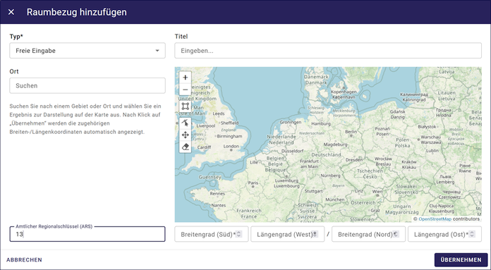
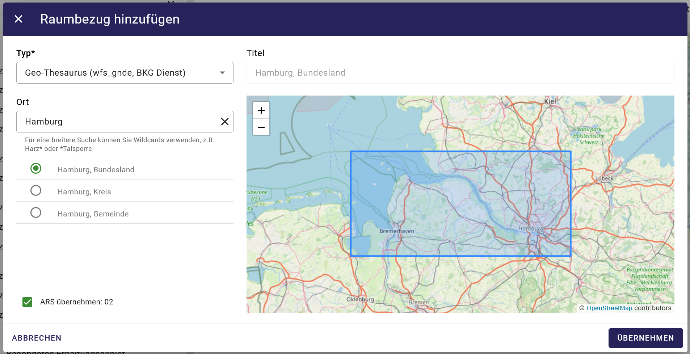

Amtlicher Regionalschlüssel (ARS)
=================================

Der ARS kann einfach in den Raumbezügen im Feld "Amtlicher Regionalschlüssel (ARS)" oder durch den BKG-Dienst (wfs_gnde) eingetragen werden.

wfs_gnde - steht für Geographische Namen Deutschlands es handelt sich um einen Downloaddienst des Bundesamtes für Kartographie und Geodäsie.

..hint:: Der Gemeindeschlüssel ist im Amtichen Regionalschlüssel enthalten.

Abb.: Raumbezug mit Angabe des ARS

Abb.: Typ - Geo-Thesaurus - (wfs_gnde, BKG Dienst)

Beispiel ARS Hamburg: 02

| 02 Hamburg (Freie und Hansestadt)
| 02 0 00 Hamburg (Kreisfreie Stadt)
| 02 0 00 000 Hamburg Gemeinschaftsfreie Gemeinde - Gemeindeschlüssel)
| 02 0 00 000 0000 Hamburg (Stadt)

Der ARS ist wie folgt aufgebaut:

| 1.–2. Stelle = Kennzahl des Bundeslandes
| 3. Stelle = Kennzahl des Regierungsbezirks; wenn nicht vorhanden: 0
| 4.–5. Stelle = Kennzahl des Landkreises oder der kreisfreien Stadt
| 6.–9. Stelle = Verbandsschlüssel
| 10.–12. Stelle = Gemeindekennzahl

Abb.: Beispiel ARS Dargun (MV) 130710027027

| 13 Mecklenburg-Vorpommern
| 13 0 Kein Regierungsbezirk
| 13 0 71 Mecklenburgische Seenplatte (Landkreis)
| 13 0 71 0027 Dargun (Amtsfreie Gemeinde - Gemeindeschlüssel)
| 13 0 71 0027 027 Dargun (Stadt)

Beispiel ARS Darmstadt (HE) 064110000000

| 06 Hessen
| 06 4 Regierungsbezirk Darmstadt
| 06 4 11 Darmstadt (Kreisfreie Stadt)
| 06 4 11 0000 Darmstadt (Gemeinschaftsfreie Gemeinde - Gemeindeschlüssel)
| 06 4 11 0000 000 Darmstadt (Stadt)

ARS Bundesland
| 01 Schleswig-Holstein 
| 02 Hamburg
| 03 Niedersachsen
| 04 Bremen
| 05 Nordrhein-Westfalen
| 06 Hessen
| 07 Rheinland-Pfalz
| 08 Baden-Württemberg
| 09 Bayern
| 10 Saarland
| 11 Berlin
| 12 Brandenburg
| 13 Mecklenburg-Vorpommern
| 14 Sachsen
| 15 Sachsen-Anhalt
| 16 Thüringen

Sie können auch auf https://opengovtech.de/ars/ nach einem Offiziellen Regionalschlüssel suchen.