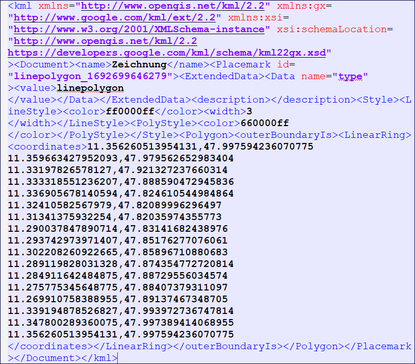
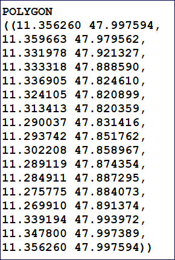

Raumbezug als WKT
=================

Obwohl das ISO-Element Polygon heißt, können in diesem Feld auch andere Geometrietypen angegeben werden.

.. tip:: Bei der Angabe der WKT ist darauf zu achten, dass jeweils eine Punktkoordinate durch ein Komma getrennt ist. In KML-Dateien zum Beispiel, werden die Angaben der Koordinaten durch ein Komma getrennt angegeben.

Abb.: Beispiel - Koordinatenangaben in einer KML-Datei (Komma zwischen Breiten- und Längenangabe)

Abb.: Beispiel - Koordinatenangaben als WKT (Komma nach den Punktkoordinaten)

Diese WKT-Klassen werden unterstützt:

| **POINT: Ein Punkt**
| **Beispiel:** POINT(8.022089 47.864416)

.. figure:: ../../../img/ige/erfassung/ige_metadaten/abschnitt-06_raumbezug/beispiel_feldberg.png
   :align: left
   :scale: 50
   :figwidth: 100%

Abb.: Beispiel - Aussichtsturm Feldberg

| **MULTIPOINT: Punktsammlung, Punktwolke**
| **Beispiel:** MULTIPOINT((10.615711 51.799107), (10.61817 51.79863), (10.61576 51.80049))

.. figure:: ../../../img/ige/erfassung/ige_metadaten/abschnitt-06_raumbezug/beispiel_brocken.png
   :align: left
   :scale: 50
   :figwidth: 100%

Abb.: Beispiel - Gebäude auf dem Brocken

| **LINESTRING: Eine Linie**
| **Beispiel:** LINESTRING (11.430833 53.627320, 13.380556 52.507074, 13.053249 52.397778, 11.631959 52.105427, 9.751075 52.362142, 8.690229 50.114887, 9.183597 48.772455)

.. figure:: ../../../img/ige/erfassung/ige_metadaten/abschnitt-06_raumbezug/beispiel_schwerin-stuttgart.png
   :align: left
   :scale: 50
   :figwidth: 100%

Abb.: Beispiel - Strecke Schwerin - Stuttgart

| **MULTILINE: Mehrere Linien**
| **Beispiel:** MULTILINESTRING ((8.682422 50.110330, 13.732779 51.051925), (8.682422 50.110330, 10.0089734 53.559106))

.. figure:: ../../../img/ige/erfassung/ige_metadaten/abschnitt-06_raumbezug/beispiel_2strecken.png
   :align: left
   :scale: 50
   :figwidth: 100%

Abb.: Beispiel - Strecken Berlin - Würzburg, Hamburg - Düsseldorf

| **POLYGON: Ein Polygon**
| **Beispiele:** 

POLYGON ((11.356260 47.997594, 11.359663 47.979562, 11.331978 47.921327, 11.333318 47.888590, 11.336905 47.824610, 11.324105 47.820899, 11.313413 47.820359, 11.290037 47.831416, 11.293742 47.851762, 11.302208 47.858967, 11.289119 47.874354, 11.284911 47.887295, 11.275775 47.884073, 11.269910 47.891374, 11.339194 47.993972, 11.347800 47.997389, 11.356260 47.997594))

.. figure:: ../../../img/ige/erfassung/ige_metadaten/abschnitt-06_raumbezug/beispiel_starnberger-see.png
   :align: left
   :scale: 50
   :figwidth: 100%

Abb.: Beispiel - Starnberger See

| **POLYGON: Polygon mit Loch**
| **Beispiel:** POLYGON((0 0, 0 10, 10 10, 10 0, 0 0), (5 5, 5 7, 7 7, 7 5, 5 5))

.. figure:: ../../../img/ige/erfassung/ige_metadaten/abschnitt-06_raumbezug/beispiel_brandenburg.png
   :align: left
   :scale: 50
   :figwidth: 100%

Abb.: Beispiel - Brandenburg ohne Berlin

| **MULTIPOLYGON: Mehrere Polygone**
| **Beispiel:** MULTIPOLYGON(((0 0, 0 10, 10 10, 10 0, 0 0),(5 5, 5 7, 7 7, 7 5, 5 5)), (15 20, 25 30, 33 25, 15 20)))

.. figure:: ../../../img/ige/erfassung/ige_metadaten/abschnitt-06_raumbezug/beispiel_.png
   :align: left
   :scale: 50
   :figwidth: 100%

Abb.: Beispiel - Bremen, Hamburg, Berlin

| **GEOMETRYCOLLECTION: unterschiedliche Geometrien**
| **Beispiel:** GEOMETRYCOLLECTION(POINT(10 10), LINESTRING(10 10, 20 20, 10 40), POLYGON((0 0, 0 10, 10 10, 10 0, 0 0)))

.. figure:: ../../../img/ige/erfassung/ige_metadaten/abschnitt-06_raumbezug/beispiel_.png
   :align: left
   :scale: 50
   :figwidth: 100%

Abb.: Beispiel - 

.. hint:: Die Koordinaten müssen zwingend im WGS84 Koordinatenreferenzsystem angegeben werden.