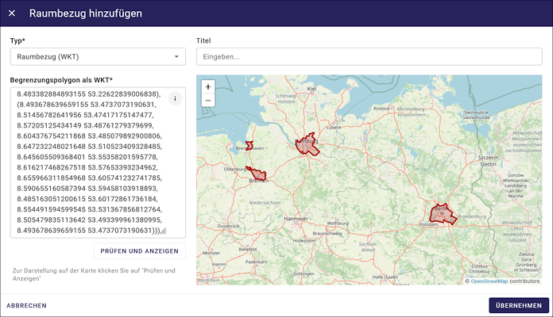

Raumbezug als WKT
=================

Obwohl das ISO-Element Polygon heißt, können in diesem Feld auch andere Geometrietypen angegeben werden.

.. tip:: Die Koordinaten für diese WKT-Klassen können im `METAVER Kartenclient <https://www.metaver.de/kartendienste;jsessionid=4E59B98F4D03F8E421F336E4426B30EE?lang=de&topic=themen&bgLayer=sgx_geodatenzentrum_de_web_light_grau_EU_EPSG_25832_TOPPLUS&E=583462.99&N=5550415.02&zoom=5&layers=20850f0888de4fe4a8063ac3e9eb69fe>`_, mit der Funktion "Zeichnen & Messen auf der Karte", erstellt werden. Die Koordinaten müssen dann als KML-Datei, über die Funktion "Exportieren", gespeichert werden. Bei der Angabe der WKT ist darauf zu achten, dass jeweils eine Punktkoordinate durch ein Komma getrennt ist. In KML-Dateien zum Beispiel, werden die Angaben der Koordinaten durch ein Komma getrennt angegeben.

.. figure:: ../../../img/ige/erfassung/ige_metadaten/abschnitt-06_raumbezug/wkt/metaver_kartenclient.png
   :align: left
   :scale: 30
   :figwidth: 90%

Abb.: Beispiel - Erstellung eines Polygons im METAVER Kartenclient

.. figure:: ../../../img/ige/erfassung/ige_metadaten/abschnitt-06_raumbezug/wkt/beispiel_kml-koordinaten.png
   :align: left
   :scale: 50
   :figwidth: 100%

Abb.: Beispiel - Koordinatenangaben in einer KML-Datei (Komma zwischen Breiten- und Längenangabe)

Abb.: Beispiel - Koordinatenangaben als WKT (Komma nach den Punktkoordinaten)

Diese WKT-Klassen werden unterstützt:

| **POINT: Ein Punkt**
| **Form:** POINT (30 10)
| **Beispiel:** POINT(10.447679 51.163361)

.. figure:: ../../../img/ige/erfassung/ige_metadaten/abschnitt-06_raumbezug/wkt/beispiel_deutschland-mitte.png
   :align: left
   :scale: 50
   :figwidth: 100%

Abb.: Beispiel - Mittelpunkt Deutschlands (nach Breiten- und Längengraden)

| **MULTIPOINT: Punktsammlung, Punktwolke**
| **Form:** MULTIPOINT (10 40, 40 30, 20 20, 30 10)
| **Form:** MULTIPOINT ((10 40), (40 30), (20 20), (30 10))
| **Beispiel:** MULTIPOINT((10.723816 54.210959), (10.615532 51.799119), (13.602431 53.483580), (12.954303 50.428704), (10.619285 51.756461), (13.726662 51.364723), (8.558416 51.276331), (7.089624 49.729275), (10.743390 50.656641), (9.933008 50.498075), (7.013475 49.628655), (8.022308 47.864520), (10.984875 47.421406))

Abb.: Beispiel - Höchste Erhebungen in den Bunsländern

| **LINESTRING: Eine Linie**
| **Form:** LINESTRING (30 10, 10 30, 40 40)
| **Beispiel:** LINESTRING (8.416624 55.058136, 10.178340 47.270118)

.. figure:: ../../../img/ige/erfassung/ige_metadaten/abschnitt-06_raumbezug/wkt/beispiel_strecke_nord-sued.png
   :align: left
   :scale: 50
   :figwidth: 100%

Abb.: Beispiel - Strecke Nördlichster Punkt zum Südlichsten Punkt Deutschlands

| **MULTILINE: Mehrere Linien**
| **Form:** MULTILINESTRING ((10 10, 20 20, 10 40), (40 40, 30 30, 40 20, 30 10))
| **Beispiel:** MULTILINESTRING ((8.416624 55.058136, 10.178340 47.270118), (5.866353 51.051102, 15.041753 51.273060))

Abb.: Beispiel - Strecken Berlin - Würzburg, Hamburg - Düsseldorf

| **POLYGON: Ein Polygon**
| **Form:** POLYGON ((30 10, 40 40, 20 40, 10 20, 30 10))
| **Beispiel:** POLYGON ((11.356260 47.997594, 11.359663 47.979562, 11.331978 47.921327, 11.333318 47.888590, 11.336905 47.824610, 11.324105 47.820899, 11.313413 47.820359, 11.290037 47.831416, 11.293742 47.851762, 11.302208 47.858967, 11.289119 47.874354, 11.284911 47.887295, 11.275775 47.884073, 11.269910 47.891374, 11.339194 47.993972, 11.347800 47.997389, 11.356260 47.997594))

.. figure:: ../../../img/ige/erfassung/ige_metadaten/abschnitt-06_raumbezug/wkt/beispiel_starnberger-see.png
   :align: left
   :scale: 50
   :figwidth: 100%

Abb.: Beispiel - Starnberger See

| **POLYGON: Polygon mit Loch**
| **Form:** POLYGON ((35 10, 45 45, 15 40, 10 20, 35 10), (20 30, 35 35, 30 20, 20 30))
| **Beispiel:** POLYGON((13.262711218079728 52.62726847793456, 13.162521542586976 52.59945742645974, 13.13011432443132 52.55862856478465, 13.116109699269256 52.48199174332719, 13.08928050229366 52.419786908610384, 13.128513697413467 52.389687920944105, 13.249765887793735 52.40390960852503, 13.37194929447567 52.38923737379414, 13.421996129483714 52.37678517665537, 13.420741033031806 52.40745896155042, 13.463493192458294 52.42059591973194, 13.47775717113561 52.39661241175605, 13.607398322118035 52.37725145242951, 13.64670963039136 52.339786008241155, 13.734207286996162 52.40739727171418, 13.7619224022823 52.435021423581944, 13.640357653134213 52.47919063163668, 13.615395157555488 52.471472126801785, 13.631378682821731 52.493912317078504, 13.658492717062444 52.527634284633244, 13.502724708963948 52.60476038032315, 13.519332729905793 52.64534117379589, 13.474852835633628 52.67236587926016, 13.424024161942347 52.63722374088164, 13.31013545376788 52.62933041420148, 13.309276123950932 52.65847438628186, 13.283364644888238 52.66054969978964, 13.262711218079728 52.62726847793456), (14.421112206454138 53.327793769107686, 14.07494817114172 53.26439731767236, 14.22534831977575 53.421271650307744, 13.783539794461 53.5457065081342, 12.987058129250887 53.175772891128965, 12.058658114272585 53.35442441462955, 11.272872211310688 53.11504802997462, 12.232886476748146 52.85094359138942, 12.177886781243501 52.507734422323495, 12.319253488521012 52.476635332230906, 12.217966759784971 52.17403279434285, 12.6562830684176 52.00096321988182, 13.123945632452449 51.86450736664343, 13.17675414579197 51.69627927762437, 13.075375049133624 51.65145047203103, 13.24501751369082 51.38529018484582, 13.385680317556996 51.44060132489892, 13.717881911319058 51.37624508318883, 14.063056366234205 51.43744608021986, 14.14203448322662 51.53687600727267, 14.70920500002145 51.57109631627993, 14.58024156903505 51.825472526187774, 14.771709533405087 52.061348828315204, 14.578068546428172 52.279513790590926, 14.615523868453247 52.57430959504238, 14.13811113923625 52.822971359635055, 14.170590067849067 52.969815114400134, 14.350506838974171 53.046556296029884, 14.421112206454138 53.327793769107686))

Abb.: Beispiel - Brandenburg ohne Berlin

| **MULTIPOLYGON: Mehrere Polygone**
| **Form:** MULTIPOLYGON (((30 20, 45 40, 10 40, 30 20)), ((15 5, 40 10, 10 20, 5 10, 15 5)))

.. code-block:: wkt

| **Beispiel:** MULTIPOLYGON (((13.262711218079728 52.62726847793456, 13.162521542586976 52.59945742645974, 13.13011432443132 52.55862856478465, 13.116109699269256 52.48199174332719, 13.08928050229366 52.419786908610384, 13.128513697413467 52.389687920944105, 13.249765887793735 52.40390960852503, 13.37194929447567 52.38923737379414, 13.421996129483714 52.37678517665537, 13.420741033031806 52.40745896155042, 13.463493192458294 52.42059591973194, 13.47775717113561 52.39661241175605, 13.607398322118035 52.37725145242951, 13.64670963039136 52.339786008241155, 13.734207286996162 52.40739727171418, 13.7619224022823 52.435021423581944, 13.640357653134213 52.47919063163668, 13.615395157555488 52.471472126801785, 13.631378682821731 52.493912317078504, 13.658492717062444 52.527634284633244, 13.502724708963948 52.60476038032315, 13.519332729905793 52.64534117379589, 13.474852835633628 52.67236587926016, 13.424024161942347 52.63722374088164, 13.31013545376788 52.62933041420148, 13.309276123950932 52.65847438628186, 13.283364644888238 52.66054969978964, 13.262711218079728 52.62726847793456), (9.76848231194473 53.62731488473964, 9.729180025852113 53.55918759025867, 9.763766730547326 53.506841285388305, 9.86050414318029 53.43365349122614, 9.898915732534602 53.45528103727245, 9.908875169492847 53.417806755702415, 9.952736330759507 53.42804244060015, 9.980932967549256 53.41648108905754, 10.049025342560434 53.45972386015899, 10.177694297121118 53.39732496866179, 10.235794469837101 53.395604386974156, 10.302624769714386 53.431538863341885, 10.323985849244314 53.44717082987836, 10.207711843756943 53.519802369578876, 10.153725448140118 53.539224038634394, 10.16125449533158 53.58259449179266, 10.199429598569251 53.585617754337434, 10.189414086505822 53.61329472988217, 10.219194716278878 53.63263890336556, 10.139760608250192 53.68026404333763, 10.181317921798907 53.71008219404299, 10.192079588653101 53.73037461427926, 10.166176722358289 53.7381846595856, 10.120286638210423 53.713690514399666, 10.083555536482535 53.72158345801073, 10.060917083051088 53.68249945483901, 9.999843062743075 53.68302488299549, 9.987561027680803 53.64761778000006, 9.919055692631382 53.65496282961273, 9.824850223581699 53.58500903039405, 9.76848231194473 53.62731488473964)), ((8.483382884893155 53.22622839006838, 8.530394185159368 53.187134648886556, 8.61735932860656 53.16780153019684, 8.67519248320242 53.084862827998755, 8.702203254917318 53.08040014880448, 8.707411682780888 53.05245748059396, 8.730095551202835 53.03437768617914, 8.766354301087224 53.05107671201362, 8.847346346452692 53.01834139958009, 8.863572629696817 53.03800565594344, 8.913138836798703 53.01198537970251, 8.98014583476982 53.04639335011625, 8.964440565185086 53.086811814839855, 8.988281538683733 53.09701648040512, 8.94934676145293 53.11627276970994, 8.981365525085156 53.125348647223774, 8.945533066491603 53.15291502139257, 8.91163974208961 53.132495006673736, 8.866414325519816 53.13245286024741, 8.829858955635713 53.163761324052416, 8.742483637149242 53.163982248290935, 8.729819405921038 53.17868727810008, 8.701486752751089 53.18390844857198, 8.66381641603016 53.175874909670576, 8.624655675802698 53.19615762387835, 8.594557641640431 53.1858591819731, 8.57751436287809 53.19222208748178, 8.605659433377983 53.20969601455165, 8.577898443312064 53.21715632782755, 8.553444096387912 53.208378483558086, 8.516111587921609 53.22674352283095, 8.483382884893155 53.22622839006838), (8.493678639659155 53.4737073190631, 8.51456782641956 53.47417175147477, 8.57205125434149 53.48761279379699, 8.604376754211868 53.485079892900806, 8.647232248021648 53.510523409328485, 8.645605509368401 53.55358201595778, 8.616217468267518 53.57653393234962, 8.655966311854968 53.605741232741785, 8.590655160587394 53.59458103918893, 8.485163051200615 53.60172861736184, 8.554491594599545 53.531367856812764, 8.505479835113642 53.493399961380995, 8.493678639659155 53.4737073190631)))

Abb.: Beispiel - Bremen, Hamburg, Berlin

| **GEOMETRYCOLLECTION: unterschiedliche Geometrien**
| **Form:**  GEOMETRYCOLLECTION(POINT(10 10), LINESTRING(10 10, 20 20, 10 40), POLYGON((0 0, 0 10, 10 10, 10 0, 0 0)))
| **Beispiel:**

.. figure:: ../../../img/ige/erfassung/ige_metadaten/abschnitt-06_raumbezug/wkt/beispiel_.png
   :align: left
   :scale: 50
   :figwidth: 100%

Abb.: Beispiel - 

.. hint:: Die Koordinaten müssen zwingend im WGS84 Koordinatenreferenzsystem angegeben werden.