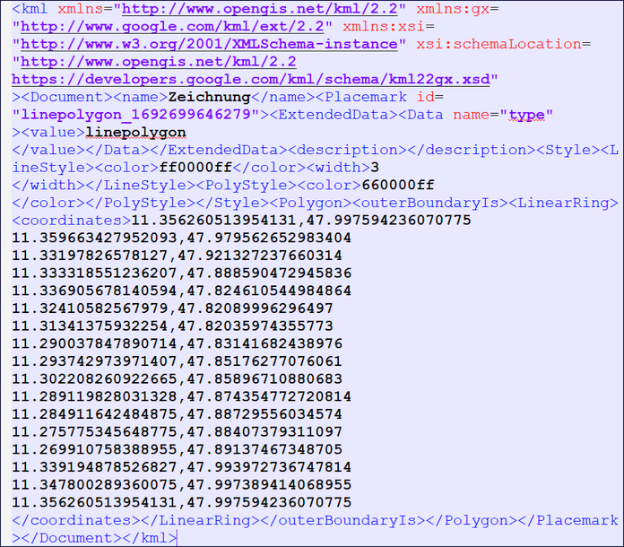

Raumbezug als WKT
=================

Obwohl das ISO-Element Polygon heißt, können in diesem Feld auch andere Geometrietypen angegeben werden.

.. tip:: Die Koordinaten für diese WKT-Klassen können im `METAVER Kartenclient <https://www.metaver.de/kartendienste;jsessionid=4E59B98F4D03F8E421F336E4426B30EE?lang=de&topic=themen&bgLayer=sgx_geodatenzentrum_de_web_light_grau_EU_EPSG_25832_TOPPLUS&E=583462.99&N=5550415.02&zoom=5&layers=20850f0888de4fe4a8063ac3e9eb69fe>`_, mit der Funktion "Zeichnen & Messen auf der Karte", erstellt werden. Die Koordinaten müssen dann als KML-Datei, über die Funktion "Exportieren", gespeichert werden. Bei der Angabe der WKT ist darauf zu achten, dass jeweils eine Punktkoordinate durch ein Komma getrennt ist. In KML-Dateien zum Beispiel, werden die Angaben der Koordinaten durch ein Komma getrennt angegeben. Weiterhin werden die Koordinaten z.B. in einer KML-Datei oder in Google Maps in umgekehrter Reihenfolge dargestellt.

.. figure:: ../../../img/ige/erfassung/ige_metadaten/abschnitt-06_raumbezug/wkt/metaver_kartenclient.png
   :align: left
   :scale: 50
   :figwidth: 100%

Abb.: Beispiel - Erstellung eines Polygons im METAVER Kartenclient

Abb.: Beispiel - Koordinatenangaben in einer KML-Datei (Komma zwischen Breiten- und Längenangabe)

.. figure:: ../../../img/ige/erfassung/ige_metadaten/abschnitt-06_raumbezug/wkt/beispiel_wkt-koordinaten.png
   :align: left
   :scale: 50
   :figwidth: 100%

Abb.: Beispiel - Koordinatenangaben als WKT (Komma nach den Punktkoordinaten)

Diese WKT-Klassen werden unterstützt:

| **POINT: Ein Punkt**
| **Beispiel:** POINT(10.447679 51.163361)

Abb.: Beispiel - Mittelpunkt Deutschlands (nach Breiten- und Längengraden)

| **MULTIPOINT: Punktsammlung, Punktwolke**
| **Beispiel:** MULTIPOINT((10.723816 54.210959), (10.615532 51.799119), (13.602431 53.483580), (12.954303 50.428704), (10.619285 51.756461), (13.726662 51.364723), (8.558416 51.276331), (7.089624 49.729275), (10.743390 50.656641), (9.933008 50.498075), (7.013475 49.628655), (8.022308 47.864520), (10.984875 47.421406))

.. figure:: ../../../img/ige/erfassung/ige_metadaten/abschnitt-06_raumbezug/wkt/beispiel_erhebungen.png
   :align: left
   :scale: 50
   :figwidth: 100%

Abb.: Beispiel - Höchste Erhebungen in den Bunsländern

| **LINESTRING: Eine Linie**
| **Beispiel:** LINESTRING (8.416624 55.058136, 10.178340 47.270118)

.. figure:: ../../../img/ige/erfassung/ige_metadaten/abschnitt-06_raumbezug/wkt/beispiel_strecke_nord-sued.png
   :align: left
   :scale: 50
   :figwidth: 100%

Abb.: Beispiel - Strecke Nördlichster Punkt zum Südlichsten Punkt Deutschlands

| **MULTILINE: Mehrere Linien**
| **Beispiel:** MULTILINESTRING ((8.416624 55.058136, 10.178340 47.270118), (5.866353 51.051102, 15.041753 51.273060))

.. figure:: ../../../img/ige/erfassung/ige_metadaten/abschnitt-06_raumbezug/wkt/beispiel_nosw.png
   :align: left
   :scale: 50
   :figwidth: 100%

Abb.: Beispiel - Strecken Berlin - Würzburg, Hamburg - Düsseldorf

| **POLYGON: Ein Polygon**
| **Beispiele:** 

POLYGON ((11.356260 47.997594, 11.359663 47.979562, 11.331978 47.921327, 11.333318 47.888590, 11.336905 47.824610, 11.324105 47.820899, 11.313413 47.820359, 11.290037 47.831416, 11.293742 47.851762, 11.302208 47.858967, 11.289119 47.874354, 11.284911 47.887295, 11.275775 47.884073, 11.269910 47.891374, 11.339194 47.993972, 11.347800 47.997389, 11.356260 47.997594))

.. figure:: ../../../img/ige/erfassung/ige_metadaten/abschnitt-06_raumbezug/wkt/beispiel_starnberger-see.png
   :align: left
   :scale: 50
   :figwidth: 100%

Abb.: Beispiel - Starnberger See

| **POLYGON: Polygon mit Loch**
| **Beispiel:** POLYGON((0 0, 0 10, 10 10, 10 0, 0 0), (5 5, 5 7, 7 7, 7 5, 5 5))

.. figure:: ../../../img/ige/erfassung/ige_metadaten/abschnitt-06_raumbezug/wkt/beispiel_brandenburg.png
   :align: left
   :scale: 50
   :figwidth: 100%

Abb.: Beispiel - Brandenburg ohne Berlin

| **MULTIPOLYGON: Mehrere Polygone**
| **Beispiel:** MULTIPOLYGON(((0 0, 0 10, 10 10, 10 0, 0 0),(5 5, 5 7, 7 7, 7 5, 5 5)), (15 20, 25 30, 33 25, 15 20)))

.. figure:: ../../../img/ige/erfassung/ige_metadaten/abschnitt-06_raumbezug/wkt/beispiel_.png
   :align: left
   :scale: 50
   :figwidth: 100%

Abb.: Beispiel - Bremen, Hamburg, Berlin

| **GEOMETRYCOLLECTION: unterschiedliche Geometrien**
| **Beispiel:** GEOMETRYCOLLECTION(POINT(10 10), LINESTRING(10 10, 20 20, 10 40), POLYGON((0 0, 0 10, 10 10, 10 0, 0 0)))

.. figure:: ../../../img/ige/erfassung/ige_metadaten/abschnitt-06_raumbezug/wkt/beispiel_.png
   :align: left
   :scale: 50
   :figwidth: 100%

Abb.: Beispiel - 

.. hint:: Die Koordinaten müssen zwingend im WGS84 Koordinatenreferenzsystem angegeben werden.