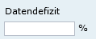
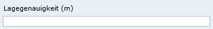
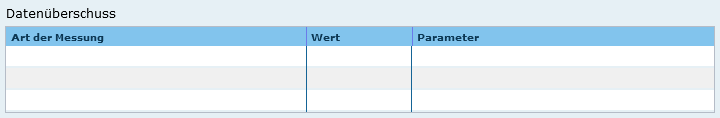
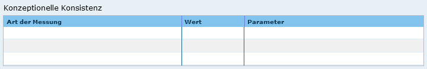
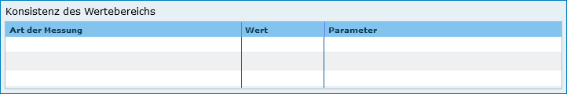
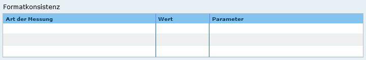
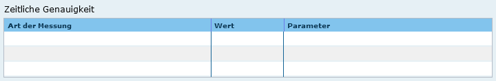
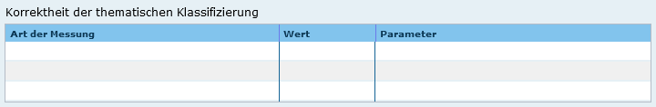
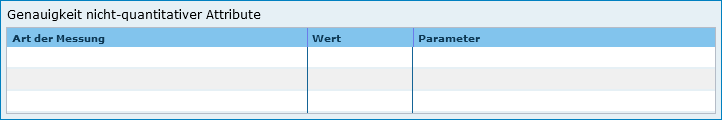
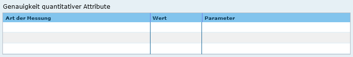

Abschnitt Datenqualität
^^^^^^^^^^^^^^^^^^^^^^^

Datendefizit
''''''''''''

 
Abb.: Feld Datendefizit

Eingabe einer Prozentangabe zum Anteil der Daten, die im Vergleich zum beschriebenen Geltungsbereich fehlen. Diese kann sich auf die Anzahl der Kartenblätter aber auch auf das Datendefizit einer Gesamtkarte beziehen.

Beispiel: 55

Wenn der Erfassungsgrad bei 100% liegt, ist in dem Feld Datendefizit 0% einzutragen. (Datendefizit = 100 – Erfassungsgrad) 

Höhengenauigkeit
''''''''''''''''

 
Abb.: Feld Höhengenauigkeit

Angabe über die Genauigkeit der Höhe z.B. in einem Geländemodell.

Beispiel: 3 (m)

Lagegenauigkeit
'''''''''''''''

 
Abb.: Feld Lagegenauigkeit

Angabe über die Genauigkeit z.B. in einer Karte.

Beispiel: 3 (m)

.. hint:: Die folgenden Eingabefelder erscheinen bei der Auswahl (Verschlagwortung) der INSPIRE-Themen: Adressen, Gewässernetz, Schutzgebiete, Verwaltungseinheiten und Verkehrsnetze.

Datenüberschuss
'''''''''''''''

 
Abb.: Feld Datenüberschuss

Angaben zu den überschüssigen Features, Attributen oder ihren Relationen.

Beispiel: Anzahl der überflüssigen Elemente zur Anzahl der gesamten Elemente: 11,2%

..hint:: Es wird nur eine Zahl angegeben; kein %-Zeichen.

Konzeptionelle Konsistenz
'''''''''''''''''''''''''

 
Abb.: Feld Konzeptionelle Konsistenz

Angaben zu Fehlern bezüglich der Verletzung der Regeln des konzeptionellen Schemas

Beispiel: Anzahl der überlappenden Oberflächen innerhalb des Datensatzes: 23

Konsistenz des Wertebereichs
''''''''''''''''''''''''''''

 
Abb.: Feld Konsistenz des Wertebereichs

Angaben zur Übereinstimmung des Wertebereichs - Angegeben wird die Anzahl der Übereinstimmungen im Verhältnis zur Gesamtmenge der Elemente.

Formatkonsistenz
''''''''''''''''

 
Abb.: Feld Formatkonsistenz

Angaben darüber, wie viele Elemente sich im Konflikt zu der physikalischen Struktur des Datensatzes befinden.

 
Zeitliche Genauigkeit
'''''''''''''''''''''

 
Abb.: Feld Zeitliche Genauigkeit

Angabe der Anzahl der zeitlich korrekt zugeordneten Elemente zur Gesamtzahl der Elemente.

Topologische Konsistenz
'''''''''''''''''''''''

 
Abb.: Feld Topologische Konsistenz

Angaben zu topologischen Fehlern, die zwischen verschiedenen Unterelementen des Datensatzes auftreten.

Beispiel: Anzahl fehlender Verbindungen zwischen Unterelementen aufgrund von Undershoots/Overshoots.

Korrektheit der thematischen Klassifizierung
''''''''''''''''''''''''''''''''''''''''''''

 
Abb.: Feld Korrektheit der thematischen Klassifizierung

Angabe der Anzahl der thematisch falsch klassifizierten Elemente zur Gesamtanzahl der Elemente.

Genauigkeit nicht-quantitativer Attribute
'''''''''''''''''''''''''''''''''''''''''

 
Abb.: Feld Genauigkeit nicht-quantitativer Attribute

Angabe der Anzahl der inkorrekten nicht-quantitativen Attributwerte im Verhältnis zur Gesamtzahl der Attribute.

Genauigkeit quantitativer Attribute
'''''''''''''''''''''''''''''''''''

 
Abb.: Feld Genauigkeit quantitativer Attribute

Angabe der Anzahl der quantitativen Attribute, die inkorrekt sind.

Beispiel: Anzahl aller quantitativen Werte, die nicht mit 95% Wahrscheinlichkeit dem wahren Wert entsprechen.*