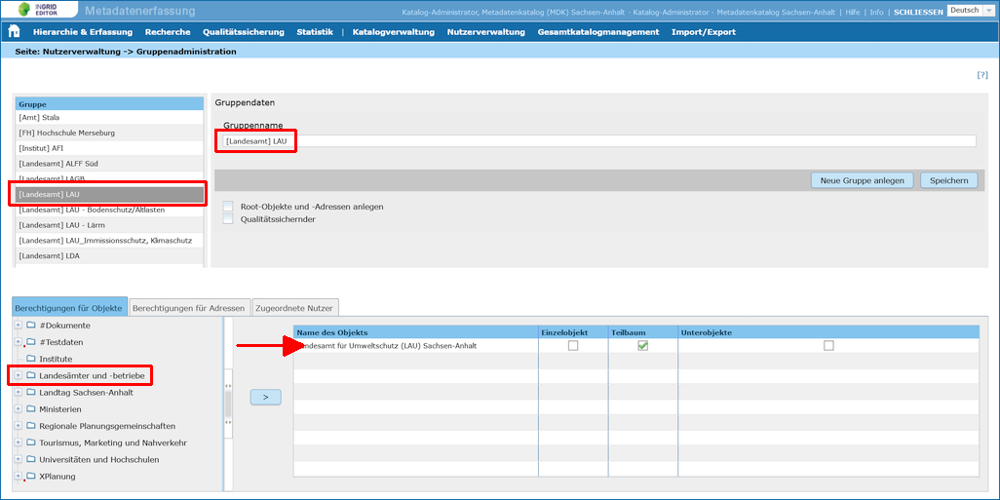
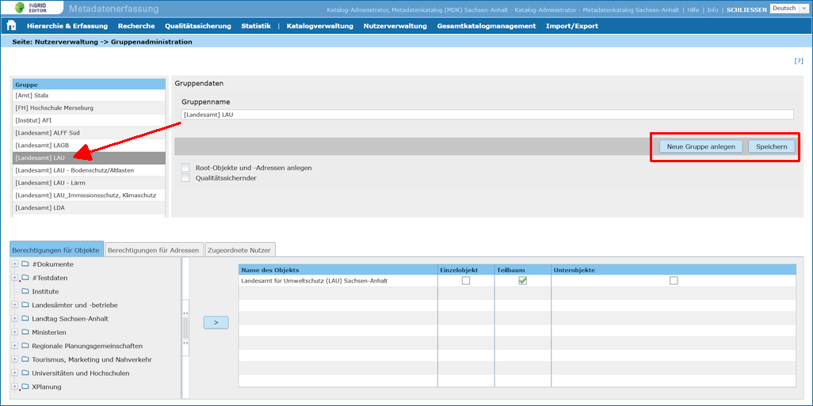
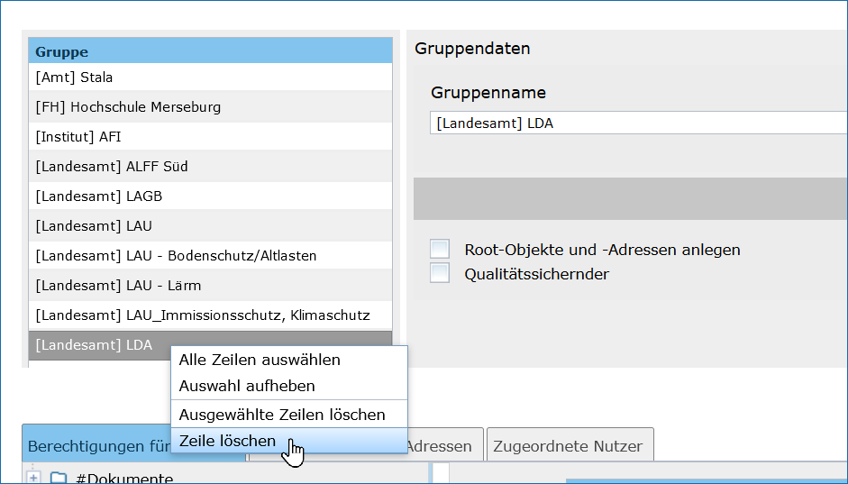
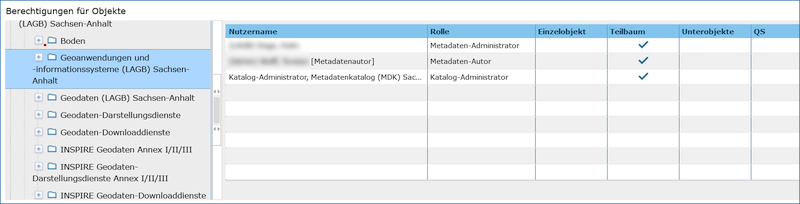
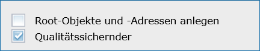
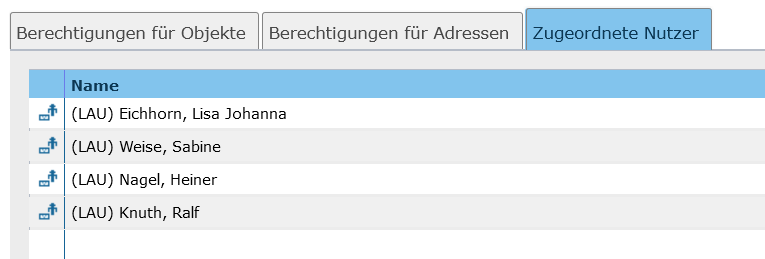

Gruppenadministration
=====================

Über die (Benutzer-) Gruppen werden die Schreibrechte auf Objekte und Adressen festgelegt.

In der Gruppenadministration können Sie:

 • Eine Gruppe bearbeiten: Klicken Sie auf den Namen der Gruppe in der Liste links oben im Fenster. Sie können nun den Namen der Gruppe ändern sowie die Rechte für die Gruppe. Änderungen müssen mit Speichern abgeschlossen werden und stehen dann sofort zur Verfügung.

Abb.: Gruppenadministration

 • Eine Gruppe neu anlegen: Klicken Sie auf die Schaltfläche Neue Gruppe anlegen. Sie müssen den Gruppennamen angeben und den Vorgang mit Speichern abschließen. Sie können nun die Rechte für die Gruppe angeben.

Abb.: Gruppe anlegen

 • Eine Gruppe löschen: Klicken Sie mit der rechten Maustaste auf den Namen der Gruppe, die Sie löschen wollen. Wählen Sie Zeile löschen aus dem Kontextmenü und bestätigen Sie den Vorgang in dem sich öffnenden Dialog.

Abb.: Gruppe löschen

 
**Wichtig:** *Alle Änderungen an den Gruppen müssen über Speichern abgeschlossen werden, damit die Änderungen wirksam werden und nicht verloren gehen.*

Sie können folgende Berechtigungen für eine Gruppe vergeben:

**Berechtigungen für Objekte**
Sie können Schreibberechtigungen für Objekte vergeben. Wählen sie dazu den Ordner oder das Objekte unter Berechtigungen für Objekte aus dem Hierarchiebaum aus, für das Sie oder ab dem Sie die Schreibberechtigung vergeben wollen. Ein Klick auf das Symbol färbt den Hintergrund blau. Über die Schaltfläche > können Sie das markierte Symbol in die Liste der Berechtigungen übernehmen.

Sie haben drei Einstellungsmöglichkeiten für die Berechtigung pro Ordner/Vorhaben:

Abb.: Berechtigungen für Objekte

 
 •**Teilbaum:** Dies ist die Standardeinstellung. Sie haben für dieses und alle nachgeordneten Objekte eine Schreibberechtigung. Sie können unterhalb dieses Objektes und allen nachgeordneten Objekte neue Objekte anlegen.

 •**Unter-Objekte:** Sie können direkt unterhalb dieses Objektes ein neues Objekte anlegen, für das Sie dann den vollen Zugriff bekommen (Teilbaum Recht auf neuem Unter-Objekte). Alle Benutzer Ihrer Gruppe bekommen damit ebenfalls vollen Zugriff (alle Benutzer der Gruppe, die das Unter-Objektesrecht beinhaltet).

 •**Einzelobjekt:** Sie haben nur auf diesem Objekte eine Schreibberechtigung, auf nachgeordnete Objekte nicht. Sie können keine neuen Objekte unterhalb dieses Objektes anlegen.

**Hinweis:** *Sie können keine Schreibrechte auf den Strukturbaumknoten Objekte vergeben. Alle Teilbäume des Kataloges, auf die ein Schreibrecht bestehen soll, müssen einzeln ausgewählt werden.*

**Berechtigungen für Adressen**
Sie können Schreibberechtigungen für Adressen vergeben. Wählen Sie dazu die Adresse unter Berechtigungen für Adressen aus dem Hierarchiebaum aus, für die Sie oder ab der Sie die Schreibberechtigung vergeben wollen. Ein Klick auf die Adresse färbt sie blau ein. Über die Schaltfläche > können Sie die markierte Adresse in die Liste der Berechtigungen übernehmen.

Sie haben drei Einstellungsmöglichkeiten für die Berechtigung pro Adresse:

.. image:: ../../../img_ige/metaver_ige/ige_administration/benutzerverwaltung/ige_gruppen-berechtigung-adressen.png

Abb.: Berechtigungen für Adressen

 
 •**Teilbaum:** Dies ist die Standardeinstellung. Sie haben für diese Adresse und alle nachgeordneten Adressen eine Schreibberechtigung. Sie können unterhalb dieser und allen nachgeordneten Adressen neue Adressen anlegen.

 •**Unteradressen:** Sie können direkt unterhalb dieser Adresse eine neue Adresse anlegen, für die Sie dann den vollen Zugriff bekommen (Teilbaum Recht auf neuer Unteradresse). Alle Benutzer Ihrer Gruppe bekommen damit ebenfalls vollen Zugriff (alle Benutzer der Gruppe, die das Unteradressenrecht beinhaltet).

 •**Einzeladresse:** Sie haben nur auf diese Adresse eine Schreibberechtigung, auf nachgeordnete Adressen nicht. Sie können keine neuen Adressen unterhalb dieser Adresse anlegen.
 
**Hinweis:** *Sie können keine Schreibrechte auf die Strukturbaumknoten Adressen und freie Adressen vergeben. Alle Teilbäume des Kataloges, auf die ein Schreibrecht bestehen soll, müssen einzeln ausgewählt werden.*

**Root-Objekte und -Adressen anlegen**
Dies ist ein gesondertes Schreibrecht. Wird es für eine Gruppe vergeben, haben die Mitglieder dieser Gruppe das Recht, neue Objekte und Adressen auf der obersten Ebene des Kataloges anzulegen. Sie erhalten dann automatisch die Schreibrechte auf den ganzen Teilbaum des neu angelegten Objektes bzw. der neu angelegten Adresse.

Abb.: Root-Objekte und -Adressen anlegen

 
**Wichtig:** *Durch dieses Recht hat die Gruppe nicht automatisch das Schreibrecht auf schon vorhandene Teilbäume, für die ihr nicht explizit Schreibrechte eingeräumt wurden.*

**Qualitätssichernder**
Über die Berechtigung Qualitätssichernder werden die Nutzer der Gruppe für alle Objekte und Adressen, für die Sie ein Schreibrecht besitzen, zu Qualitätssichernden. Sie haben also das Recht (und auch die Pflicht), an Sie überwiesene Objekte und Adressen zur Veröffentlichung freizugeben bzw. endgültig zu löschen oder bei Qualitätsmängeln die Objekte bzw. Adressen an den Zuständigen zurück zu überweisen.

Abb.: Qualitätssichernder

 
**Hinweis:** *Dieses Recht wird nur im Zusammenhang mit der eingeschalteten Workflow-Kontrolle in den Katalogeinstellungen wirksam.

**Zugeordnete Nutzer**
Auf dem dritten Reiter werden alle Benutzer aufgelistet, welche der gewählten Gruppe zugeordnet wurden.

Abb.: Zugeordnete Nutzer

**Die spezielle Gruppe administrators des Katalogadministrators**
Dem Katalogadministrator wird immer automatisch die Gruppe administrators zugewiesen. Diese Zuweisung kann nicht verändert werden. Die Gruppe hat Schreibrechte auf den gesamten Katalog (natürlich einschließlich des Rechts auf Anlegen von neuen Objekte und Adressen auf der obersten Ebene). Die Gruppe hat feste Rechte und ist in jedem Katalog automatisch vorhanden. Sie lässt sich nicht über die Gruppenadministration pflegen und wird daher auch nicht in der Liste der Gruppen angezeigt.
