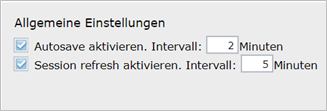

Allgemeines zum InGrid Editor
=============================

Aufbau der Benutzeroberfläche
-----------------------------

  .. image:: ../../img_ige/metaver_ige/ige_ausgangszustand/ige-benutzeroberflaeche.png
	
Abb.: Benutzeroberfläche des InGrid Editors

Die Benutzeroberfläche ist wie folgt aufgebaut: 

1. Navigationsleiste
2. Symbolleiste (Toolbar) 
3. Strukturbaum
4. Erfassungsmaske

Strukturbaum
------------

Der InGrid Editor verfügt über einen Strukturbaum.

  .. image:: ../../img_ige/metaver_ige/ige_strukturbaum/ige-strukturbaum.png
  
Abb.: Der Strukturbaum ist in Objekte und Adressen unterteilt.
  

Plus- und Minuszeichen
'''''''''''''''''''''''
Durch Klicken auf die Pluszeichen wird der Strukturbaum geöffnet bzw. durch Anklicken der Minuszeichen wieder geschlossen. Die Ordnung innerhalb einer Hierarchiestufe erfolgt alphabetisch nach Objektname bzw. Adresstitel und kann durch Verschieben oder Einfügen nicht geändert werden.

  .. image:: ../../img_ige/metaver_ige/ige_strukturbaum/ige-struktur.png
  
Abb.: Strukturbaum auf und zu klappen

Icon im Strukturbaum
--------------------

Objekte und Adressen
'''''''''''''''''''''

Der InGrid Editor beinhaltet unterschiedliche Objekt- und Adresstypen. Jeder Typ besitzt ein eigenes Symbol (Icon), welches im Strukturbaum des Editors und in der Portalansicht neben dem Objektnamen bzw. dem Adresstitel dargestellt wird. 

Hinweis:
Die blauen und roten Symbole werden im Strukturbaum des InGrid Editors verwendet (Backend), die schwarzen Symbole in der Portalansicht (Frontend).

**Objekte**

Für die Erfassung und die Recherche von Metadaten werden im InGrid Editor und im Portal METAVER folgende sieben Objektklassen zur Auswahl angeboten: 

.. csv-table::
    :header: "Portal", "Editor", "Objektklassen"
    :widths: 30 30 80

    .. image:: ../../img_ige/metaver_ige/ige_icons/objekte/portal/geodatensatz.png, .. image:: ../../img_ige/metaver_ige/ige_icons/objekte/ige/geodatensatz.png, Geodatensatz
	.. image:: ../../img_ige/metaver_ige/ige_icons/objekte/portal/geodatendienst.png, .. image:: ../../img_ige/metaver_ige/ige_icons/objekte/ige/geodatendienst.png, Geodatendienst
	.. image:: ../../img_ige/metaver_ige/ige_icons/objekte/portal/anwendung.png, .. image:: ../../img_ige/metaver_ige/ige_icons/objekte/ige/anwendung.png, Anwendung
	.. image:: ../../img_ige/metaver_ige/ige_icons/objekte/portal/datenbank.png, .. image:: ../../img_ige/metaver_ige/ige_icons/objekte/ige/datenbank.png, Datenbank
	.. image:: ../../img_ige/metaver_ige/ige_icons/objekte/portal/dokument.png, .. image:: ../../img_ige/metaver_ige/ige_icons/objekte/ige/dokument.png, Dokument
	.. image:: ../../img_ige/metaver_ige/ige_icons/objekte/portal/projekt.png, .. image:: ../../img_ige/metaver_ige/ige_icons/objekte/ige/projekt.png, Projekt
	.. image:: ../../img_ige/metaver_ige/ige_icons/objekte/portal/organisationseinheit.png, .. image:: ../../img_ige/metaver_ige/ige_icons/objekte/ige/organisationseinheit.png, Organisationseinheit

Objektklassen sind eine Gruppe von Objekten mit gleichen Merkmalen und Strukturen. Je nach Auswahl des Typs werden bei der Erfassung unterschiedliche Eingabefelder angezeigt. So müssen beispielsweise für den Typ "Geodatensatz" andere Felder gefüllt werden als für den Typ "Geodatendienst". 

**Adressen**

Für die Erfassung und die Recherche von Adressen werden im InGrid Editor und im Portal METAVER folgende drei Adresstypen zur Auswahl angeboten.

.. csv-table::
    :header: "Portal", "Editor", "Adresstypen"
    :widths: 30 30 80

    .. image:: ../../img_ige/metaver_ige/ige_icons/adressen/portal/institution.png, .. image:: ../../img_ige/metaver_ige/ige_icons/adressen/ige/institution.png, Institution
	.. image:: ../../img_ige/metaver_ige/ige_icons/adressen/portal/einheit.png, .. image:: ../../img_ige/metaver_ige/ige_icons/adressen/ige/einheit.png, Einheit
	.. image:: ../../img_ige/metaver_ige/ige_icons/adressen/portal/person.png, .. image:: ../../img_ige/metaver_ige/ige_icons/adressen/ige/person.png, Person

Ordner
''''''

  .. image:: ../../img_ige/metaver_ige/ige_strukturbaum/ige-ordner.png
  
Abb.: Strukturierung der Metadaten mit Ordnern

**Hinweis:**
In einer zukünftigen neuen Version der Software kann die Struktur nur noch mit Ordnern angelegt werden. Die Möglichkeit eine Struktur mit Objektklassen aufzubauen entfällt.

Bearbeitungsstand
'''''''''''''''''

Neben dem Objekttyp bzw. dem Adresstyp zeigen die Icons im Editor zusätzlich den jeweiligen Bearbeitungsstand an. 

.. csv-table::
    :header: "Icon", "Farbe", "Beschreibung"
    :widths: 30 30 280

    .. image:: ../../img_ige/metaver_ige/ige_icons/status/dienst_blau.png, Blau, Objekt bzw. Adresse ist veröffentlicht
	.. image:: ../../img_ige/metaver_ige/ige_icons/status/dienst_rot.png, Rot, Objekt bzw. Adresse ist in Bearbeitung (Icon mit Buchstaben "B" für Bearbeitung)
	.. image:: ../../img_ige/metaver_ige/ige_icons/status/dienst_blau-rot.png, Blau/Rot, Wird ein blaues Icon rot überlagert so gibt es eine veröffentlichte Version des Objektes bzw. der Adresse und eine bearbeitete Version.

Veröffentlichungsbreite
'''''''''''''''''''''''

Jedem Objekt und jeder Adresse im Metadatenkatalog muss eine Veröffentlichungsbreite angegeben werden (Feld: „Veröffentlichung“).

Der Editor enthält folgende drei Auswahlmöglichkeiten:

.. csv-table::
    :header: "Icon", "Status"
    :widths: 30 100

    .. image:: ../../img_ige/metaver_ige/ige_icons/status/dienst_internet.png, Internet
	.. image:: ../../img_ige/metaver_ige/ige_icons/status/dienst_intranet.png, Intranet (blaues Pixel)
	.. image:: ../../img_ige/metaver_ige/ige_icons/status/dienst_amtsintern.png, amtsintern (rotes Pixel)
	
Im Strukturbaum wird die Veröffentlichungsbreite der jeweiligen Objekte angezeigt. Die Veröffentlichungsbreite „Internet“ wird nicht gesondert markiert, die Veröffentlichungsbreite „Intranet“ wird mit einem kleinen blauen Quadrat links unterhalb des Objekttypensymbols dargestellt und „amtsintern“ mit einem kleinen roten Quadrat. 

**Internet**

Das Objekt/die Adresse wird im Internet im MetadatenVerbund (MetaVer) unter www.metaver.de/ veröffentlicht. Durch die Veröffentlichung auf www.metaver.de/ werden die Daten automatisch auch für andere Informationssysteme bereitgestellt. Hierzu zählen zum Beispiel das Geoportal Deutschlands (Geoportal.de) www.geoportal.de/, in dem Geodaten aus ganz Deutschland recherchiert werden können und das INSPIRE GEOPORTAL https://inspire-geoportal.ec.europa.eu/, das die europaweite Suche nach Geodatenressourcen im Geltungsbereich von INSPIRE ermöglicht.

**Intranet**

Das Objekt/die Adresse darf nicht im Internet, sondern nur im Intranet veröffentlicht werden. 

**Hinweis:**
*Die Funktion „Intranet“ ist für den Metadatenkatalog Sachsen-Anhalt nicht relevant, da der Metadatenkatalog nicht über das Intranet erreichbar ist.*

**amtsintern**

Das Objekt/die Adresse ist nur im Editor einsehbar. Das Objekt/die Adresse wird weder im Internet noch im Intranet angezeigt. Personen ohne Zugang zum InGrid Editor können diese Objekte/die Adressen nicht recherchieren. 

Ausgegraute Objekte/Adressen im Strukturbaum
'''''''''''''''''''''''''''''''''''''''''''''

Teilweise werden im Strukturbaum Objekte oder Adressen nicht schwarz, sondern nur in grau angezeigt. Dieses hängt mit der Zuweisung von Berechtigungen zusammen. Ändern kann ein Erfasser nur die Objekte/Adressen, die im Strukturbaum schwarz dargestellt sind.

 
Das IGE-Kontextmenü
--------------------

  .. image:: ../../img_ige/metaver_ige/ige_kontextmenue/ige-kontextmenue.png
  
Abb.: Kontextmenü (Strukturbaum - rechte Maustaste)

Wenn ein Objekt im Strukturbaum markiert wurde, kann das Kontextmenü mit der rechte Maustaste geöffnet werden.

**Neu anlegen**

Dient dem Anlegen einer neuen Adresse oder eines neuen Objektes im Strukurbaum.

**Ordner erstellen**

Mit Ordner erstellen kann im Strukturbaum eine Hierarchie aufgebaut werden. Unter dem letzten Ordner werden dann die Objekte angelegt. 

**Vorschau und Druckansicht**

Die Druckfunktion ist unter dem Punkt „Drucken von Teilbäumen und Suchergebnissen“ ausführlich beschrieben.

**Objekte/Adressen/Teilbäume ausschneiden**

Adressen und Objekte oder Teile des Strukturbaumes lassen sich über diese Funktion ausschneiden.

**Objekte/Adressen kopieren**

Adressen und Objekte lassen sich über diese Funktion kopieren.

**Teilbaume kopieren**

Teile des Strukturbaumes lassen sich über diese Funktion kopieren.

**Einfügen**

Funktion für das Einfügen von ausgeschnittenen oder kopierten Adressen, Objekten und Teilbäumen.

**Teilbaum neu laden**

Werden mehrere Adressen oder Objekte auf einer Ebene nacheinander angelegt, so stehen diese nicht alphabetisch geordnet untereinander. Über diese Funktion kann die darüber liegende Adresse oder das Objekt angeklickt werden und der Teil-Baum wird im IGE neu geladen. Nach dem Laden stehen die Adressen/Objekte alphabetisch geordnet im Strukturbaum.

**Löschen**

Löschen von Adressen, Objekten oder Teilbaumen aus dem Strukurbaum.

- Ändern auf Internet
- Ändern auf Intranet
- Ändern auf amtsintern

Mit diesen Funktionen wird die Veröffentlichungsbreite der Adressen / Objekte geregelt.

IGE-Symbolleiste (Toolbar)
--------------------------
  
.. csv-table::
    :widths: 250 10 50

    .. image:: ../../img_ige/metaver_ige/ige_symbolleiste/ige-symbolleiste.png,... , .. image:: ../../img_ige/metaver_ige/ige_symbolleiste/ige-symbolleiste_2.png

Abb.: InGrid Editor - Symbolleiste

Hier im Einzelnen die zur Verfügung stehenden Werkzeuge: 

.. csv-table::
    :header: "Icon", "Bedeutung"
    :widths: 50 250

    .. image:: ../../img_ige/metaver_ige/ige_symbolleiste/icons/neu-anlegen.png, Neu anlegen
    .. image:: ../../img_ige/metaver_ige/ige_symbolleiste/icons/neuen-ordner-anlegen.png, Neuen Ordner anlegen
    .. image:: ../../img_ige/metaver_ige/ige_symbolleiste/icons/druckansicht.png, Vorschau und Druckansicht
    .. image:: ../../img_ige/metaver_ige/ige_symbolleiste/icons/iso.png, ISO XML Anzeige
    .. image:: ../../img_ige/metaver_ige/ige_symbolleiste/icons/ausschneiden.png, Objekte Adressen Teilbäume ausschneiden
    .. image:: ../../img_ige/metaver_ige/ige_symbolleiste/icons/kopieren.png, Objekte Adressen kopieren
    .. image:: ../../img_ige/metaver_ige/ige_symbolleiste/icons/teilbaum-kopieren.png, Teilbaum kopieren
    .. image:: ../../img_ige/metaver_ige/ige_symbolleiste/icons/einfuegen.png, Einfügen
    .. image:: ../../img_ige/metaver_ige/ige_symbolleiste/icons/zwischenspeichern.png, Zwischenspeichern
    .. image:: ../../img_ige/metaver_ige/ige_symbolleiste/icons/rueckgaengig.png, Rückgängig
    .. image:: ../../img_ige/metaver_ige/ige_symbolleiste/icons/aenderung-verwerfen.png, Änderungen am aktuellen Objekt Adresse verwerfen
    .. image:: ../../img_ige/metaver_ige/ige_symbolleiste/icons/speichern-und-veroeffentlichen.png, Abschließendes Speichern & Veröffentlichen
    .. image:: ../../img_ige/metaver_ige/ige_symbolleiste/icons/loeschen.png, Ausgewähltes Objekt Adresse Teilbaum löschen
    .. image:: ../../img_ige/metaver_ige/ige_symbolleiste/icons/aenderungen-anzeigen.png, Änderungen anzeigen
    .. image:: ../../img_ige/metaver_ige/ige_symbolleiste/icons/kommentar-ansehen.png, Kommentar ansehen hinzufügen
    .. image:: ../../img_ige/metaver_ige/ige_symbolleiste/icons/vorher.png, Klicken um zum vorherigen Metadatensatz zu gehen
    .. image:: ../../img_ige/metaver_ige/ige_symbolleiste/icons/naechstes.png, Klicken um zum nächsten Metadatensatz zu gehen
    .. image:: ../../img_ige/metaver_ige/ige_symbolleiste/icons/alle-felder-aufklappen.png, Alle Felder aufklappen

Erläuterung der Icons in der Symbolleiste
-----------------------------------------

Objekt/Adresse löschen
''''''''''''''''''''''

Soll ein Objekt oder eine Adresse komplett gelöscht werden, ist der Befehl „Ausgewähltes Objekt / Teilbaum löschen“ aus der Symbolleiste auszuwählen. Alternativ kann die Funktion „Löschen“ auch über das Kontextmenü (rechte Maustaste) aufgerufen werden. 

.. image:: ../../img_ige/metaver_ige/ige_symbolleiste/ige-symbolleiste_loeschen.png

Abb.: Symbolleiste - Icon Löschen

Wichtig ist, dass zuvor das Objekt bzw. die Adresse markiert wird, welche(s) gelöscht werden soll. Erst wenn das betreffende Objekt rechts in der Erfassungsmaske des Editors zu sehen ist, darf der Befehl aufgerufen werden. 
Es öffnet sich daraufhin ein Fenster mit einer Sicherheitsabfrage, ob das Objekt bzw. die Adresse tatsächlich gelöscht werden soll. Mit einem Klick auf „Ok“ werden die Daten endgültig gelöscht. 

.. image:: ../../img_ige/metaver_ige/ige_box_dialog/ige-dialog_loeschen.png

Abb.: Dialogbox - Löschen

Im Strukturbaum können auch mehrere Objekte bzw. Adressen gleichzeitig markiert werden. Dazu wird beim Markieren eines Objektes per Mausklick zusätzlich die „Strg“-Taste gedrückt. Auf diese Weise sind die Operationen „verschieben“, „löschen“ und „kopieren“ auf mehrere Objekte gleichzeitig anwendbar. 

**Hinweise:**

*Soll ein Objekt oder eine Adresse gelöscht werden, welche(s) untergeordnete Objekte bzw. Adressen besitzt, so werden diese automatisch mit gelöscht!*

*Eine Adresse kann immer nur dann gelöscht werden, wenn dieser Adresse keine Objekte zugeordnet sind.*

Objekt/Adresse kopieren und einfügen
''''''''''''''''''''''''''''''''''''

Ein markiertes Objekt oder eine markierte Adresse kann mit der Funktion „Kopieren“ in den Zwischenspeicher kopiert werden. Anschließend ist es möglich, die Kopie an einer anderen Stelle oder der gleichen Stelle im Hierarchiebaum wieder einzufügen. Sinnvoll ist dieses beispielweise, wenn Sie zwei ähnliche Objekte oder Adressen anlegen wollen. Sie brauchen dann nur ein Objekt bzw. eine Adresse anzulegen. Bei dem zweiten Metadatensatz müssen nur noch die Änderungen eingearbeitet werden. 

Zum Kopieren eines Objektes / einer Adresse markieren Sie bitte das Objekt/die Adresse und wählen anschließend das Icon „Objekt/Adresse kopieren“ aus der Symbolleiste aus. 

.. image:: ../../img_ige/metaver_ige/ige_symbolleiste/ige-symbolleiste_kopieren.png

Abb.: Symbolleiste - Kopieren

Alternativ können Sie nach dem Markieren des Objektes / der Adresse den Befehl auch über das Kontextmenü (rechte Maustaste) auswählen. 

.. image:: ../../img_ige/metaver_ige/ige_kontextmenue/ige-kontextmenue-kopieren.png

Abb.: Kontextmenü - Objekte/Adressen kopieren

Es öffnet sich daraufhin ein Fenster mit einem Warnhinweis. Diese Warnung macht den Nutzer darauf aufmerksam, dass mit dem Vorgang des Kopierens und Einfügens der Metadatensatz eine neue Objekt-ID (UUID) zugeteilt bekommt und unter der alten Objekt-ID (UUID) nicht mehr auffindbar sein wird. 

.. image:: ../../img_ige/metaver_ige/ige_box_dialog/ige-dialog_information.png

Abb.: Dialogbox - Information

Dieser Dialog kann vom Nutzer für künftige Kopiervorgänge unterdrückt werden, indem die Checkbox Nicht mehr anzeigen markiert wird. Dieser Hinweis ist wichtig, da die UUID eine entscheidende Eigenschaft eines Metadatensatzes ist und eine Änderung derselben weitreichenden Konsequenzen hat. (z.B. Daten-Dienste-Kopplung, INSPIRE-Monitoring-Prozess der GDI-DE).

Zum Einfügen markieren Sie bitte das Objekt bzw. die Adresse, die hierarchisch über dem einzufügenden Objekt bzw. der einzufügenden Adresse steht. 
Ist die entsprechende Adresse bzw. das entsprechende Objekt markiert, so kann mit dem Icon „Einfügen“ (aus der Symbolleiste) die Kopie eingefügt werden. 

.. image:: ../../img_ige/metaver_ige/ige_symbolleiste/ige-symbolleiste_einfuegen.png

Abb.: Symbolleiste - Einfügen

Alternativ ist der Befehl „Einfügen“ auch über das Kontextmenü (rechte Maustaste) aufzurufen. 

Im Strukturbaum können auch mehrere Objekte bzw. Adressen gleichzeitig selektiert werden. Dazu wird beim Markieren eines Objektes per Mausklick zusätzlich die „Strg“-Taste gedrückt. Auf diese Weise ist die Operation „kopieren“ auf mehrere Objekte gleichzeitig anwendbar. 

Nach dem Einfügen wird das Symbol der kopierten Adresse bzw. des kopierten Objektes im 
Strukturbaum rot dargestellt. Es befindet sich somit im Bearbeitungszustand. 

.. image:: ../../img_ige/metaver_ige/ige_strukturbaum/ige-strukturbaum_bearbeitungszustand.png

Abb.: Strukturbaum - Symbol erscheint rot

Vor dem abschließenden Speichern müssen Sie nun noch die Änderungen gegenüber dem kopierten Objekt / der kopierten Adresse vornehmen. 

**Hinweis:**

*Wichtig ist, dass der Objektname bzw. der Adresstitel geändert werden. Geschieht dieses nicht, so existieren im Metadatenkatalog zwei Objekte/Adressen mit dem gleichen Namen. Dieses sollte unbedingt vermieden werden!* 

*Die Ordnung innerhalb einer Hierarchiestufe erfolgt im Übrigen alphabetisch nach Objektname bzw. Adresstitel und kann durch Verschieben oder Einfügen nicht geändert werden.*

Objekt/Adresse/Teilbaum ausschneiden und wieder einfügen
''''''''''''''''''''''''''''''''''''''''''''''''''''''''

Es ist im InGrid Editor möglich, ein Objekt, eine Adresse oder einen Teilbaum (d.h. ein Objekt mit allen hierarchisch darunterliegenden Objekten bzw. Adressen) zu verschieben. Hierfür wird das entsprechende Objekt ausgeschnitten und einem anderen Platz in der Hierarchie des aktuellen Kataloges wieder zugewiesen. 
Sinnvoll ist das Verschieben, wenn beispielsweise Personen innerhalb einer Behörde das Amt bzw. die Abteilung wechseln. 

Um ein Objekt, eine Adresse oder einen Teilbaum zu verschieben, markieren Sie dieses. Um einen Teilbaum (d.h. ein Objekt mit allen hierarchisch darunterliegenden Objekten bzw. Adressen) auszuschneiden, muss das hierarchisch oberste Objekt markiert sein. Es ist jedoch auch möglich, im Strukturbaum mehrere Objekte bzw. Adressen gleichzeitig zu markieren. Dazu wird beim Markieren eines Objektes per Mausklick zusätzlich die „Strg“-Taste gedrückt. 

Nach dem Markieren wird über das Kontextmenü (rechte Maustaste) der Befehl „Objekt / Adresse ausschneiden / Teilbaum ausschneiden“ ausgewählt. Alternativ kann der Befehl auch über das Icon der Symbolleiste aufgerufen werden. 

.. image:: ../../img_ige/metaver_ige/ige_symbolleiste/ige-symbolleiste_ausschneiden.png

Abb.: Symbolleiste - Ausschneiden

Das Objekt, die Adresse oder der Teilbaum befinden sich nun im Zwischenspeicher. Zu erkennen ist dieses im Strukturbaum. Das ausgeschnittene Objekt wird dort nur noch grau dargestellt. 

.. image:: ../../img_ige/metaver_ige/ige_strukturbaum/ige-symbolleiste_ausschneiden-grau.png

Abb.: Strukturbaum - Schrift grau

Mit dem Befehl „Einfügen“ können die Daten wieder in den Strukturbaum eingefügt werden. Markieren Sie hierzu das Objekt bzw. die Adresse, die hierarchisch über dem einzufügenden Objekt oder Teilbaum bzw. der einzufügenden Adresse steht. Anschließend ist der Befehl „Einfügen“ über das Kontextmenü oder über die Symbolleiste auszuwählen. 

.. image:: ../../img_ige/metaver_ige/ige_symbolleiste/ige-symbolleiste_einfuegen.png

Abb.: Symbolleiste - Einfügen

Damit wird das ausgeschnittene Objekt, die ausgeschnittene Adresse bzw. der Teilbaum wieder im Strukturbaum eingefügt. Im Gegensatz zum Kopieren ist das eingefügte Objekt bzw. die eingefügte Adresse nicht automatisch im Bearbeitungszustand. Beim Verschieben bleibt die Veröffentlichungsstufe bestehen. Die Ordnung innerhalb einer Hierarchiestufe erfolgt alphabetisch und kann durch Verschieben oder Einfügen nicht geändert werden. 

Adressangaben in nachgeordnete Adressen übernehmen
''''''''''''''''''''''''''''''''''''''''''''''''''

Auf zwei Wegen können Adressangaben einer übergeordneten Adresse in eine nachgeordnete (=untergeordnete) Adresse übertragen werden: 

a)	Im Hierarchiebaum die Adresse auswählen, die in die nachgeordnete Adresse übernommen werden soll. Über das Kontextmenü (rechter Mausklick) die Option „Neu anlegen“ auswählen. Die Adressangabe der gewählten Adresse wird in der neuen nachgeordneten Adresse übernommen.

.. image:: ../../img_ige/metaver_ige/ige_adressen/ige-adressangaben.png

Abb.: Adressangaben übernehmen

b) Im Hierarchiebaum die Adresse auswählen, die in die nachgeordneten Adressen übernommen werden sollen. Über das Kontextmenu (rechter Mausklick) die Option „Adressangaben in nachgeordnete Adressen übernehmen“ auswählen. Die Adressangaben der gewählten Adresse werden in alle nachgeordneten Adressen übernommen. 

.. image:: ../../img_ige/metaver_ige/ige_kontextmenue/ige-adressangaben_uebernehmen.png

Abb.: Adressangaben übernehmen 

Rückgängig
''''''''''

Mit dem Befehl „Rückgängig“ können Ihre Änderungen seit dem letzten Zwischenspeichern verworfen werden. Die Funktion „Rückgängig“ ist immer dann aktiv, wenn in einem Feld eine Veränderung vorgenommen und das Feld verlassen wurde. 

.. image:: ../../img_ige/metaver_ige/ige_symbolleiste/ige-symbolleiste_rueckgaengig.png

Abb.: Befehl Rückgängig machen

Klickt man auf das „Rückgängig“ Symbol, so öffnet sich ein kleines Fenster, in dem bestätigt werden muss, dass die aktuellen Änderungen tatsächlich verworfen werden sollen. 

"Ja" bewirkt, dass alle Bearbeitungen seit dem letzten Zwischenspeichern gelöscht werden - nicht nur die Änderungen, die im letzten bearbeiteten Feld vorgenommen wurden. 
Um das Objekt bzw. die Adresse auf die Version der letzten Veröffentlichung zurückzusetzen nutzen Sie bitte die Funktion „Änderungen am aktuellen Objekt/Adresse verwerfen“.

.. image:: ../../img_ige/metaver_ige/ige_box_dialog/ige-dialog_aktuelle-aenderung-verwerfen.png

Abb.: Dialog aktuelle Änderung verwerfen?

Änderungen am aktuellen Objekt/Adresse verwerfen
''''''''''''''''''''''''''''''''''''''''''''''''

Mit dieser Funktion können Objekte und Adressen, die schon veröffentlicht wurden, auf den Stand zurückgesetzt werden, den sie bei der Veröffentlichung hatten. Die Bearbeitungen, auch die die mit der Funktion Zwischenspeichern gesichert wurden, werden zurückgesetzt und gelöscht.

.. image:: ../../img_ige/metaver_ige/ige_symbolleiste/ige-symbolleiste_aenderung-verwerfen.png

Abb.: Befehl Rückgängig machen

Das Icon ist immer dann auswählbar, wenn Änderungen vorgenommen, und das Objekt bzw. die Adresse zwischengespeichert wurden. Klickt man auf das Symbol, so kommt eine Sicherheitsabfrage. 

Wird an dieser Stelle mit „Ja“ geantwortet, so werden alle Änderungen verworfen und das Objekt bzw. die Adresse wird auf die Version der letzten Veröffentlichung zurückgesetzt. 

.. image:: ../../img_ige/metaver_ige/ige_box_dialog/ige-dialog_alle-aenderungen-verwerfen.png

Abb.: Dialog alle Änderung verwerfen?

Auf- und Zuklappen der optionalen Felder
----------------------------------------

In der Grundeinstellung des InGrid Editors werden, in den Eingabemasken der Adressen und in den Eingabemasken der Objekte, Pflichtfelder und optionale Felder angezeigt. Durch einen Klick auf das Symbol fast ganz rechts in der Symbolleiste, werden weitere optionale Felder sichtbar.

.. image:: ../../img_ige/metaver_ige/ige_icons/pflichtfelder/ige-symbol_aufklappen_1.png

Abb.: Optionale Felder ausklappen

Zum Ausblenden aller optionalen Felder das Symbol erneut anklicken.

.. csv-table::
    :header: "Icon", "Bedeutung"
    :widths: 50 100

    .. image:: ../../img_ige/metaver_ige/ige_icons/pflichtfelder/ige-symbol_aufklappen_3.png, Alle Felder aufklappen
    .. image:: ../../img_ige/metaver_ige/ige_icons/pflichtfelder/ige-symbol_zuklappen.png, Nur Pflichtfelder aufklappen

Des weiteren besteht die Möglichkeit, nur für eine Rubrik die optionalen Felder auf- bzw. zuzuklappen. Hierfür einfach auf das entsprechende Symbol vor dem Rubriknamen klicken.

.. image:: ../../img_ige/metaver_ige/ige_icons/pflichtfelder/ige-symbol_aufklappen_2.png

Abb.: In einer Rubrik optionale Felder aufklappen

Pflichtfelder
-------------

Im InGrid Editor gibt es eine Vielzahl von Feldern, die ausgefüllt werden können, es müssen jedoch nicht immer alle Felder belegt werden. Für jedes Objekt bzw. jede Adresse gibt es sogenannte Pflichtfelder, die auf jeden Fall ausgefüllt werden müssen. Ohne die Befüllung dieser Pflichtfelder ist das Abschließende Speichern und Veröffentlichen nicht möglich, da eine Validierung erfolgt, welche Pflichtfelder noch nicht und/bzw. ggf. fehlerhaft befüllt sind. Zwischenspeichern ist möglich. Gekennzeichnet sind diese Pflichtfelder durch fett gedruckte Überschriften sowie durch ein Sternchen.

.. csv-table::
    :header: "Feldbezeichnung", "Hervorhebung"
    :widths: 50 100

    .. image:: ../../img_ige/metaver_ige/ige_feldarten/ige-pflichtfeld.png, Pflichtfeld (fett mit *)
    .. image:: ../../img_ige/metaver_ige/ige_feldarten/ige-optionales-feld.png, optionales Feld (normal)

Pflichtfelder sind Felder, die unter anderem INSPIRE-Forderungen entsprechend der Metadatenverordnung bedienen oder die die ISO umsetzen. Optionale Felder können darüber hinaus mit weiteren Angaben zur detaillierten Beschreibung des Metadatensatzes ausgefüllt werden.

Unterschiedliche Feldarten
--------------------------

Textfelder
''''''''''
Zum Füllen von Textfeldern klicken Sie in das Feld.
Zum vergrößern des Textfeldes, klicken Sie mit der Maus auf die rechte untere Ecke des Feldes, halten die Maustaste gedrückt, und ziehen das Feld auf die gewünschte Größe.

.. image:: ../../img_ige/metaver_ige/ige_feldarten/ige-textfeld.png

Abb.: Beispiel Textfeld

Auswahllisten
'''''''''''''
Nach einem einfachen Klick in die auszufüllende Zeile, kann die vorgegebene Auswahlliste über den Pfeil an der rechten Seite des Feldes aufgeklappt werden.

.. image:: ../../img_ige/metaver_ige/ige_feldarten/ige-auswahllisten.png

Abb.: Beispiel Auswahllisten

Tabellen
''''''''
Um in den Editiermodus eines Feldes innerhalb einer Tabelle zu gelangen, müssen Sie einen Doppelklick mit der linken Maustaste auf das gewünschte Feld ausführen. Gleiches gilt z.B. auch für die Eingabe von Datumsangaben in einer Tabelle.
Mit einem einfachen Klick können Sie befüllte Zeilen, in der der Mauszeiger steht, markieren. Sie können mehrere Zeilen markieren, in dem sie die Shift-Taste oder die Strg-Taste gleichzeitig mit einem einfachen Klick der linken Maustaste verwenden. Ein gleichzeitiges Drücken der Strg-Taste markiert eine Zeile, ohne die Markierung der bereits vorher markierten Zeilen aufzuheben. Ein gleichzeitiges Drücken der Shift-Taste markiert alle Zeilen zwischen der zuletzt markierten bis zu der angeklickten Zeile.
Mit der rechten Maustaste lässt sich ein Kontextmenü öffnen, über das Sie die markierten Zeilen bearbeiten (z.B. löschen) können.

.. image:: ../../img_ige/metaver_ige/ige_feldarten/ige-tabellen.png

Abb.: Beispiel Tabellen

Dialog
''''''
Einige Felder können nur über Dialoge gefüllt werden.
Öffnen Sie für die Datenerfassung das Dialogfenster.

.. image:: ../../img_ige/metaver_ige/ige_feldarten/ige-dialog-oeffnen.png

Abb.: Beispiel Dialogfenster öffenen

.. image:: ../../img_ige/metaver_ige/ige_feldarten/ige-dialogfenster.png
  :width: 400

Abb.: Beispiel Dialogfenster

Speichern
---------

In der Symbolleiste des InGrid Editors werden zwei Speicherarten unterschieden:

.. csv-table::
    :header: "Icon", "Bedeutung"
    :widths: 50 250

    .. image:: ../../img_ige/metaver_ige/ige_symbolleiste/icons/zwischenspeichern.png, Zwischenspeichern
    .. image:: ../../img_ige/metaver_ige/ige_symbolleiste/icons/speichern-und-veroeffentlichen.png, Abschließendes Speichern & Veröffentlichen

Zwischenspeichern
'''''''''''''''''
Das Zwischenspeichern speichert den geänderten bzw. neu erfassten Metadatensatz, die Daten werden allerdings noch nicht für die Veröffentlichung im Internet freigegeben, d.h. sie bleiben weiterhin nur im Strukturbaum des InGrid Editors sichtbar. Das Zwischenspeichern ist jederzeit möglich, auch wenn noch nicht alle Pflichtfelder ausgefüllt wurden. Zusätzlich erfolgt alle 2 Minuten eine automatische Speicherung (Einstellung in der Katalogverwaltung).

Abschließenden Speichern & Veröffentlichen
''''''''''''''''''''''''''''''''''''''''''
Anders ist es beim Abschließenden Speichern & Veröffentlichen. Durch diese Art der Speicherung werden die Daten automatisch gemäß ihrer Veröffentlichungsbreite (Internet, Intranet oder amtsintern) publiziert und erscheinen nach der automatischen Indexierung im Internet.
Voraussetzung für das abschließende Speichern ist die Befüllung sämtlicher Pflichtfelder. Fehlen entsprechende Angaben, erscheint bei der Betätigung des Buttons „Abschließendes Speichern“ eine Fehlermeldung und die Überschriften der entsprechenden Felder werden rot eingefärbt.

.. image:: ../../img_ige/metaver_ige/ige_box_hinweis/ige-dialog_hinweis_alle-pflichtfelder-ausfuellen.png

Abb.: Hinweisfenster - Alle Pflichtfelder ausfüllen

Um trotz der Fehlermeldung die Bearbeitung sichern zu können, wählen Sie die Funktion Zwischenspeichern.

.. image:: ../../img_ige/metaver_ige/ige_box_hinweis/ige-dialog_hinweis_zeige-naechsten-fehler.png

Abb.: Rot gekennzeichnete Eingabefelder

Über die Schaltfläche „Zeige nächsten Fehler“, kann die Erfassungsmaske nach fehlenden Einträgen durchsucht werden.

Automatische Speicherung / Session abgelaufen
'''''''''''''''''''''''''''''''''''''''''''''

Abb.: InGrid Editor Einstellungen

Einstellungen in der Katalogverwaltung.

Autosave
''''''''
Die automatische Speicherung (Zwischenspeichern), ist in der Katalogverwaltung auf zwei Minuten eingestellt und kann nur durch den Katalogadministrator geändert werden.

Session refresh
'''''''''''''''
Wenn eine längere Zeit keine Interaktion mit dem Editor stattfindet, läuft die Session (Sitzung) ab, man wird aus dem InGrid Editor abgemeldet und muss sich am Editor neu anmelden. Die Session refresh – Funktion sorgt dafür, dass nach einer längeren Pause im Editor weitergearbeitet werden kann, ohne sich erneut anmelden zu müssen. Dieses Intervall kann nur durch den Katalogadministrator geändert werden.
