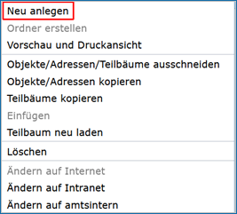

Erfassung von Adressdaten
=========================

Für eine effiziente Adressverwaltung empfiehlt es sich, hierarchische Strukturen aufzubauen, so dass erkennbar wird, in welche Fachbereiche eine Einrichtung untergliedert ist und wer die Ansprechpartner in den Fachbereichen sind. Für Personen, die keiner Institution zugeordnet werden können, besteht die Möglichkeit, diese im Adressen-Strukturbaum unterhalb des Bereiches „Freie Adressen“ anzulegen.

Abb.: Strukturbaum - Teilbaum Adressen

Zum Anlegen einer neuen Adresse muss zunächst die Adresse ausgewählt werden, unter der die neue Adresse angelegt werden soll. Dafür die entsprechende Adresse im Strukturbaum anklicken und warten, bis die Initialisierung abgeschlossen ist.

Sobald die Eingabemaske der Adresse im rechten Fenster (Inhaltsfenster) angezeigt wird, kann die neue Adresse, über das Symbol „Neu anlegen“ aus der Symbolleiste oder über das Kontextmenü (rechte Maustaste – „Neu anlegen“), erstellt werden.

Abb.: Kontextmenü - Neu anlegen

Es besteht hierbei die Wahl zwischen folgenden Adresstypen:

Abb.: Dialogfenster - Adresse anlegen

.. csv-table::
    :header: "Symbol", "Adresstypen"
    :widths: 30 400

    .. image:: .. image:: ../../img_ige/metaver_ige/ige_icons/adressen/ige/institution.png, Institution (z. B. Behörde)
	.. image:: .. image:: ../../img_ige/metaver_ige/ige_icons/adressen/ige/einheit.png, Einheit (z. B. Referat, Dezernat, Fachbereich oder Abteilung)
	.. image:: .. image:: ../../img_ige/metaver_ige/ige_icons/adressen/ige/person.png, Person

Nach Auswahl des Adresstyps erscheint die neue Adresse rechts im Inhaltsfenster. Hier sehen Sie alle verfügbaren Felder und Informationen zur ausgewählten Adresse. Diese Felder sind je nach Adresstyp unterschiedlich.
Standardmäßig werden zunächst nur die Pflichtfelder angezeigt. Neben den verpflichtenden Angaben können weitere Adressangaben (Anschrift, Aufgabenbereiche, usw.) zur Kontaktstelle sowie Schlagworte gespeichert werden. Sie öffnen diese optionalen Felder durch einen Klick auf das Symbol „Alle Felder aufklappen“ auf der rechten Seite in der Symbolleiste oder über das Symbol vor der Überschrift eines Themenabschnittes (dunkelblaue Balken).

**Hinweis:** 

*Obwohl die Adresse neu ist und gerade erst angelegt wurde, sind bestimmte Felder bereits befüllt. Diese Angaben stammen von der übergeordneten Adresse und sind als Vorschläge/Eingabehilfe zu verstehen und müssen unbedingt auf ihre Richtigkeit überprüft werden. Bitte klappen Sie daher immer alle Felder aus, um die automatisch eingefügten Daten kontrollieren zu können.*

[Grafik]

Abb.: In dieser Abbildung sind die automatisch befüllten Felder rot umrandet.

Löschen von Einträgen
---------------------

Soll ein bestehender Eintrag gelöscht werden, bitte die entsprechende Zeile mit der rechten Maustaste anklicken und den Punkt „Zeile löschen“ auswählen bzw. bei Textfeldern einfach den Eintrag markieren und löschen.

Änderung von Einträgen
----------------------

Wenn ein Eintrag geändert werden soll, klicken Sie mit der linken Maustaste in das entsprechende Feld. Ein einfacher Klick setzt den Mauszeiger an die gewählte Stelle, ein weiterer Klick markiert das Wort links vom Cursor, noch ein weiterer Klick markiert die ganze Zeile.

Veröffentlichung (Status)
-------------------------

Von besonderer Bedeutung ist das Feld „Veröffentlichung“. Wie bei Objekten kann auch bei Adressen eine Veröffentlichungsbreite eingestellt werden. Im Auswahlmenü „Veröffentlichung“ sind die Werte „amtsintern“, „Intranet“ und „Internet“ verfügbar. Nur Adressen mit der Veröffentlichungsbreite „Internet“ sind auch im MetaVer veröffentlicht.
Dabei ist zu beachten, dass eine Adresse mindestens eine gleichwertige Veröffentlichungsbreite haben muss wie ein Objekt, dem sie zugeordnet ist. Beispielsweise kann die Adresse die Veröffentlichungsbreite „Internet“ und das Objekt die Veröffentlichungsbreite „Intranet“ haben, nicht aber umgekehrt. Wenn aufgrund unterschiedlicher Veröffentlichungsbreite bei Objekt und Adresse Probleme auftreten, so wird der Nutzer darauf hingewiesen. Konflikte müssen vom Nutzer vor der Veröffentlichung der Adresse durch Anpassung der Veröffentlichungsbreite aufgelöst werden.

[Grafik]

**Hinweis:**

*Die Angabe der E-Mail-Adresse im Abschnitt „Kommunikation“ ist ein Pflichtfeld und muss stets eingetragen werden. Fehlt die E-Mail-Adresse kann der Adressdatensatz nicht abschließend gespeichert und für das Internet veröffentlicht werden. Es kommt dann zu einer Fehlermeldung.*

Daten nicht anzeigen
--------------------

Wird die Option „Daten nicht anzeigen“ ausgewählt, so wird bei der Darstellung im Portal (auch im CSW und in OpenSearch) bei allen Metadatensätzen, denen diese Adresse zugeordnet ist, stattdessen die Adresse der übergeordneten Institution verwendet.

[Grafik]

Zugeordnete Objekte
--------------------

Unter dem Abschnitt „Zugeordnete Objekte“ können keine Einträge per Hand vorgenommen werden. Hier sind alle Metadatenobjekte sichtbar, die mit dem Fachbereich bzw. der Person verknüpft sind. Beim Neuanlegen einer Adresse ist dieser Bereich noch leer. Wird jedoch in einem Objekt die Adresse als Kontaktadresse (Ansprechpartner, Hersteller, usw.) angegeben, so erscheint dieses Objekt automatisch in der Tabelle unter dem Abschnitt „Zugeordnete Objekte“.

[Grafik]

**Hinweise:**
*Eine Adresse kann immer nur dann gelöscht werden, wenn dieser Adresse keine Objekte mehr zugeordnet sind, d.h. die oben abgebildete Liste der zugeordneten Objekte muss leer sein.*

*Sind alle Pflichtfelder und die aus Nutzersicht notwendigen optionalen Felder gefüllt, kann die Adresse über das Symbol „Abschließendes Speichern & Veröffentlichen“ in der Symbolleiste für das Internet freigegeben werden.*

*Es besteht keine Verpflichtung zur Veröffentlichung von persönlichen Adressen. Die Angabe einer Institution ist ausreichend und wird empfohlen.*