Geodatendienst
==============

.. csv-table::
    :header: "Portal", "Editor"
    :widths: 30 30

    .. image:: ../../../img_ige/metaver_ige/ige_icons/objekte/portal/geodatendienst.png, .. image:: ../../../img_ige/metaver_ige/ige_icons/objekte/ige/geodatendienst.png

Ein Geodatendienst ist ein in der Regel über das Internet angebotener Dienst, mit dessen Hilfe man sich Geodaten anschauen, einbinden, bearbeiten oder abfragen kann. Geodatendienste sind Webservices, die raumbezogene Informationen verarbeiten und vom Open Geospatial Consortium (OGC) auf Basis von ISO-Normen international standardisiert wurden.

Einem Geodatendienst kann ein Geodatensatz zu geordnet werden, dieser beschreibt die Daten die im Geodatendienst enthalten sind. Einem Geodatendienst können auch mehrere Geodatensätze zugeordnet werden, diese beschreiben dann die Layer, die im Geodatendienst enthalten sind. 
Einem Geodatensatz können unterschiedliche Geodatendienste zugeordnet werden (z.B. WMS-, WFS-, Atom-Dienste), der Geodatensatz beschreibt dann die Daten, die in den Geodatendiensten enthalten sind.

Wenn ein Geodatensatz einem Geodatendienst zugeordnet wird, dann werden diese Metadatensätze miteinander gekoppelt (Datenkopplung). Das bedeutet, der Geodatensatz verweist durch eine Verlinkung auf den Geodatendienst und der Geodatendienst wiederum verweist durch eine Verlinkung auf den Geodatensatz.

`Auflistung der verschiedenen Dienstarten <https://metaver-bedienungsanleitung.readthedocs.io/de/latest/metaver_ige/ige_auswahllisten/auswahlliste_geodatendienst_dienstarten.html>`_

.. important:: Neben den Allgemeinen Metadaten, wie sie auch in den anderen Objektklassen unter `Erfassung von Objekten <https://metaver-bedienungsanleitung.readthedocs.io/de/latest/metaver_ige/ige_erfassung/erfassung-objekte.html>`_ beschrieben sind, kommen in der Objektkasse Geodatendienst folgende Metadaten dazu.

Erfassung
---------

Der getCapabilities-Assistent
^^^^^^^^^^^^^^^^^^^^^^^^^^^^^^

.. figure:: ../../../img_ige/metaver_ige/ige_erfassung/ige_objekte/ige_assistenten/ige-objekt-anlegen_assistent_1.png
   :width: 500
   

	
Abb.: Der Erfassungsassistent - Auswahl des getCapabilitie Assistenten

	
.. figure:: ../../../img_ige/metaver_ige/ige_erfassung/ige_objekte/ige_assistenten/ige-objekt-anlegen_getcapabilitie-assistent.png
	
Abb.: Der getCapabilitie Assistent

Wird ein neues Objekt erstellt, öffnet sich der Erfassungsassistent. Für ISO-konforme Geodatendienste kann der darin enthaltene getCapabilties Assistent genutzt werden. Der getCapabilties Assistent holt sich die Metadaten aus der XML des Geodatendienstes. Diese können für das Befüllen der Objektklasse Geodatendienst genutzt werden. 

Der "getCapabilities Assistent" unterstützt folgende Dienste-Typen:

 - WMS - Web Map Service
 - WMTS - Web Map Tile Service
 - WFS - Web Feature Service
 - WCS - Web Coverage Service
 - WCS-T - Web Coverage Service – Transaktion
 - CSW - Catalogue Service for the Web
 
Eine Ausnahme ist der Atom-Feed, dieser kann nicht über den GetCapabilitie Assistent abgerufen bzw. erstellt werden.

Geben Sie die getCapability-URL des Dienstes ein und betätigen Sie den Button "Erstellen". Der Assistent ruft den Dienst über die eingetragene URL ab und zeigt alle in der getCapability verfügbaren Informationen an. Der Erfasser kann dann die Metainformationen auswählen, die in ddas Objekt übernommen werden sollen.

Abschnitt Allgemeines
^^^^^^^^^^^^^^^^^^^^^

.. figure:: ../../../img_ige/metaver_ige/ige_erfassung/ige_objekte/ige_abschnitt-02_allgemeines/ige-abschnitt_allgemeines.png

INSPIRE-relevant
''''''''''''''''

.. figure:: ../../../img_ige/metaver_ige/ige_erfassung/ige_objekte/ige_abschnitt-02_allgemeines/ige-allgemeines_checkbox-inspire-relevant-dienst.png
   :width: 100

Abb.: Checkbox INSPIRE-relevant

Dieses Feld definiert (wenn aktiviert) dass ein Metadatensatz für das INSPIRE-Monitoring vorgesehen ist.

Folgende Eigenschaften ändern sich bei der Aktivierung der Checkbox:
  - Hinzufügen des Schlagwortes "inspireidentifiziert" während der ISO-XML Generierung
  - Verpflichtende Angabe eines INSPIRE-Themas im Abschnitt "Verschlagwortung"

Die als INSPIRE-relevant markierten Datensätze werden im INSPIRE GeoPortal (https://inspire-geoportal.ec.europa.eu/) veröffentlicht.

AdV kompatibel
''''''''''''''

.. figure:: ../../../img_ige/metaver_ige/ige_erfassung/ige_objekte/ige_abschnitt-02_allgemeines/ige-allgemeines_checkbox-adv-kompatibel.png
   :width: 100

Abb.: Checkbox AdV-kompatibel

Wird die Checkbox "AdV kompatibel" aktiviert, werden die Anforderungen des AdV-Metadatenprofils umgesetzt (z.B. Automatisiertes Setzen des Schlüsselwortes "AdVMIS" in der Datenbank).

Abschnitt Verschlagwortung
^^^^^^^^^^^^^^^^^^^^^^^^^^
.. figure:: ../../../img_ige/metaver_ige/ige_erfassung/ige_objekte/ige_abschnitt-03_verschlagwortung/ige-abschnitt_verschlagwortung.png

AdV Produktgruppe
'''''''''''''''''

.. figure:: ../../../img_ige/metaver_ige/ige_erfassung/ige_objekte/ige_abschnitt-03_verschlagwortung/ige-verschlagwortung_adv-produktgruppe.png

Abb.: Feld AdV Produktgruppe

`Auswahlliste AdV-Produktgruppe <https://metaver-bedienungsanleitung.readthedocs.io/de/latest/metaver_ige/ige_auswahllisten/auswahlliste_verschlagwortung_adv_produktgruppe.html>`_

Auswahl einer Produktgruppe bzw. eines Fachthemas der AdV.

.. hint::  Dieses Feld ist nur ein Pflichtfeld, wenn in das Feld "AdV kompatibel" ein Häkchen gesetzt wurde.

 
INSPIRE-Themen
''''''''''''''

.. figure:: ../../../img_ige/metaver_ige/ige_erfassung/ige_objekte/ige_abschnitt-03_verschlagwortung/ige-verschlagwortung_inspire-themen.png

Abb.: Feld - INSPIRE-Themen

`Auswahlliste INSPRE-Themen <https://metaver-bedienungsanleitung.readthedocs.io/de/latest/metaver_ige/ige_auswahllisten/auswahlliste_verschlagwortung_inspire_themen.html>`_

Auswahl eines INSPIRE Themengebiets für die Verschlagwortung des Datensatzes (INSPIRE-Pflichtfeld). Dieses Feld ist nur dann ein Pflichtfeld, wenn in das Feld "INSPIRE-relevant" ein Häkchen gesetzt wurde.

.. hint:: Bei Eintragung oder Löschen eines INSPIRE-Themas werden im Pflichtfeld "Spezifikation der Konformität" automatisch Einträge vorgenommen bzw. entfernt.

.. note:: Beispiel: Boden - automatischer Eintrag im Abschnitt "Zusatzinformation" - Feld "Konformität": "VERORDNUNG (EG) Nr. 1089/2010 - INSPIRE Durchführungsbestimmung Interoperabilität von Geodatensätzen und -diensten: konform / nicht konform"
 

.. figure:: ../../../img_ige/metaver_ige/ige_erfassung/ige_objekte/ige_abschnitt-03_verschlagwortung/ige-verschlagwortung_inspire-priority-data-set.png

Abb.: Feld - INSPIRE - priority data set

`Auswahlliste - priority data set <https://metaver-bedienungsanleitung.readthedocs.io/de/latest/metaver_ige/ige_auswahllisten/auswahlliste_verschlagwortung_inspire_priority-data-set.html>`_

"INSPIRE - priority data set" ist ein optionales Feld - "priority Data Sets" sind jene Geodatensätze, die für die Berichterstattung im Rahmen der EU-Umwelt-Richtlinien bereitgestellt werden (Berichtsdatensätze). Dazu sind je nach Betroffenheit von den Umweltberichterstattungspflichten die entsprechenden Rechtsschriften aus der Liste auszuwählen.

INSPIRE - Räumlicher Anwendungsbereich (optionales Feld)
''''''''''''''''''''''''''''''''''''''''''''''''''''''''

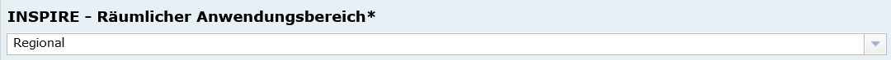

Abb.: Feld - INSPIRE-Räumlicher Anwendungsbereich

`Auswahlliste - INSPIRE-Räumlicher Anwendungsbereich <https://metaver-bedienungsanleitung.readthedocs.io/de/latest/metaver_ige/ige_auswahllisten/auswahlliste_verschlagwortung_inspire_raeumlicher-anwendungsbereich.html>`_

Das Schlagwort "Räumlicher Anwendungsbereich" wird im Rahmen des INSPIRE-Monitorings verwendet, um die flächenmäßige Abdeckung der INSPIRE-relevanten Geodatensätze auszuwerten. INSPIRE-relevante Geodatensätze müssen aus den zur Auswahl stehenden Werten entweder mit "National", "Regional" oder "Lokal" beschrieben werden.

Abschnitt Fachbezug
^^^^^^^^^^^^^^^^^^^

.. figure:: ../../../img_ige/metaver_ige/ige_erfassung/ige_objekte/ige_abschnitt-04_fachbezug/ige-abschnitt_fachbezug.png

Klassifikation des Dienstes
'''''''''''''''''''''''''''

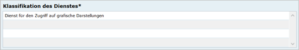

Abb.: Feld - Klassifikation des Dienstes

`Auswahlliste - Klassifikation des Dienstes <https://metaver-bedienungsanleitung.readthedocs.io/de/latest/metaver_ige/ige_auswahllisten/auswahlliste_geodatendienst_klassifikation.html>`_

Aus der vorgegebenen Auswahlliste ist der Eintrag zu wählen, der auf den Dienst zutrifft. Bei WebMapDiensten (WMS) kann beispielsweise „Dienst für den Zugriff auf grafische Darstellungen ausgewählt werden. Dieses Feld dient in erster Linie der Identifikation eines Dienstes durch den recherchierenden Nutzer. 

Art des Dienstes
''''''''''''''''

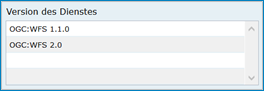

Abb.: Feld - Art des Dienstes

`Auswahlliste - Art des Dienstes <https://metaver-bedienungsanleitung.readthedocs.io/de/latest/metaver_ige/ige_auswahllisten/auswahlliste_fachbezug_geodatendienst_art.html>`_

In diesem Pflichtfeld kann die Art des Dienstes ausgewählt werden. Über das Feld werden die zur weiteren Befüllung auszuwählenden Angaben zu Operationen gesteuert (siehe Tabelle unter Punkt: Name der Operation).

Bei Eintragungen bzw. Änderungen dieses Feldes werden in der Tabelle Konformität die Einträge für die zugehörige Spezifikation automatisch gesetzt (gilt nicht für alle Dienstarten).

Beispiel: Darstellungsdienst (automatischer Eintrag in Konformität/Spezifikation: "Technical Guidance for the implementation of INSPIRE View Services")

.. hint:: Die Auswahl der Dienstart hat Auswirkungen auf das Feld Konformität. Je nach gewählter Art des Dienstes wird das Feld Konformität schon vorbelegt.

Als ATOM-Download Dienst bereitstellen
''''''''''''''''''''''''''''''''''''''

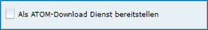

Abb.: Checkbox - Als ATOM-Download Dienst bereitstellen 

Bei aktivierter Option, wird dieser Datensatz im Portal als Download angeboten. Zusätzlich wird die in den Katalogeinstellungen hinterlegte "ATOM-Downloadservice-URL" automatisch in das ISO-Format unter "distributionInfo/*/linkage" abgebildet.

`Ausführliche Beschreibung - Bereitstellung als ATOM-Download Dienst <https://metaver-bedienungsanleitung.readthedocs.io/de/latest/metaver_ige/ige_erfassung/ige_objektklassen/atom-feed/bereitstellung.html>`_

Der ATOM-Feed Client
''''''''''''''''''''

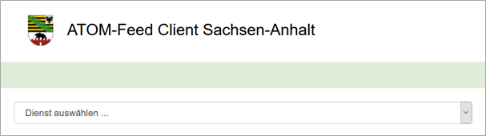

Abb.: ATOM-Feed Client

`Beschreibung des Atom-Feed Clients <https://metaver-bedienungsanleitung.readthedocs.io/de/latest/metaver_ige/ige_erfassung/ige_objektklassen/atom-feed/client.html>`_

Version des Dienstes
''''''''''''''''''''

Abb.: Feld - Version des Dienstes

`Auswahlliste - Version des Dienstes <https://metaver-bedienungsanleitung.readthedocs.io/de/latest/metaver_ige/ige_auswahllisten/auswahlliste_fachbezug_geodatendienst_version.html>`_

Angaben zu Version der dem Dienst zugrunde liegenden Spezifikation. Bitte alle Versionen eintragen, die vom Dienst unterstützt werden.

Beispiel: OGC: WMS 1.3.0

Operationen
'''''''''''

Erfassung der Dienste URL.

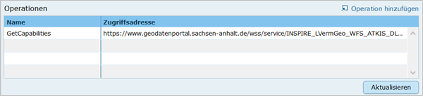

Abb.: Feld - Operationen

`Hier werden die Operationen ausführlich beschrieben. <https://metaver-bedienungsanleitung.readthedocs.io/de/latest/metaver_ige/ige_erfassung/ige_objektklassen/operationen/operationen_beschreibung.html>`_

Erstellungsmaßstab
''''''''''''''''''

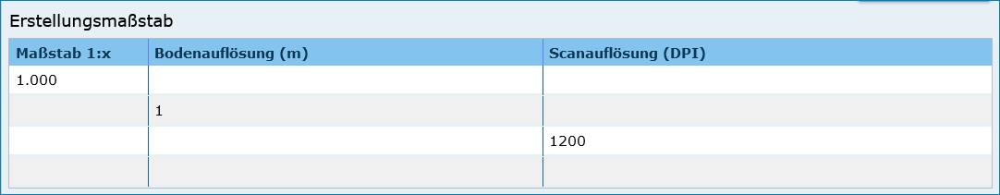

Abb.: Erstellungsmaßstab

Angabe des Erstellungsmaßstabes, der sich auf die erstellte Karte und/oder Digitalisiergrundlage bei Geodaten bezieht. Maßstab: Maßstab der Karte, z.B 1:12 Bodenauflösung: Einheit geteilt durch Auflösung multipliziert mit dem Maßstab (Angabe in Meter, Fließkommazahl) Scanauflösung: Auflösung z.B. einer eingescannten Karte, z.B. 120dpi (Angabe in dpi, Integerzahl). Es handelt sich um ein optionales INSPIRE-Feld.

Beispiel: Bodenauflösung: Auflösungseinheit in Linien/cm; Einheit: z.B. 1 cm geteilt durch 400 Linien multipliziert mit dem Maßstab 1:25.000 ergibt 62,5 cm als Bodenauflösung

Systemumgebung
''''''''''''''

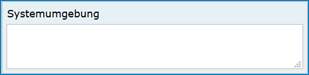

Abb.: Erstellungsmaßstab

Angaben zum Betriebssystem und der Software, ggf. auch Hardware, die zur Implementierung des Dienstes eingesetzt wird.

Historie
''''''''

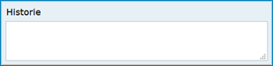

Abb.: Historie

Angaben zur Implementierungsgeschichte des Dienstes.

Beispiel: 11.12.03: Installation des UMN Mapserver 3.0 auf Linux 2.2.005.04.04: Upgrade Linux 2.2.0 auf Linux 2.6.0 Modellversuch beim Gewerbeaufsichtsamt Osnabrück 1991; Einführung 1993

Erläuterungen
'''''''''''''

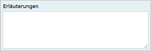

Abb.: Erläuterungen

Zusätzliche Anmerkungen zu dem beschriebenen Dienst. Hier können weitergehende Angaben z. B. technischer Art gemacht werden, die zum Verständnis des Dienstes notwendig sind.

.. note:: Beispiel: Der Datensatz ist eine Shape-Datei, die alle Grundwassermessstellen in Sachsen-Anhalt mit Lage und Kennung beinhaltet.

Daten-Dienstekopplung
'''''''''''''''''''''

.. figure:: ../../../img_ige/metaver_ige/ige_erfassung/ige_objekte/ige_objektklassen/objektklasse_geodatendienst/fachbezug/datenkopplung/fachbezug_daten-dienstekopplung.png

Abb.: Daten-Dienstekopplung

`Datenkopplung im Geodatensatz <https://metaver-bedienungsanleitung.readthedocs.io/de/latest/metaver_ige/ige_erfassung/ige_objektklassen/objektklasse-geodatensatz.html#darstellender-dienst>`_

Dargestellte Daten
''''''''''''''''''

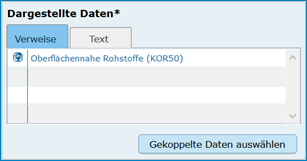

Abb.: Dargestellte Daten

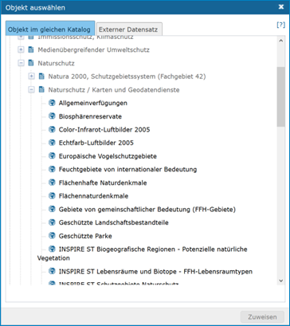

Abb.: Gekoppelte Daten auswählen

Das Metadatenfeld „Dargestellte Daten“ bzw. „Gekoppelte Daten auswählen“ ist für den Objekttyp „Geodatendienst“ von besonderer Bedeutung. Ziel ist es, hier alle Metadatensätze zu Geodaten aufzulisten, die Bestandteil des Geodatendienstes sind. Auf diese Weise erfolgt eine Kopplung der Daten und Dienste und dieses wiederum hat den nutzerfreundlichen Vorteil, dass sich der User gefundene Daten sofort über einen Link (im Datensatz) im Kartenviewer ansehen kann (siehe Daten-Dienste-Kopplung).

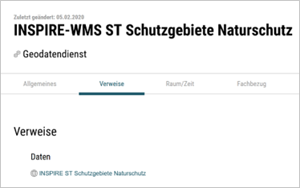

Abb.: Datenkopplung in der Portalansicht

 
Datenkopplung
'''''''''''''

.. figure:: ../../../img_ige/metaver_ige/ige_erfassung/ige_objekte/ige_objektklassen/objektklasse_geodatendienst/fachbezug/datenkopplung/fachbezug_datenkopplung.png

Abb.: Datenkopplung

Zum Eintragen von verknüpften Daten kann nun unterhalb der Tabelle auf den Button „Gekoppelte Daten auswählen“ geklickt werden. In dem daraufhin erscheinenden Dialog aus dem Hierarchiebaum bitte den Datensatz auswählen, der mit dem Dienst gekoppelt werden soll.

Mit einem Klick auf den Button „Zuweisen“ wird die gekoppelte Datensatz beim Dienst-Objekt eingetragen. Zeitgleich erhält der Datensatz automatisch einen Eintrag zum gekoppelten Dienst (Feld: "Darstellender Dienst"). 

Kopplungstyp
''''''''''''

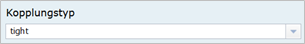

Abb.: Kopplungstyp

Die Art der Kopplung vom Dienst (Service) zu den Daten. Der Typ "tight" bewirkt, dass ein Verweis zu einem Datensatz existieren muss.

Mögliche Kopplungstypen: loose, mixed, tight

Katalog-übergreifende Daten-Dienste-Kopplung
''''''''''''''''''''''''''''''''''''''''''''

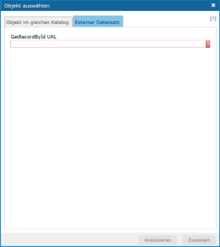

Abb.: Daten-Dienste-Kopplung

Daten eines externen Metadatenkatalogs können mit Diensten der Objektklasse "Geodatendienst" gekoppelt werden. Die Kopplung ist bislang jedoch nur mit Datensätzen möglich, bei denen die Daten über einen Verweis vom Typ Datendownload zum Download bereitgestellt werden.

 
Die Kopplung wird für den Geodatendienst im InGrid-Editor in der Rubrik Fachbezug unter dem Punkt Dargestellte Daten eingetragen.

 
Nach einem Klick auf den Button „Gekoppelte Daten auswählen“ öffnet sich ein Dialogfenster. Liegt der Datensatz, mit dem der Dienst gekoppelt werden soll, in einem externen Metadatenkatalog vor, so ist die zweite Registerkarte „Externer Datensatz“ auszuwählen.

Im Feld "GetRecordById URL" muss der GetRecordById-Request zum Aufruf des externen Datensatzes (XML-Dokument) angegeben werden.

Beispiel für GetRecordById-Requests: https://www.host.de/csw?request=getrecordbyid&service=csw&version=2.0.2&id=fd218f68-d2b4-11d5-88c8-000102dccf41&elementsetname=full

Über die Angabe dieses Requests wird die katalogübergreifende Daten-Dienste-Kopplung ermöglicht. Nach Eingabe der URL und Klick auf „Analysieren“ erfolgt eine Auswertung des XML-Dokumentes. Mit dem Button „Zuweisen“ wird der externe Datensatz mit dem Dienst gekoppelt.

Abb.: Detailansicht einer erfolgreichen Daten-Dienste-Kopplung im Portal am Beispiel des INSPIRE.WMS ST Schutzgebite Naturschutz.

Zugang geschützt
''''''''''''''''

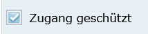

Abb.: Zugang geschützt

Das Kontrollkästchen  Zugang geschützt soll aktiviert werden, wenn der Zugang zu dem Dienst z.B. durch ein Passwort geschützt ist. Bei aktiviertem Kontrollkästchen wird kein direkter Link ( Zeige Karte) aus dem Portal zu dem Dienst generiert.

Abschnitt Zusatzinformation
^^^^^^^^^^^^^^^^^^^^^^^^^^

Konformität
'''''''''''

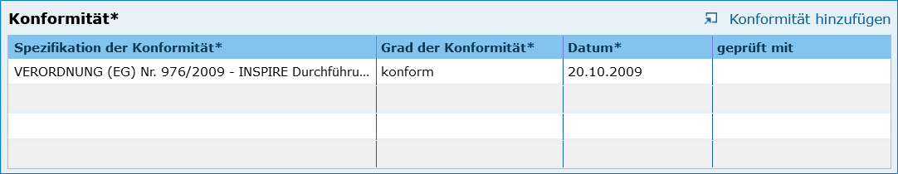

Abb.: Konformität

Hier muss angegeben werden, zu welcher Durchführungsbestimmung der INSPIRE-Richtlinie bzw. zu welcher anderweitigen Spezifikation die beschriebenen Daten konform sind. (INSPIRE-Pflichtfeld)

Dieses Feld wird bei der Auswahl der "INSPIRE-Themen" oder der "Art des Dienstes" automatisch befüllt. Es muss dann nur der Grad der Konformität manuell eingetragen werden.

.. important:: Bitte entsprechend den Empfehlungen des AdV-Metadatenprofils nur die Werte "konform" und "nicht konform" im Feld "Grad der Konformität" verwenden. Für alle nicht INSPIRE-Objekte, sollte hier die „INSPIRE-Richtlinie“ mit dem Wert „nicht evaluiert“ ausgewählt werden.

.. hint:: Die Abschnitte Raumbezugsystem, Zeitbezug, Zusatzinformation, Verfügbarkeit und Verweise sind ausführlich unter `Erfassung von Objekten <https://metaver-bedienungsanleitung.readthedocs.io/de/latest/metaver_ige/ige_erfassung/erfassung-objekte.html>`_  beschrieben, da sie auf mehrere Metadatentypen zutreffen.

