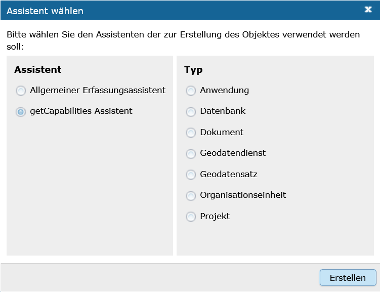
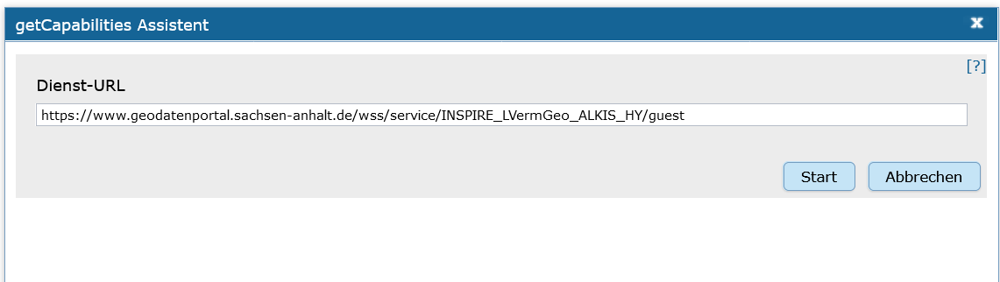
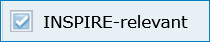
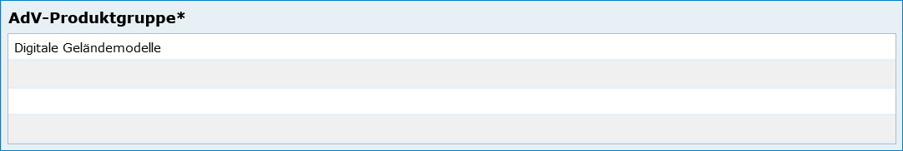
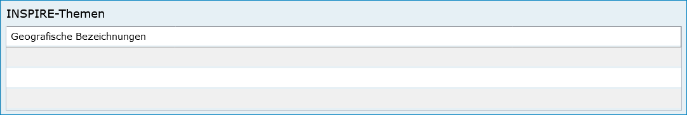
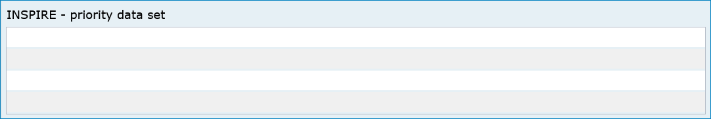

Geodatendienst
==============

.. csv-table::
    :header: "Portal", "Editor"
    :widths: 30 30

	.. image:: ../../../img_ige/metaver_ige/ige_icons/objekte/portal/geodatendienst.png, .. image:: ../../../img_ige/metaver_ige/ige_icons/objekte/ige/geodatendienst.png

Ein Geodatendienst ist ein in der Regel über das Internet angebotener Dienst, mit dessen Hilfe man sich Geodaten anschauen, einbinden, bearbeiten oder abfragen kann. Geodatendienste sind Webservices, die raumbezogene Informationen verarbeiten und vom Open Geospatial Consortium (OGC) auf Basis von ISO-Normen international standardisiert wurden.

Einem Geodatendienst kann ein Geodatensatz zu geordnet werden, dieser beschreibt die Daten die im Geodatendienst enthalten sind. Einem Geodatendienst können auch mehrere Geodatensätze zugeordnet werden, diese beschreiben dann die Layer, die im Geodatendienst enthalten sind. 
Einem Geodatensatz können unterschiedliche Geodatendienste zugeordnet werden (z.B. WMS-, WFS-, Atom-Dienste), der Geodatensatz beschreibt dann die Daten, die in den Geodatendiensten enthalten sind.

Wenn ein Geodatensatz einem Geodatendienst zugeordnet wird, dann werden diese Metadatensätze miteinander gekoppelt (Datenkopplung). Das bedeutet,der Geodatensatz verweist durch eine Verlinkung auf den Geodatendienst, der Geodatendienst wiederum verweist durch eine Verlinkung auf den Geodatensatz.

Zu den Geodatendiensten zählen:

Darstellungsdienste
'''''''''''''''''''

 - WMS - Web Map Service (Server kann angeforderte Karten aus Rasterdaten oder Vektordaten visualisieren.)
   
 - WMTS - Web Map Tile Service (Webservice, um digitale Karten kachelbasiert anbieten und abrufen zu können.)

Downloaddienste
''''''''''''''''

 - WFS - Web Feature Service (Internet-gestützter Zugriff auf Geodaten (Vektordaten).)

 - WCS - Web Coverage Service (Der WCS stellt verfügbare Daten mit detaillierten Beschreibungen (Metadaten) bereit und definiert eine reiche Syntax für Anfragen auf diese Daten und Metadaten. Er liefert multidimensionale Daten zurück.)

 - WCS-T - Web Coverage Service – Transaktion (Definiert, wie neue Coverages (Vektordatenformate) auf einen Server geladen werden können bzw. bereits vorhandene Coverages geändert werden können.)

 - Atom-Feed - Web-Feeds im XML-Format

Katalogdienst
'''''''''''''

 - CSW - Catalogue Service for the Web (Internet-gestützte Veröffentlichung von Informationen über Geoanwendungen, Geodienste und Geodaten (Metadaten) in einer Geodateninfrastruktur.)

**Neben den Allgemeinen Metadaten, wie sie auch in den anderen Objektklassen unter** `Erfassung von Objekten <https://metaver-bedienungsanleitung.readthedocs.io/de/latest/metaver_ige/ige_erfassung/erfassung-objekte.html>`_ **beschrieben sind, kommen in der Objektkasse Geodatendienst folgende Metadaten dazu.**

Erfassung
---------

Der getCapabilities-Assistent
^^^^^^^^^^^^^^^^^^^^^^^^^^^^^^

   

	
Abb.: Der Erfassungsassistent - Auswahl des getCapabilitie Assistenten

	

	
Abb.: Der getCapabilitie Assistent

Wird ein neues Objekt erstellt, öffnet sich der Erfassungsassistent. Für ISO-konforme Geodatendienste kann der darin enthaltene getCapabilties Assistent genutzt werden. Der getCapabilties Assistent holt sich die Metadaten aus der XML des Geodatendienstes. Diese können für das Befüllen der Objektklasse Geodatendienst genutzt werden. 

Der "getCapabilities Assistent" unterstützt folgende Dienste-Typen:

 - WMS - Web Map Service
 - WMTS - Web Map Tile Service
 - WFS - Web Feature Service
 - WCS - Web Coverage Service
 - WCS-T - Web Coverage Service – Transaktion
 - CSW - Catalogue Service for the Web
 
Eine Ausnahme ist der Atom-Feed, dieser kann nicht über den GetCapabilitie Assistent abgerufen bzw. erstellt werden.

Geben Sie die getCapability-URL des Dienstes ein und betätigen Sie den Button "Erstellen". Der Assistent ruft den Dienst über die eingetragene URL ab und zeigt alle in der getCapability verfügbaren Informationen an. Der Erfasser kann dann die Metainformationen auswählen, die in ddas Objekt übernommen werden sollen.

Abschnitt Allgemeines
---------------------

.. image:: ../../../img_ige/metaver_ige/ige_erfassung/ige_objekte/ige_abschnitt-02_allgemeines/ige-abschnitt_allgemeines.png

INSPIRE-relevant
''''''''''''''''

Abb.: Checkbox INSPIRE-relevant

Dieses Feld definiert (wenn aktiviert) dass ein Metadatensatz für das INSPIRE-Monitoring vorgesehen ist.

Folgende Eigenschaften ändern sich bei der Aktivierung der Checkbox:
  - Hinzufügen des Schlagwortes "inspireidentifiziert" während der ISO-XML Generierung
  - Verpflichtende Angabe eines INSPIRE-Themas im Abschnitt "Verschlagwortung"

Die als INSPIRE-relevant markierten Datensätze werden im INSPIRE GeoPortal (https://inspire-geoportal.ec.europa.eu/) veröffentlicht.

AdV kompatibel
''''''''''''''

.. image:: ../../../img_ige/metaver_ige/ige_erfassung/ige_objekte/ige_abschnitt-02_allgemeines/ige-allgemeines_checkbox-adv-kompatibel.png

Abb.: Checkbox INSPIRE-relevant

Wird die Checkbox "AdV kompatibel" aktiviert, werden die Anforderungen des AdV-Metadatenprofils umgesetzt (z.B. Automatisiertes Setzen des Schlüsselwortes "AdVMIS" in der Datenbank).

Abschnitt Verschlagwortung
^^^^^^^^^^^^^^^^^^^^^^^^^^

AdV Produktgruppe
'''''''''''''''''

Abb.: `Auswahlliste AdV-Produktgruppe <https://metaver-bedienungsanleitung.readthedocs.io/de/latest/metaver_ige/ige_auswahllisten/auswahlliste_verschlagwortung_adv_produktgruppe.html>`_

Auswahl einer Produktgruppe bzw. eines Fachthemas der AdV.

**Hinweis:**
*Dieses Feld ist nur ein Pflichtfeld, wenn in das Feld "AdV kompatibel" ein Häkchen gesetzt wurde.*

 
INSPIRE-Themen
''''''''''''''

Auswahl eines INSPIRE Themengebiets für die Verschlagwortung des Datensatzes (INSPIRE-Pflichtfeld).

Bei Eintragung oder Löschen eines INSPIRE-Themas werden im Pflichtfeld Spezifikation der Konformität automatisch Einträge vorgenommen bzw. entfernt.

**Beispiel: Boden**
*(automatischer Eintrag im Abschnitt "Zusatzinformation", Feld: "Konformität": "VERORDNUNG (EG) Nr. 1089/2010 - INSPIRE Durchführungsbestimmung Interoperabilität von Geodatensätzen und -diensten: konform / nicht konform")*

**Achtung!**
*Dieses Feld ist nur ein Pflichtfeld, wenn in das Feld "INSPIRE-relevant" ein Häkchen gesetzt wurde.*
 

Abb.: `Auswahlliste INSPRE-Themen <https://metaver-bedienungsanleitung.readthedocs.io/de/latest/metaver_ige/ige_auswahllisten/auswahlliste_verschlagwortung_inspire_themen.html>`_

 
INSPIRE - priority data set (optionales Feld)
Priority Data Sets sind jene Geodatensätze, die für die Berichterstattung im Rahmen der EU-Umwelt-Richtlinien bereitgestellt werden (Berichtsdatensätze). Dazu ist je nach Betroffenheit von den Umweltberichterstattungspflichten die entsprechende/-n Rechtsschrift/-en aus der Liste auszuwählen.

Abb.: `Auswahlliste - priority data set <https://metaver-bedienungsanleitung.readthedocs.io/de/latest/metaver_ige/ige_auswahllisten/auswahlliste_verschlagwortung_inspire_priority-data-set.html>`_

INSPIRE - Räumlicher Anwendungsbereich (optionales Feld)
'''''''''''''''''''''''''''''''''''''''''''''''''''''''''

Das Schlagwort "Räumlicher Anwendungsbereich" wird im Rahmen des INSPIRE-Monitorings verwendet, um die flächenmäßige Abdeckung der INSPIRE-relevanten Geodatensätze auszuwerten. INSPIRE-relevante Geodatensätze müssen aus den zur Auswahl stehenden Werten entweder mit "National", "Regional" oder "Lokal" beschrieben werden.

.. image:: ../../../img_ige/metaver_ige/ige_erfassung/ige_erfassung/ige_objekte/ige_abschnitt-03_verschlagwortung/ige-verschlagwortung_inspire-raeumlicher-anwendungsbereich.png

Abb.: `Auswahlliste - INSPIRE-Räumlicher Anwendungsbereich<https://metaver-bedienungsanleitung.readthedocs.io/de/latest/metaver_ige/ige_auswahllisten/auswahlliste_verschlagwortung_inspire_raeumlicher-anwendungsbereich.html>`_

Abschnitt Fachbezug
^^^^^^^^^^^^^^^^^^^

.. image:: ../../../img_ige/metaver_ige/ige_erfassung/ige_objekte/ige_abschnitt-04_fachbezug/ige-abschnitt_fachbezug.png

Klassifikation des Dienstes
'''''''''''''''''''''''''''

Aus der vorgegebenen Auswahlliste ist der Eintrag zu wählen, der auf den Dienst zutrifft. Bei WebMapDiensten (WMS) kann beispielsweise „Dienst für den Zugriff auf grafische Darstellungen ausgewählt werden. Dieses Feld dient in erster Linie der Identifikation eines Dienstes durch den recherchierenden Nutzer. 

Auswahlliste Klassifikation des Dienstes

  - Abonnementdienst
  - Analysedienst für räumliche Nachbarschaftsbeziehungen
  - Analysedienst für zeitbezogene Nachbarschaftsbeziehungen
  - Auflösungsreduzierungsdienst
  - Aufrufprogramm für Bearbeitungsketten
  - Auftragsdienst
  - Auszugsdienste für geografische Informationen
  - Berechnungsdienst für Geoparameter
  - Betrachter für geografische Datenstrukturen
  - Bildbearbeitungsdienste
  - Bildsynthesedienste
  - Codierungsdienst
  - Dauerauftragsdienst
  - Dienst für den Zugriff auf externe Daten und Programme (Atom)
  - Dienst für den Zugriff auf grafische Darstellungen (WMS)
  - Dienst für den Zugriff auf Objektarten (Atom)
  - Dienst für den Zugriff auf Objekte (WFS)
  - Dienst für den Zugriff auf Produkte
  - Dienst für den Zugriff auf Rasterdaten
  - Dienst für die Ausführung von Bearbeitungsketten
  - Dienst für die Beschreibung von Sensoren
  - Dienst für die Definition von Bearbeitungsketten
  - Dienst für die Justierung von Geometriemodellen von Sensoren
  - Dienst für die Konversion von Bildkoordinaten
  - Dienst für die Konversion von Geometriemodellen
  - Dienst für die Konversion von Koordinaten
  - Dienst für die thematische Klassifizierung
  - Dienst für die Transformation von Koordinaten
  - Dienst für die Umwandlung zwischen Raster- und Vektordaten	 - Dienst für geografische Tabellenkalkulation
  - Dienst für geografische Visualisierung
  - Dienst für statistische Berechnungen
  - Editor für die Definition von Bearbeitungsketten
  - Editor für die Objektgeneralisierung
  - Editor für geografische Objekte
  - Editor für geografische Symbole
  - Editor für Verarbeitungsdienste
  - Entzerrungsdienst
  - Ergänzungsdienste für Geodaten
  - Erkennungsdienst für Veränderungen
  - Gazetteerdienst
  - Generalisierungsdienst
  - Generalisierungsdienst für Objektarten
  - Geocodierungsdienst
  - Geografischer Ausschnittsdienst
  - Geoparserdienst
  - Interpretationsdienste für Bilder
  - Kachelungsdienst
  - Katalogdienst (Service)
  - Katalogdienst (Viewer)
  - Kompressionsdienst für Geodaten
  - Messungsdienst
  - Multiband-Bildbearbeitung
  - Nachrichtenübermittlungsdienst
  - Objektbearbeitungsdienste
  - Objekterkennungsdienst
  - Ortho-Entzerrungsdienst
  - Positionierungsdienst
  - Raumbezogener Auswahldienst
  - Registerdienst
  - Routensuchdienst
  - Themenbezogener Ausschnittsdienst
  - Themenbezogener Bildverarbeitungsdienst
  - Transformationsdienst für den Zeitbezug
  - Übertragungsdienst
  - Umformatierungsdienst für Geodaten
  - Vergleichsdienst
  - Zähldienst
  - Zeitbezogener Ausschnittsdienst
  - Zeitbezogener Auswahldienst

 

Art des Dienstes
''''''''''''''''

Über das Dropdownmenü kann zwischen folgenden Dienstarten gewählt werden: 

Auswahlliste Art des Dienstes

  - Darstellungsdienste (WMS) 
  - Dienste zum Abrufen von Geodatendiensten 
  - Download-Dienste (WFS/Atom)  	 - Sonstige Dienste 
  - Suchdienste 
  - Transformationsdienste

In diesem Pflichtfeld kann die Art des Dienstes ausgewählt werden. Über das Feld werden die zur weiteren Befüllung auszuwählenden Angaben zu Operationen gesteuert (siehe Tabelle unter Punkt: Name der Operation).

Bei Eintragungen bzw. Änderungen dieses Feldes werden in der Tabelle Konformität die Einträge für die zugehörige Spezifikation automatisch gesetzt (gilt nicht für alle Dienstarten).

**Beispiel:**
*Darstellungsdienst (automatischer Eintrag "Technical Guidance for the implementation of INSPIRE View Services" in Konformität/Spezifikation)*

Die Auswahl der Dienstart hat Auswirkungen auf das Feld Konformität. Je nach gewählter Art des Dienstes wird das Feld Konformität schon vorbelegt. 

Als ATOM-Download Dienst bereitstellen
'''''''''''''''''''''''''''''''''''''''

Bei aktivierter Option, wird dieser Datensatz im Portal als Download angeboten. Zusätzlich wird die in den Katalogeinstellungen hinterlegte "ATOM-Downloadservice-URL" automatisch in das ISO-Format unter "distributionInfo/*/linkage" abgebildet.
 
**Hinweis:**
*Bei ATOM-Download Diensten, die im Rahmen von INSPIRE bereitgestellt und nicht über den InGrid Editor generiert werden, ist für das Feld "Name der Operation" -  "Get Download Service Metadata" auszuwählen.*

Auswahllisten:
	
Darstellungsdienste

  - OGC:WMS 1.1.1
  - OGC:WMS 1.3.0
  - OGC:WMTS 1.0.0	

Downloaddienste	

  - OGC:WFS 1.1.0
  - OGC:WFS 2.0
  - predefined ATOM	

Suchdienste

  - OGC:CSW 2.0.2

Transformationsdienste

  - OGC:CSW 2.0.2

Version des Dienstes
''''''''''''''''''''

Angaben zu Version der dem Dienst zugrunde liegenden Spezifikation.
Bitte alle Versionen eintragen, die vom Dienst unterstützt werden.

**Beispiel:** *"OGC:WMS 1.3.0"*

Operationen
'''''''''''

Angabe von Operationen bezüglich Webdiensten wie GetMap, GetCapabilities und getFeatureInfo. Neue Operationen können entweder über den GetCapabilities-Assistenten beim Neuanlegen des Objektes eingetragen werden, oder aber manuell über den Link "Operation hinzufügen". 

 
Operation bearbeiten
'''''''''''''''''''''

Bestehende Operation können bearbeitet werden, indem der entsprechende Eintrag in der Liste mit der rechten Maustaste angeklickt und die Funktion „Zeile bearbeiten“ aus dem Kontextmenü ausgewählt wird. (rechte Maustaste). Es öffnet sich ein separater Dialog mit folgenden Feldern.

Name der Operation
'''''''''''''''''''

Name der von einem Dienst bereitgestellten Funktion/Operation. Hier muss ein eindeutiger Bezeichner für die beschriebene Operation eingegeben werden.

Art des Dienstes	Name der Operation

  - Darstellungsdienste	 - GetCapabilities (WMS)
  - GetFeatureInfo (WMS)
  - GetMap (WMS)
  - Dienste zum Abrufen von Geodatendiensten	
  - Download-Dienste	 - DescripeFeatureType (WFS)
  - GetDownloadMetadata (Atom)
  - GetCapabilities (WFS)
  - GetFeature (WFS)
  - LockFeature
  - Transaction
  - Sonstige Dienste	
  - Suchdienste	 - DescribeRecord
  - GetCapabilities
  - GetDomain
  - GetRecordById
  - GetRecords
  - Harvest
  - Transaction
  - Transformationsdienste	 - GetCapabilities
  - GetRecourceById
  - GetTransformation	
  - IsTransformable
  - Transform

Zugriffsadresse
'''''''''''''''

Eindeutige URL über die die Operation aufgerufen werden kann.

**Beispiel:** https://my.host.com/cgi-bin/mapserv?map=mywms.map&

Unterstützte Plattformen
''''''''''''''''''''''''

Angaben zur Art der Plattform bzw. Schnittstelle über die der Dienst angesprochen werden kann.

Auswahlliste Unterstützte Plattformen
  - COM
  - CORBA
  - HTTPGet
  - HTTPPost
  - JAVA	 - SOAP
  - SQL
  - WebServices (WMS, WFS, Atom)
  - XML

**Beispiel:** *HTTPGet oder WebServices (WMS, WFS, Atom)*

Parameter
'''''''''

Mögliche Parameter, die bei einem Aufruf der Operation übergeben werden können:

  - Parametername und gegebenenfalls Zuweisung eines Wertes (in der Form Name=Wert, siehe Beispiel unten)
  - Richtung des Datenflusses, der durch diesen Parameter erzeugt wird.
  - Textliche Beschreibung des Parameters.
  - Optionalität: Angabe, ob der Parameter angegeben werden muss oder nicht.
  - Angabe, ob eine Mehrfacheingabe des Parameters möglich ist.

**Beispiel:**

Name: REQUEST=GetCapabilities
Richtung:
Beschreibung: Name of request
Optional: Nein
Mehrfacheingabe: Nein

GetCapabilities-Request-Parameter weglassen
'''''''''''''''''''''''''''''''''''''''''''

Der GetCapabilities-Assistent füllt für Objekte des Typs Geodatendienst u.a. auch die Tabelle „Operationen“ aus. Die Zugriffsadresse endet mit: „?“. 
Dies ist eine Forderung der ISO. 

Die Request-Parameter (z.B. REQUEST=GetCapabilities&SERVICE=WMS) sollen daher auch nicht manuell nachgetragen werden. Für die Darstellung in der Detailansicht im Portal werden die Parameter automatisch an die Zugriffsadresse angehängt - auch für gekoppelte Daten.

Sollten die Parameter noch in Geodatendiensten, Tabelle "Operationen" vorhanden sein, so sind diese zu löschen. Streng genommen sind die Objekte, bei denen die Parameter in der Zugriffsadresse enthalten sind, nicht ISO-konform.

Aufruf
''''''

Eindeutiger Funktionsname über den die Operation aufgerufen werden kann. Bei OGC Web-Diensten sind die jeweiligen spezifizierten REQUEST-Aufrufe zu verwenden.

**Beispiel:** *GetMap oder GetCapabilities oder GetFeatureInfo*

Beschreibung
''''''''''''

Textliche Beschreibung der Funktionalität der Operation.

 
**Beispiel:** *Die GetMap Operation des WMS gibt eine Raster-Repräsentation der in "Basisdaten" beschriebenen digitalen Karte zurück.*

Abhängigkeiten
'''''''''''''''

Die Namen der Operationen, die vor dem Ausführen der aktuellen Operation ausgeführt werden müssen, wenn die Operation als Teil einer Service Chain genutzt werden soll.

**Beispiel:** *Die Operation "GetMap" ist abhängig von der Operation "GetCapabilities".*

Durch das Anklicken der Schaltfläche "Hinzufügen" übernehmen Sie die geänderten Daten in die Tabelle "Operationen". Zum Löschen einer Operation aus der Tabelle wählen Sie die Funktion "Zeile Löschen" aus dem Kontextmenü (rechte Maustaste). 

Aktualisieren von Operationen und Metadaten
'''''''''''''''''''''''''''''''''''''''''''

Unter der Tabelle Operationen befindet sich der Button "Aktualisieren". 
Dieser bewirkt, dass die Informationen in dem Metadatenobjekt aus dem Capabilities-Dokument des Dienstes auf den neuesten Stand gebracht werden. Die Aktualisierung erfolgt genau wie die Initialisierung eines neuen Objektes mit dem GetCapabilities-Assistenten. 

**Achtung:** *Alle im Assistenten ausgewählten Felder werden bei der Aktualisierung ohne Ausnahme überschrieben. Wenn im Vorfeld an einem der im Folgenden genannten Felder manuell Änderungen hinzugefügt wurden, so gehen diese verloren und müssen gegebenenfalls neu eingetragen werden!*

**Hinweis:** *Eine Aktualisierung über den Assistenten ist nur möglich, wenn der Dienst nicht geschützt ist.
Sollen nur die Operationen aktualisiert werden, dürfen keine Metadaten im GetCapabilities-Assistenten ausgewählt werden!*
 
 
[Grafik]
 
Abb.: Dieser Hinweis kann bei der Aktualisierung einer Operation erscheinen.

Erstellungsmaßstab
''''''''''''''''''

Angabe des Erstellungsmaßstabes, der sich auf die erstellte Karte und/oder Digitalisiergrundlage bei Geodaten bezieht. Maßstab: Maßstab der Karte, z.B 1:12 Bodenauflösung: Einheit geteilt durch Auflösung multipliziert mit dem Maßstab (Angabe in Meter, Fließkommazahl) Scanauflösung: Auflösung z.B. einer eingescannten Karte, z.B. 120dpi (Angabe in dpi, Integerzahl). Es handelt sich um ein optionales INSPIRE-Feld.

**Beispiel:**
*Bodenauflösung: Auflösungseinheit in Linien/cm; Einheit: z.B. 1 cm geteilt durch 400 Linien multipliziert mit dem Maßstab 1:25.000 ergibt 62,5 cm als Bodenauflösung*

Systemumgebung
'''''''''''''''
Angaben zum Betriebssystem und der Software, ggf. auch Hardware, die zur Implementierung des Dienstes eingesetzt wird.

Historie
''''''''
Angaben zur Implementierungsgeschichte des Dienstes.

**Beispiel:** *11.12.03: Installation des UMN Mapserver 3.0 auf Linux 2.2.005.04.04: Upgrade Linux 2.2.0 auf Linux 2.6.0 Modellversuch beim Gewerbeaufsichtsamt Osnabrück 1991; Einführung 1993*

Erläuterungen
'''''''''''''

Zusätzliche Anmerkungen zu dem beschriebenen Dienst. Hier können weitergehende Angaben z. B. technischer Art gemacht werden, die zum Verständnis des Dienstes notwendig sind.

Beispiel: Der Datensatz ist eine Shape-Datei, die alle Grundwassermessstellen in Sachsen-Anhalt mit Lage und Kennung beinhaltet.

Daten-Dienstekopplung
'''''''''''''''''''''

Dargestellte Daten
''''''''''''''''''
Das Metadatenfeld „Dargestellte Daten“ bzw. „Gekoppelte Daten auswählen“ ist für den Objekttyp „Geodatendienst“ von besonderer Bedeutung. Ziel ist es, hier alle Metadatensätze zu Geodaten aufzulisten, die Bestandteil des Geodatendienstes sind. Auf diese Weise erfolgt eine Kopplung der Daten und Dienste und dieses wiederum hat den nutzerfreundlichen Vorteil, dass sich der User gefundene Daten sofort über einen Link (im Datensatz) im Kartenviewer ansehen kann (siehe Daten-Dienste-Kopplung). 

 
Datenkopplung
'''''''''''''
Zum Eintragen von verknüpften Daten kann nun unterhalb der Tabelle auf den Button „Gekoppelte Daten auswählen“ geklickt werden. In dem daraufhin erscheinenden Dialog aus dem Hierarchiebaum bitte den Datensatz auswählen, der mit dem Dienst gekoppelt werden soll.

Mit einem Klick auf den Button „Zuweisen“ wird die gekoppelte Datensatz beim Dienst-Objekt eingetragen. Zeitgleich erhält der Datensatz automatisch einen Eintrag zum gekoppelten Dienst (Feld: "Darstellender Dienst"). 

Kopplungstyp
''''''''''''
Die Art der Kopplung vom Dienst (Service) zu den Daten. Der Typ "tight" bewirkt, dass ein Verweis zu einem Datensatz existieren muss.

Mögliche Kopplungstypen: loose, mixed, tight

Zugang geschützt
''''''''''''''''
Das Kontrollkästchen  Zugang geschützt soll aktiviert werden, wenn der Zugang zu dem Dienst z.B. durch ein Passwort geschützt ist. Bei aktiviertem Kontrollkästchen wird kein direkter Link ( Zeige Karte) aus dem Portal zu dem Dienst generiert.

Katalog-übergreifende Daten-Dienste-Kopplung
''''''''''''''''''''''''''''''''''''''''''''
Daten eines externen Metadatenkatalogs können mit Diensten der Objektklasse "Geodatendienst" gekoppelt werden. Die Kopplung ist bislang jedoch nur mit Datensätzen möglich, bei denen die Daten über einen Verweis vom Typ Datendownload zum Download bereitgestellt werden.

 
Die Kopplung wird für den Geodatendienst im InGrid-Editor in der Rubrik Fachbezug unter dem Punkt Dargestellte Daten eingetragen.

 
Nach einem Klick auf den Button „Gekoppelte Daten auswählen“ öffnet sich ein Dialogfenster. Liegt der Datensatz, mit dem der Dienst gekoppelt werden soll, in einem externen Metadatenkatalog vor, so ist die zweite Registerkarte „Externer Datensatz“ auszuwählen.

Im Feld "GetRecordById URL" muss der GetRecordById-Request zum Aufruf des externen Datensatzes (XML-Dokument) angegeben werden.

Beispiel für GetRecordById-Requests: https://www.host.de/csw?request=getrecordbyid&service=csw&version=2.0.2&id=fd218f68-d2b4-11d5-88c8-000102dccf41&elementsetname=full

Über die Angabe dieses Requests wird die katalogübergreifende Daten-Dienste-Kopplung ermöglicht. Nach Eingabe der URL und Klick auf „Analysieren“ erfolgt eine Auswertung des XML-Dokumentes. Mit dem Button „Zuweisen“ wird der externe Datensatz mit dem Dienst gekoppelt.

[Grafik]

Abb.: Detailansicht einer erfolgreichen Daten-Dienste-Kopplung im Portal am Beispiel des INSPIRE.WMS ST Schutzgebite Naturschutz.

Abschnitt Raumbezugsystem
^^^^^^^^^^^^^^^^^^^^^^^^^^

Geothesaurus Raumbezug
''''''''''''''''''''''
Im Bereich Geothesaurus-Raumbezug wird die räumliche Ausdehnung des betreffenden Objekts angezeigt. Es wird ein Begrenzungsrechteck (Bounding Box) aus geografischen Koordinaten („Min“ und „Max“) angegeben, in dem die Ressource liegt.

Als Ausdehnung wird bei neuen Objekten automatisch standardmäßig das Bundesland Sachsen-Anhalt eingetragen. Diesen Eintrag können Sie bei Bedarf löschen (Zeile markieren, rechte Maustaste, „Zeile löschen“). 
Zur Eingabe eines anderen geografischen Bereichs wählen Sie den Geothesaurus-Navigator. Sie öffnen ihn durch einen Klick auf den Link „Geothesaurus-Navigator“.

Über den Geothesaurus-Navigator kann nach den Koordinaten der räumlichen Einheit gesucht werden.

Geothesaurus-Navigator
''''''''''''''''''''''
Eingabe der Räumlichen Einheit, deren Koordinaten gesucht werden sollen. 

Geben Sie in das Suchfeld den geografischen Begriff (oder einen Teil des Begriffs) ein den Sie suchen. Nach dem Klicken auf die Schaltfläche „In Geo-Thesaurus suchen“ wird nach diesem Begriff im SNS (Semantic Network Service des Umweltbundesamtes) gesucht und die Ergebnisse werden unter Auswahl aufgelistet. Sie können einen oder mehrere Begriffe dieser Liste markieren und über die Schaltfläche "Übernehmen" als Raumbezug dem Objekt hinzufügen. Neben den geografischen Begriffen werden damit automatisch auch die Koordinaten des geografischen Bereiches in das Objekt übernommen. 

Sollte der gewünschte geografische Begriff nicht vorhanden sein, besteht die Möglichkeit, diesen zusammen mit den Koordinaten manuell einzutragen. Wählen Sie unter "Freier Raumbezug" den Link "Raumbezug hinzufügen" z.B. Magdeburg.

**Hinweise:**
*Der Link "Raumbezug hinzufügen" ist nur sichtbar, wenn die optionalen Felder eingeblendet sind. Für eine breitere Suche können Sie Wildcards verwenden, z.B. Harz* oder *Talsperre.*

Umgerechnete Koordinaten
''''''''''''''''''''''''
Umrechnung der unter Geothesaurus-Raumbezug ausgewählten Daten in die in der Auswahlbox zur Verfügung stehenden Koordinatensysteme.

Freier Raumbezug
''''''''''''''''
Informationen über die räumliche Zuordnung des in dem Objekt beschriebenen Datenbestand. Es können frei wählbare Raumbezugs-Koordinaten hinzugefügt werden. Der Wertebereich im WGS ist folgendermaßen definiert:

- Breite (Latitude): -90 bis 90
- Länge (Longitude): -180 bis 180

 
Raumbezug hinzufügen
''''''''''''''''''''
In dem sich öffnenden Dialog können Sie einen freien Raumbezug in dem Koordinatensystem angeben, welches Sie (im Dialogfester unten) ausgewählt haben. 

Mit einem Klick auf die Schaltfläche „Hinzufügen“ werden die Angaben in das Feld „Freier Raumbezug“ des Objektes übernommen. 

erben
'''''
Über den Link "erben" können alle freien Raumbezüge des übergeordneten Objektes übernommen werden. Dabei werden nur neue Raumbezüge übernommen.

Raumbezugsystem
''''''''''''''''
Über ein Dropdownmenü erfolgt an dieser Stelle die Auswahl des Raumbezugssystems, welches in der Ressource verwendet wurde. 

**Anmerkung:**
*Die Arbeitsgemeinschaft der Vermessungsverwaltungen der Länder der Bundesrepublik Deutschland (AdV) hat 1991 die Einführung des ETRS89 als Bezugssystem Lage und 1995 die Einführung von UTM als ebenes Koordinatensystem für ETRS89 beschlossen. Dies geschieht im Einklang mit den Empfehlungen der EU zur Realisierung eines europaweiten Raumbezuges und somit zur Schaffung einer einheitlichen Basis für die zukunftsfähige Geodateninfrastruktur in Europa.*

**Beispiel:** *EPSG:4326 / WGS 84 / geographisch*

Auswahlliste Raumbezugssystem

  - CRS 84: CRS 84 / mathematisch
  - DE_42/83 / GK_3
  - DE_DHDN / GK_3
  - DE_DHDN / GK_3_BW100
  - DE_DHDN / GK_3_HE100
  - DE_DHDN / GK_3_NW177
  - DE_DHDN / GK_3_RDN
  - DE_DHDN / GK_3_RP101
  - DE_DHDN / GK_3_RP180
  - DE_ETRS89 / UTM
  - DE_PD/83 / GK_3
  - DE_PD/83 / GK_9-15, Bezug 12. Meridian (BY)
  - DE_RD/83 / GK_3
  - EPSG 2176: ETRS89 / Poland CS2000 zone 5
  - EPSG 23031: ED50 / UTM Zone 31N
  - EPSG 23032: ED50 / UTM Zone 32N
  - EPSG 23033: ED50 / UTM Zone 33N
  - EPSG 2397: Pulkovo 1942(83) / Gauss-Kruger zone 3
  - EPSG 2398: Pulkovo 1942(83) / Gauss-Kruger zone 4
  - EPSG 2399: Pulkovo 1942(83) / Gauss-Kruger zone 5
  - EPSG 25831: ETRS89 / UTM Zone 31N (INSPIRE)
  - EPSG 25832: ETRS89 / UTM Zone 32N (INSPIRE)
  - EPSG 25833: ETRS89 / UTM Zone 33N (INSPIRE)
  - EPSG 25834: ETRS89 / UTM Zone 34N (INSPIRE)
  - EPSG 28462: Pulkovo 1942 / Gauss-Krüger 2N
  - EPSG 28463: Pulkovo 1942 / Gauss-Krüger 3N
  - EPSG 3034: ETRS89 / LCC Europa (INSPIRE)
  - EPSG 3035: ETRS89 / LAEA Europa (INSPIRE)
  - EPSG 3038: ETRS89 / ETRS-TM26
  - EPSG 3039: ETRS89 / ETRS-TM27
  - EPSG 3040: ETRS89 / ETRS-TM28
  - EPSG 3041: ETRS89 / ETRS-TM29
  - EPSG 3042: ETRS89 / ETRS-TM30
  - EPSG 3043: ETRS89 / ETRS-TM31
  - EPSG 3044: ETRS89 / UTM Zone 32N (N-E) (INSPIRE)
  - EPSG 3045: ETRS89 / UTM Zone 33N (N-E) (INSPIRE)
  - EPSG 3046: ETRS89 / ETRS-TM34
  - EPSG 3047: ETRS89 / ETRS-TM35
  - EPSG 3068: DHDN / Soldner Berlin
  - EPSG 31466: DHDN / Gauss-Krüger Zone 2
  - EPSG 31467: DHDN / Gauss-Krüger Zone 3
  - EPSG 31468: DHDN / Gauss-Krüger Zone 4
  - EPSG 31469: DHDN / Gauss-Krüger Zone 5
  - EPSG 32631: WGS 84 / UTM Zone 31N
  - EPSG 32632: WGS 84 / UTM Zone 32N
  - EPSG 32633: WGS 84 / UTM Zone 33N
  - EPSG 35832: ETRS89 / UTM zone 32N 8d
  - EPSG 35833: ETRS89 / UTM zone 33N 8d
  - EPSG 3857: WGS 84 / Pseudo-Mercator
  - EPSG 4178: Pulkovo 1942(83) / geographisch
  - EPSG 4230: ED50 / geographisch
  - EPSG 4258: ETRS89 / geographisch (INSPIRE)
  - EPSG 4284: Pulkovo 1942 / geographisch
  - EPSG 4314: DHDN / geographisch
  - EPSG 4326: WGS 84 / geographisch
  - EPSG 4647: ETRS89 / UTM Zone 32N (zE-N)
  - EPSG 4839: ETRS89 / LCC Deutschland (N-E)
  - EPSG 5650: ETRS89 / UTM Zone 33N (zE-N)
  - EPSG 5676: DHDN / Gauss-Krüger Zone 2 (E-N)
  - EPSG 5677: DHDN / Gauss-Krüger Zone 3 (E-N)
  - EPSG 5678: DHDN / Gauss-Krüger Zone 4 (E-N)
  - EPSG 5679: DHDN / Gauss-Krüger Zone 5 (E-N)
  - EPSG 8395: ETRS89 / Gauss-Krüger (CM 9E)

Höhe
''''

Minimum / Maximum
'''''''''''''''''
Angabe der Werte für die Höhe über einem Punkt (siehe Pegel) eingegeben. Ist eine vertikale Ausdehnung vorhanden, so kann für das Maximum ein größerer Wert eingegeben werden. Sollte dies nicht der Fall sein, so ist die Eingabe eines Minimalwerts ausreichend, dieser Wert wird dann automatisch ebenso für den Maximalwert übernommen.

**Beispiel:** *Minimum 100, Maximum 110*

Maßeinheit
''''''''''
Angabe der Maßeinheit, in der die Höhe gemessen wird.

**Beispiel:** *Meter*

Vertikaldatum
Angabe des Referenzpegels, zu dem die Höhe relativ gemessen wird. In Deutschland ist dies i.A. der Pegel Amsterdam.

**Beispiel:** *Pegel Amsterdam*

Erläuterungen
''''''''''''''
Zusätzliche Angaben zum Raumbezug.

**Beispiel:** Die Koordinaten für die Fachliche Gebietseinheit sind ungefähre Angaben.

Konformität
'''''''''''
Hier muss angegeben werden, zu welcher Durchführungsbestimmung der INSPIRE-Richtlinie bzw. zu welcher anderweitigen Spezifikation die beschriebenen Daten konform sind. (INSPIRE-Pflichtfeld)

Dieses Feld wird bei der Auswahl der "INSPIRE-Themen" oder der "Art des Dienstes" automatisch befüllt. Es muss dann nur der Grad der Konformität manuell eingetragen werden.

**Achtung!**
*Bitte entsprechend den Empfehlungen des AdV-Metadatenprofils nur die Werte "konform" und "nicht konform" im Feld "Grad der Konformität" verwenden. Für alle nicht INSPIRE-Objekte, sollte hier die „INSPIRE-Richtlinie“ mit dem Wert „nicht evaluiert“ ausgewählt werden.*

XML-Export-Kriterium
''''''''''''''''''''

Eintrag eines Selektionskriteriums zur Steuerung des Exports der Daten. Um eine Teilmenge von Objekten exportieren zu können, kann in diesem Feld ein diese Teilmenge identifizierendes Schlagwort eingegeben werden. In der Exportfunktion kann dann eines der Schlagworte aus diesem Feld angegeben werden und alle Objekte exportiert werden, für die in diesem Feld das entsprechende Schlagwort vergeben wurde. Die Eingabe mehrerer Schlagworte ist möglich. Die Schlagworte können frei eingegeben werden. Zur Verhinderung von Schreibfehlern sollte jedoch der Eintrag aus der Auswahlliste vorgezogen werden.

**Beispiel:** *CDS*

Rechtliche Grundlage
'''''''''''''''''''''
Angabe der rechtlichen Grundlage, die die Erhebung der beschriebenen Daten veranlasst hat. Hier können Kürzel von Gesetzen, Erlassen, Verordnungen usw. eingetragen werden, in denen z. B. die Methode oder die Form der Erhebung der im Objekt beschriebenen Daten festgelegt oder beschrieben wird. Es ist bei Bedarf der Eintrag mehrerer Angaben möglich.

**Beispiel:** *Umweltinformationsgesetz des Landes Sachsen-Anhalt*

Herstellungszweck
'''''''''''''''''
Angabe eines Grundes für die Datenerhebung.

 
Eignung/Nutzung
'''''''''''''''
Angaben über die Verwendungsmöglichkeiten, die diese Daten in Verbindung mit weiteren Informationen erfüllen können.

**Beispiel:**
*Präsentation des Raumordnungsprogramms auf Basis der topografischen Kartenwerke.*

Abschnitt Verfügbarkeit
^^^^^^^^^^^^^^^^^^^^^^^

Zugriffsbeschränkungen
''''''''''''''''''''''

Das Feld Zugriffsbeschränkungen beschreibt, die Art der Zugriffsbeschränkung. Bei frei nutzbaren Daten bzw. Services soll der Eintrag "Es gelten keine Zugriffsbeschränkungen" ausgewählt werden (ISO: accessConstraints).

**Beispiel:** *aufgrund der Rechte des geistigen Eigentums*

Auswahlliste Zugriffsbeschränkungen
  - aufgrund der Rechte des geistigen Eigentums
  - aufgrund der Vertraulichkeit der Verfahren von Behörden
  - aufgrund der Vertraulichkeit personenbezogener Daten
  - aufgrund der Vertraulichkeit von Geschäfts- oder Betriebsinformationen
  - aufgrund des Schutzes einer Person
  - aufgrund des Schutzes von Umweltbereichen
  - aufgrund internationaler Beziehungen, der öffentliche Sicherheit oder der Landesverteidigung
  - aufgrund laufender Gerichtsverfahren
  - Es gelten keine Zugriffsbeschränkungen

Nutzungsbedingungen
'''''''''''''''''''

Einschränkungen zum Schutz der Privatsphäre oder des geistigen Eigentums sowie andere besondere Einschränkungen oder Warnungen bezüglich der Nutzung der Ressource oder der Metadaten (ISO: useConstraints).

In das Feld Nutzungsbedingungen sollen die Bedingungen zur Nutzung des beschriebenen Datensatzes bzw. des Dienstes eingetragen werden. In die entsprechende Zeile kann ein beliebiger Text geschrieben werden.

**Beispiel:** *Nutzungsbedingungen für das amtliche Vermessungswesen Sachsen-Anhalt*

Es ist auch möglich, vordefinierten Text aus einer Liste auszuwählen. 

Auswahlliste Nutzungsbedingungen

  - Es gelten keine Bedingungen
  - Amtliches Werk, lizenzfrei nach §5 Abs. 1 UrhG
  - Andere Freeware Lizenz
  - Andere geschlossene Lizenz
  - Andere kommerzielle Lizenz
  - Andere offene Lizenz
  - Andere Open Source Lizenz
  - BSD Lizenz
  - Creative Commons CC Zero License (cc-zero)
  - Creative Commons Namensnennung (CC-BY)
  - Creative Commons Namensnennung - - Keine Bearbeitung 4.0 International (CC BY-ND 4.0)
  - Creative Commons Namensnennung - Nicht kommerziell (CC BY-NC)
  - Creative Commons Namensnennung - Nicht kommerziell 4.0 International (CC BY-NC 4.0)
  - Creative Commons Namensnennung - Weitergabe unter gleichen Bedingungen (CC-BY-SA)
  - Creative Commons Namensnennung - Weitergabe unter gleichen Bedingungen 4.0 International (CC-BY-SA 4.0)
  - Creative Commons Namensnennung -- Keine Bearbeitung 3.0 Unported (CC BY-ND 3.0)
  - Creative Commons Namensnennung – 4.0 International (CC BY 4.0)
  - Datenlizenz Deutschland Namensnennung 1.0
  - Datenlizenz Deutschland Namensnennung 2.0
  - Datenlizenz Deutschland Namensnennung nicht-kommerziell 1.0
  - Datenlizenz Deutschland – Zero – Version 2.0
  - eingeschränkte Geolizenz
  - Freie Softwarelizenz der Apache Software Foundation
  - Geolizenz Ia Namensnennung
  - GNU Free Documentation License (GFDL)
  - GNU General Public License version 3.0 (GPLv3)
  - Mozilla Public License 2.0 (MPL)
  - Nutzung der Daten nur nach Rücksprache mit dem Dateneigentümer
  - Nutzungsbestimmungen für die Bereitstellung von Geodaten des Bundes
  - Open Data Commons Attribution License (ODC-BY 1.0)
  - Open Data Commons Open Database License (ODbL)
  - Open Data Commons Public Domain Dedication and Licence (ODC PDDL)
  - Public Domain Mark 1.0 (PDM)

Bei frei nutzbaren Daten bzw. Diensten ist beispielsweise "Es gelten keine Bedingungen" aus der Liste zu verwenden. Aber auch die Lizenzen für Open Data-Objekte finden Sie in dieser Liste (Datenlizenz Deutschland). 
Haben Sie immer wiederkehrende Nutzungsbedingungen, die nicht in der Liste auftauchen, so wenden Sie sich bitte direkt an die Koordinierungsstelle Metadaten im Ministerium für Umwelt, Landwirtschaft und Energie (metadaten@mule.sachsen-anhalt.de). Wir erweitern die Liste gern um Ihren Eintrag. 

Anwendungseinschränkungen
'''''''''''''''''''''''''
Das Feld Anwendungseinschränkungen dient der Beschreibung, welche Einschränkung oder Eignung auf die Ressourcen oder Metadaten zutreffen (ISO: useLimitation).

**Beispiel:** *Registrierung erforderlich*

Datenformat
'''''''''''

Angabe des Formats der Daten in DV-technischer Hinsicht, in welchem diese verfügbar sind. Das Format wird durch 4 unterschiedliche Eingaben spezifiziert. Wenn die erste Spalte befüllt wird, müssen auch die anderen Eintragungen vorgenommen werden. 

Name: Angabe des Formatnamens, wie z.B. "Date" 
Version: Version der verfügbaren Daten (z.B. "Version 8" oder "Version vom 26.06.2019") Kompressionstechnik: Kompression, in welcher die Daten geliefert werden (z.B. "WinZip", "keine") 
Bildpunkttiefe: BitsPerSample.

**Beispiel:** *Formatkürzel: tif, Version: 8.0, Kompression: LZW, Bildpunkttiefe: 8 Bit*

Download-Dienste als ATOM-Feed bereitstellen
^^^^^^^^^^^^^^^^^^^^^^^^^^^^^^^^^^^^^^^^^^^^
 
Atom-Feed - ASF - Atom Syndication Format
'''''''''''''''''''''''''''''''''''''''''

Dieses XML-Format, ermöglicht den plattformunabhängigen Austausch von Informationen z. B. für Web-Feeds.

INSPIRE-relevante Daten, welche durch Daten-Metadaten beschrieben sind, müssen über Download-Dienste verfügbar gemacht werden. Zu den möglichen Download-Diensten zählen auch die sogenannten ATOM-Feeds. 
Mit der InGrid-Software wird die automatische Bereitstellung von Download-Diensten basierend auf ATOM-Feeds realisiert. Auf diesem Weg ist es möglich, die Anforderungen durch INSPIRE hinsichtlich der Download-Dienste zu erfüllen.
 
Die Grundidee dabei ist, dass vom Metadaten-Erfasser im InGrid-Editor Serivce-Metadaten für einen oder mehrere Download-Dienste angelegt werden. Mit diesen Objekten werden Daten-Metadaten als gekoppelte Ressourcen verknüpft. Für jeden dieser Download-Service-Metadatensätze wird durch einen Webservice (bzw. eine Service-Fassade) ein solcher Download-Dienst automatisch bereitgestellt. Hierzu wird dynamisch der Service-Feed erzeugt. 

Alle an dieses Service-Metadatenobjekt gekoppelten Daten-Metadaten werden im Service-Feed eingetragen. Für jeden Daten-Metadatensatz kann sodann ein Daten-Feed abgerufen werden, dessen URL als entry-Element des Service-Feeds annonciert wird. Im Daten-Feed werden alle Download-Optionen für diesen Datensatz eingetragen. 

Folgende Voraussetzungen müssen durch den Metadaten-Erfasser erfüllt sein, damit automatisiert ATOM-Feeds erstellt werden können. 

Art des Dienstes
''''''''''''''''

Neben den üblichen Pflichtfeldern ist darauf zu achten, dass bei "Art des Dienstes" der Wert "Download-Dienste" ausgewählt und die darunter liegende Checkbox "Als ATOM-Download-Dienst bereitstellen" gesetzt wird. 

Als ATOM-Download Dienst bereitstellen
'''''''''''''''''''''''''''''''''''''''

Bei aktivierter Option, wird dieser Datensatz im Portal als Download angeboten. Zusätzlich wird die in den Katalogeinstellungen hinterlegte "ATOM-Downloadservice-URL" automatisch in das ISO-Format unter "distributionInfo/*/linkage" abgebildet.

 
Version des Dienstes
'''''''''''''''''''''

Angaben zu Version der dem Dienst zugrunde liegenden Spezifikation.

Eintrag: predefineted ATOM

 
Name der Operation
'''''''''''''''''''

Bei ATOM-Downloaddiensten, die nicht über den InGrid Editor generiert und die im Rahmen von INSPIRE bereitgestellt werden, ist als Name der Operation "Get Download Service Metadata" auszuwählen.

Zugriffsadresse
''''''''''''''''

Eindeutige URL über die die Operation aufgerufen werden kann.

**Beispiel:** https://www.host.de/.../downloads/name_der_datei.zip

Unterstützte Plattformen
''''''''''''''''''''''''
Angaben zur Art der Plattform bzw. Schnittstelle über die der Dienst angesprochen werden kann.
Auswahl: WebService

Download-URL
''''''''''''

Die Daten, welche für den Download bereitgestellt werden sollen, müssen über das Internet verfügbar sein und über eine URL direkt abrufbar sein. Dabei ist es egal, ob die Daten gezippt oder ungezipt bereitgestellt werden.

 
**Beispiel:** *Formate für den Daten-Download: .shp, .zip*

GetFeature-Request werden dagegen nicht ausgewertet. Der Service-Feed enthält hierbei zwar den Verweis zum Daten-Feed, ruft man aber den Daten-Feed auf, so fehlt der Link zum Download. 

**Beispiel:** GetFeature-Request: https://www.geodatenportal.sachsen-anhalt.de/wss/service/INSPIRE_LAU_Schutzgebiete_WFS/guest? 

Der InGrid ATOM-Feed Client
^^^^^^^^^^^^^^^^^^^^^^^^^^^

Da die Webbrowser Atom-Feeds kaum noch direkt unterstützen, wurde als Alternative der InGrid Atom-Feed Client bereitgestellt. Die Übernahme der Atom-Dienste aus dem InGrid Editor in den Atom-Feed Client erfolgt im InGrid Editor durch das Aktivieren des Feldes "Als ATOM-Download Dienst bereitstellen".

**Beispiel URL:** https://metaver.de/search/dls/#?partner=st 

**Hinweis:** *Änderungen in der URL mit der Taste F5 (Seite neu laden) abschließen.*

**Beispiel:** https://metaver.de/search/dls/#?serviceId=F3B1E711-7F7F-4E16-A15F-5C39ED0CF9F9&partner=st 

**Beispiel:** https://metaver.de/search/dls/#?serviceId=F3B1E711-7F7F-4E16-A15F-5C39ED0CF9F9&datasetId=E7222818-65AB-4482-9850-73A4744C2BFE&partner=st
 
Folgende Bedingungen müssen erfüllt sein, so dass ein Dienst mit seinen Download-Referenzen angezeigt wird:

**Kopplung mit Geodatensatz**

  1. Der anzuzeigende Service muss von der Art “Download-Dienste” sein.
  2. Es muss die Option “Als ATOM-Download Dienst bereitstellen” aktiviert sein.
  3. Es muss mindestens eine Referenz auf ein Objekt vom Typ “Geodatensatz” vorhanden sein.
  4. Dieser Geodatensatz muss mindestens einen Verweis vom Typ “Download” besitzen.
  5. Ein angeschlossenes iPlug-DSC muss die Daten des IGC indexiert haben.

**Kopplung mit externem Datensatz**

  1. Der anzuzeigende Service muss von der Art “Download-Dienste” sein.
  2. Es muss die Option “Als ATOM-Download Dienst bereitstellen” aktiviert sein.
  3. Es muss mindestens ein externer Datensatz in den “gekoppelten Daten” hinzugefügt werden.
  4. Dieser Datensatz muss als URL die Zeichenkette “REQUEST=GetRecordById” enthalten.
  5. Ein angeschlossenes iPlug-DSC muss die Daten des IGC indexiert haben.

**Direkter Verweis auf externem Datensatz**

  1. Der anzuzeigende Service muss von der Art “Download-Dienste” sein.
  2. Es muss die Option “Als ATOM-Download Dienst bereitstellen” aktiviert sein.
  3. Es muss mindestens ein Verweis vom Typ “Datendownload” hinzugefügt werden.
  4. Dieser Verweis muss als URL die Zeichenkette “REQUEST=GetRecordById” enthalten.
  5. Ein angeschlossenes iPlug-DSC muss die Daten des IGC indexiert haben.

