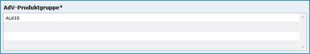
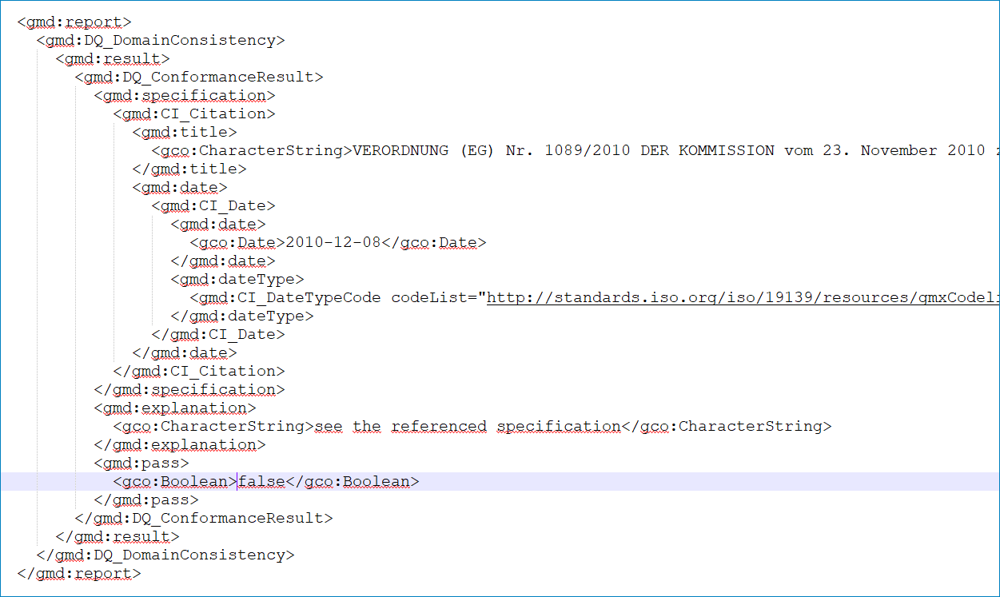

Option - AdV kompatibel
-----------------------

Grundlage
^^^^^^^^^

Kompatibilität der Metadaten mit dem Metadatenprofil der Arbeitsgemeinschaft der Vermessungsverwaltungen (AdV)

Erfassung
^^^^^^^^^

**Nachfolgend werden die Felder beschrieben, die in der Erfassungsmaske speziell für diesen Metadatentyp angezeigt werden.**

Abschnitt Allgemeines
''''''''''''''''''''''
.. image:: ../../../../img_ige/metaver_ige/ige_erfassung/ige_objekte/ige_abschnitt-02_allgemeines/ige-abschnitt_allgemeines.png

Checkbox AdV kompatibel
'''''''''''''''''''''''

Abb.: Checkbox AdV kompatibel

Wird die Checkbox "AdV kompatibel" aktiviert,  werden die Anforderungen des AdV-Metadatenprofils umgesetzt.

Folgende Eigenschaften ändern sich bei der Aktivierung der Checkbox AdV kompatibel:
 - Abschnitt Verschlagwortung: Aktivierung der Tabelle "AdV-Produktgruppe"
 - Aktivierung des Schlagwortes "AdVMIS" während der ISO-XML Generierung

Abschnitt Verschlagwortung
''''''''''''''''''''''''''

.. image:: ../../../../img_ige/metaver_ige/ige_erfassung/ige_objekte/ige_abschnitt-02_allgemeines/ige-abschnitt_verschlagwortung.png

Abb.: Tabelle "AdV-Produktgruppe" - (Pflichtangaben)

`Auswahlliste - AdV-Produktgruppe<https://metaver-bedienungsanleitung.readthedocs.io/de/latest/metaver_ige/ige_auswahllisten/auswahlliste_verschlagwortung_adv_produktgruppe.html>`_

Abb.: ISO-XML - Angabe des Schlüsselwortes "AdVMIS"