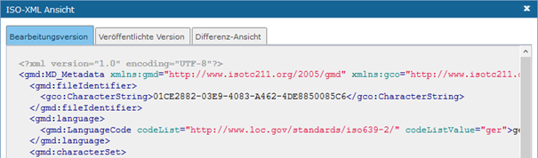
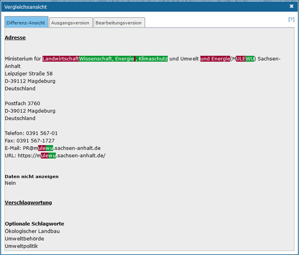
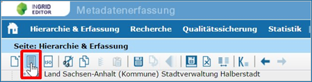
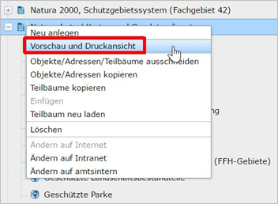
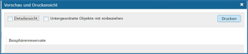
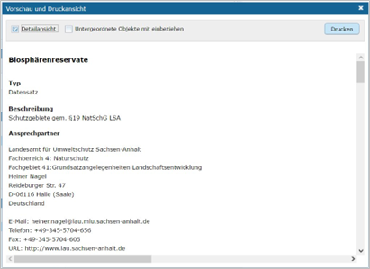
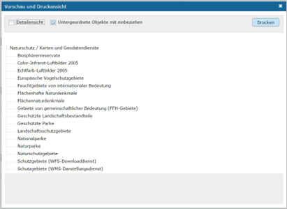
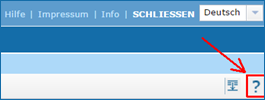
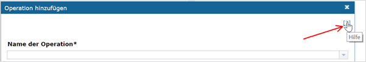
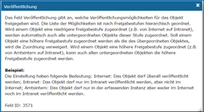

InGrid Editor Funktionen
========================

ISO-XML-Anzeigen
----------------

Abb.: Symbolleiste - Befehl ISO-XML-Anzeigen

Zeigt das erstellte Metadatenobjekt als ISO-XML an.

Abb.: ISO-XML Ansicht

Änderungen anzeigen
-------------------

Mit dem Befehl „Änderungen anzeigen“ haben Sie die Möglichkeit, sich das Objekt bzw. die Adresse einmal vor und einmal nach dem Editieren anzusehen und zu vergleichen. 

Abb.: Symbolleiste - Befehl Änderungen anzeigen

Es öffnet sich ein Dialog-Fenster „Vergleichsansicht“, welches die Informationen vor der Bearbeitung eines Objektes bzw. einer Adresse anzeigt (Ausgangsversion) und nach der Bearbeitung (Bearbeitungsversion). In der Differenz-Ansicht sind die gelöschten Daten in Rot dargestellt, die neu eingefügten Daten werden dagegen grün angezeigt. 

Abb.: Vergleichsansicht

Hilfreich ist diese Ansicht beispielsweise, wenn ein Objekt bzw. eine Adresse vor längerer Zeit nur zwischengespeichert wurde. Mit einem Blick auf die Vergleichsansicht kann schnell festgestellt werden, was geändert wurde und ob das Objekte bzw. die Adresse abschließend gespeichert werden kann oder die Änderungen eventuell verworfen werden müssen. 

Vorschau und Druckansicht
-------------------------

Man kann aus dem InGrid Editor heraus Objekte oder Adressen drucken. Aufgerufen wird der Druckdialog entweder über den Befehl „Vorschau und Druckansicht“ in der Symbolleiste.

Abb.: Symbolleiste - Befehl Vorschau und Druckansicht

oder über den gleichen Befehl innerhalb des Kontextmenüs (rechte Maustaste). 

Abb.: Kontextmenü - Befehl Vorschau und Druckansicht 

Je nachdem, ob der Befehl über die Menüleiste oder aber über das Kontextmenü aufgerufen wird, variiert der Inhalt ein wenig. Beim Aufruf über das Kontextmenü werden die gespeicherten Metadaten angezeigt. Ruft man dagegen die Druckansicht über die Menüleiste auf, so wird der aktuelle Stand gezeigt, auch, wenn die Änderungen noch nicht gespeichert wurden. 

**Vorschau und Druckansicht**

Für die Druckansicht Optionen enthält das Fenster die Optionen:
 - Detailansicht und
 - Untergeordnete Objekte mit einbeziehen.

Abb.: Vorschau und Druckansicht - Auswahl

**Detailansicht**

Es besteht die Möglichkeit, nur den Namen der Objekte (bzw. der Adressen) zu drucken, oder aber zusätzlich sämtliche Detailinformationen. 

Abb.: Vorschau und Druckansicht - Auswahl - Detailansicht

**Untergeordnete Objekte/Adressen mit einbeziehen**

Es kann entweder ein einzelnes im Hierarchiebaum ausgewähltes Objekt (bzw. Adresse) dargestellt werden, oder aber ein Teilbaum mit zusätzlich allen untergeordneten Objekten/Adressen. 

Gesteuert wird dieses über die Auswahl „Untergeordnete Adressen mit einbeziehen“. Ohne Haken wird nur das ausgewählte Objekt/Adresse angezeigt und gedruckt. Wird dagegen ein Haken gesetzt, so werden alle untergeordneten Adressen/Objekte ebenfalls gedruckt – jedoch nur jeweils die Namen der Objekte/Adressen. Soll zusätzlich die gesamte Beschreibung des Objektes/der Adresse gedruckt werden, so ist ein Haken für die „Detailansicht“ zu setzen. 

Abb.: Vorschau und Druckansicht - Auswahl - Untergeordnete Objekte mit einbeziehen

..  Suche

..  Reports

Hilfe
-----

**Allgemeine Hilfe**

.. image:: ../../img_ige/metaver_ige/ige_funktionen/ige_hilfe/ige-hilfe_allgemein.png

Abb.: Hilfe im Menü

Eine allgemeine Hilfe zum InGrid Editor kann durch einen Klick auf das Fragezeichensymbol (ganz rechts in der Toolbar) aufgerufen werden. Sie enthält Hinweise und Ratschläge für die Nutzung des InGrid Editors.

Abb.: Hilfe [?] in der Symbolleiste

**Hilfe in den Dialogfenstern**

In den Dialogfenstern steht ebenfalls eine Hilfe zur Verfügung.
Das Symbol [?] verweist auf den Hilfetext.

Abb.: Hilfe [?] in den Dialogfenstern

**Hilfe hinter den Feldbezeichnungen**

Zusätzlich erhalten Sie Hilfe für die Befüllung einzelner Felder, indem Sie den Mauszeiger über die Bezeichnung des jeweiligen Feldes ziehen. Der Pfeil verändert dann seine Form zu einer Kombination aus Pfeil und Fragezeichen. Ein einfacher Klick mit der linken Maustaste öffnet ein Fenster, welches einen Hilfetext zu dem zugehörigen Feld anzeigt.

Abb.: Feldüberschriften - Hilfe [?]

Abb.: Hilfefenster