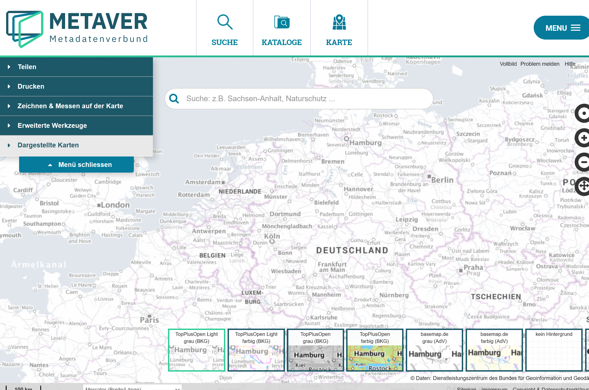

Kartenclient
============

Der Metaver-Kartenclient enthält eine Auswahl an unterschiedlichen Basiskarten.

  - TopPlusOpen Light grau (BKG) - Abdeckung Europa
  - TopPlusOpen Light farbig (BKG) - Abdeckung Europa
  - TopPlusOpen grau (BKG) - Abdeckung Europa
  - TopPlusOpen farbig (BKG) - Abdeckung Europa
  - basemap.de grau (AdV) - Abdeckung Bundesrepublik Deutschland
  - basemap.de farbig (AdV) - Abdeckung Bundesrepublik Deutschland

- BKG - Bundesamt für Kartographie und Geodäsie
- AdV - Arbeitsgemeinschaft der Vermessungsverwaltungen

Abb.: METAVER-Kartenclient - Verfügbare Basiskarten