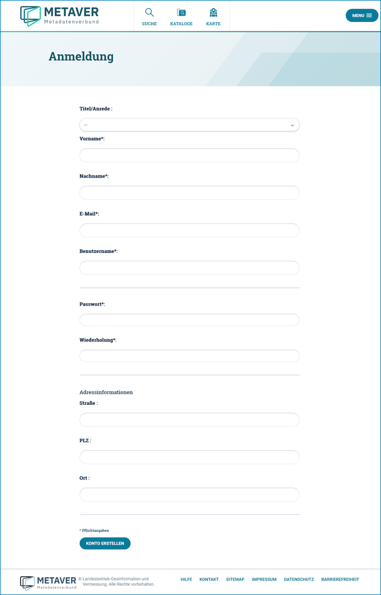
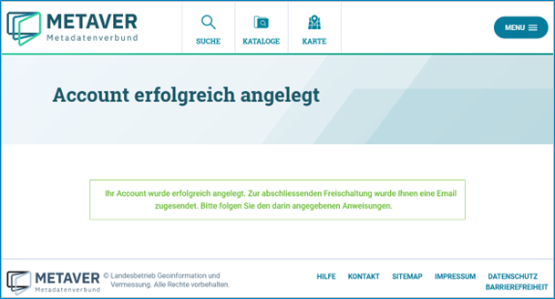
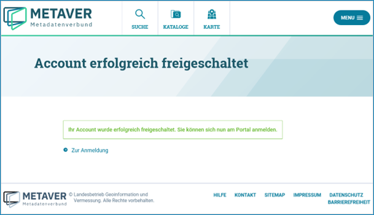
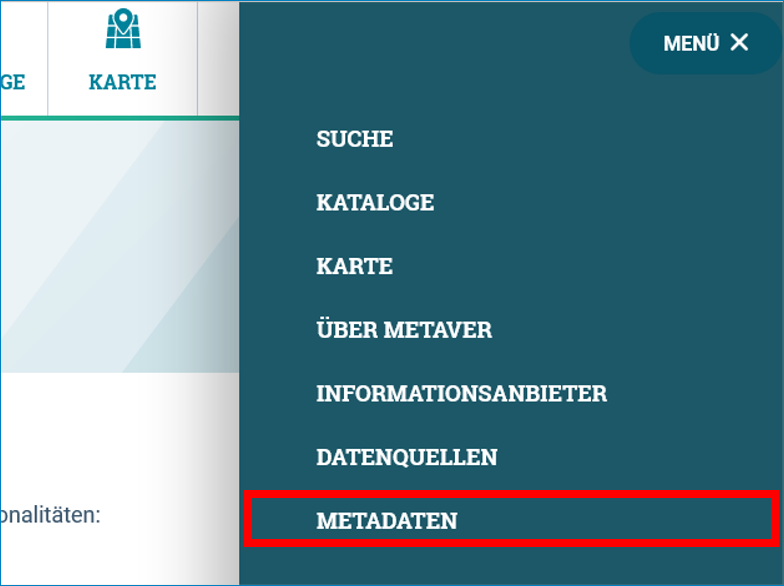
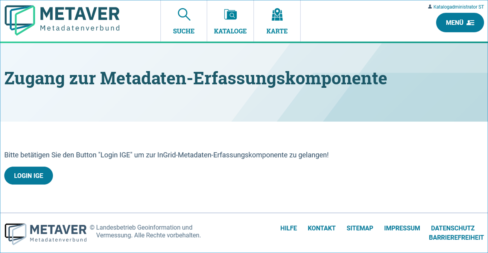
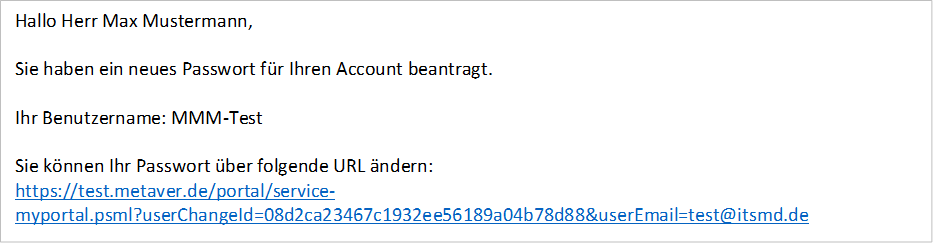
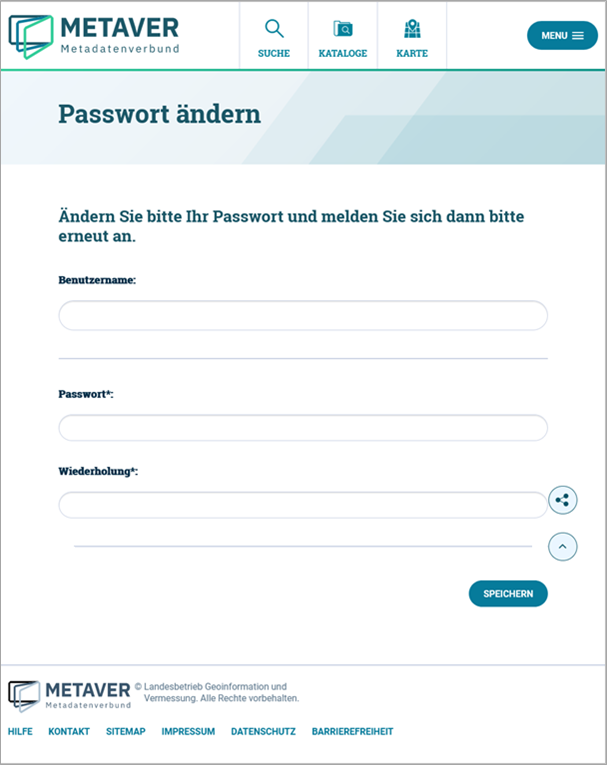

Registrierung und Anmeldung
=========================

Öffnen Sie die Anmeldeseite.

URL: https://metaver.de/log-in

.. image:: ../../img_ige/metaver_registrierung-anmeldung/metaver_log-in.png

Abb.: Seite Anmeldung

Zum Anlegen eines neuen Benutzers wählen Sie: "REGISTRIEREN".

Auf der Seite Anmeldung müssen mindestens alle Pflichtfelder (Kennzeichnung durch Sternchen) ausgefüllt werden. Ihren zukünftigen Benutzernamen sowie das zugehörige Passwort können Sie frei wählen.

Abb.: Seite Registrierung

Es erfolgt eine Passwortprüfung, wählen Sie bitte ein starkes Passwort (grüner Balken).

Zum Abschließen der Registrierung betätigen Sie den Button "KONTO ERSTELLEN". Sie erhalten daraufhin folgende Nachricht in Ihrem Browserfenster

Abb.: Seite Account erfolgreich angelegt

Außerdem erhalten Sie eine E-Mail an die zuvor von Ihnen eingegebene E-Mail-Adresse: 

.. image:: ../../img_ige/metaver_registrierung-anmeldung/metaver_e-mail.png

Abb.: vom System versendete E-Mail

Zur Freischaltung ihrer neuen Benutzerkennung klicken Sie bitte auf den Link in Ihrer E-Mail. Es öffnet sich daraufhin der Browser mit folgender Anzeige:

Abb.: Seite "Ihr Account wurde erfolgreich freigeschaltet. ..."

Bevor Sie Metadaten erfassen und pflegen können, muss Ihre neue Benutzerkennung für die Erfassung und Pflege der Metadaten freigeschaltet werden. Bisher dürfen Sie sich nur am Portal anmelden und persönliche Einstellungen vornehmen, aber noch keine Änderungen an den Metadaten vornehmen. 
Schicken Sie uns eine Nachricht über das METAVER-Kontaktformular (wählen Sie das zutreffende Bundesland aus) und teilen uns mit, dass wir für Sie einen Zugang zum InGrid Editor anlegen sollen (dafür benötigen wir den von Ihnen gewählten Benutzernamen). Wir richten Ihnen dann den entsprechenden Zugang mit den entsprechenden Berechtigungen ein. 

Anmeldung in METAVER
---------------------

Wenn Sie eine Benutzerkennung haben und als InGrid Editor-Nutzer angelegt wurden, rufen Sie die Anmeldeseite auf (https://metaver.de/log-in), tragen Ihren Benutzernamen und Ihr Passwort ein und betätigen abschließend den Button "ANMELDEN".

.. image:: ../../img_ige/metaver_registrierung-anmeldung/metaver_anmeldung.png

Abb: Seite Anmeldung - Benutzernamen und Passwort eingeben

Im Unterschied zu einem unangemeldeten Nutzer bzw. einem Nutzer ohne Zugang zum InGrid Editor, sehen Sie jetzt im Menü den Punkt "METADATEN". Diese Auswahl ist immer nur dann sichtbar, wenn die entsprechenden Zugriffsrechte vorliegen. Hierüber erfolgt der Einstieg zum InGrid Editor.

   
Abb.: Im Menü den Punkt METADATEN wählen

Durch einen Klick auf den Menüpunkt "METADATEN" und anschließend auf den Button "Login IGE" kommen Sie in die Metadaten-Erfassungskomponente den InGrid Editor. Der InGrid Editor öffnet sich in einer neueren Registerkarte Ihres Browsers.

Abb.: Den Button "LOGIN IGE" betätigen

Der InGrid Editor im Ausgangszustand
------------------------------------

Nach dem Laden des Editors wird zuerst das Dashboard gezeigt. Hier wird dargestellt, welche Objekte bzw. Adressen zuletzt bearbeitet wurden und wann das geschehen ist.
Es gibt zwei Darstellungen: die Objekte/Adressen, für die der User selbst verantwortlich ist ("Meine Datensätze"), sowie eine Übersicht über alle Objekte/Adressen des Katalogs ("Alle Datensätze"). 

Im Bereich "Meine Datensätze" gibt es drei Tabellen: 

1.	Objekte in Bearbeitung
Alle Objekte des Benutzers, die in Bearbeitung sind (Zwischenspeicherung). Also Objekte, die nach dem Neuanlegen noch nicht abschließend gespeichert wurden bzw. Objekte, die schon veröffentlicht waren, aber geändert wurden und deren Änderungen bislang noch nicht wieder abschließend gespeichert wurden. 

2.	Veröffentlichte Objekte 
Alle Objekte des Benutzers, die bereits veröffentlicht sind. 

3.	Adressen in Bearbeitung
Alle Adressen des Benutzers, die in Bearbeitung sind (Zwischenspeicherung). Also Adressen, die nach dem Neuanlegen noch nicht abschließend gespeichert wurden bzw. Adressen, die schon veröffentlicht waren, aber geändert wurden und deren Änderungen bislang noch nicht wieder abschließend gespeichert wurden. 

.. image:: ../../img_ige/metaver_registrierung-anmeldung/ige_dashboard.png

Abb.: Home-Seite - Dashboard - Meine Datensätze

Im Bereich "Alle Datensätze" gibt es nur die Tabellen, in denen die Objekte und Adressen dargestellt werden, die sich in Bearbeitung befinden. Die eigenen angezeigten Objekte bzw. Adressen sind mit Links hinterlegt, sodass diese direkt zur Ansicht/Bearbeitung geöffnet werden können. Alle anderen Objekte sind grau.

.. image:: ../../img_ige/metaver_registrierung-anmeldung/ige_dashboard_alle-datensaetze.png

Abb.: Home-Seite - Dashboard - Alle Datensätze

Passwort vergessen
------------------

Aufruf der Seite „Anmeldung“: https://metaver.de/log-in Betätigen Sie den Link „Passwort vergessen?“.

.. image:: ../../img_ige/metaver_registrierung-anmeldung/metaver_log-in.png

Abb: Funktion Passwort vergessen

Es öffnet sich die „Passwort vergessen“ - Seite, deren Aufforderung bitte folgen.

.. image:: ../../img_ige/metaver_registrierung-anmeldung/metaver_anmeldung.png

Abb.: Angabe der E-Mail-Adresse

Feld „E-Mail*:“ Tragen Sie hier Ihre E-Mail-Adresse ein, betätigen Sie anschließend den Button „E-MAIL ANFORDERN“.

Es öffnet sich die Seite „E-Mail gesendet“ mit der Information: „Sie haben eine E-Mail erhalten mit Informationen zu Ihrer Passwort-Änderung.“

.. image:: ../../img_ige/metaver_registrierung-anmeldung/metaver_anmeldung_passwort-vergessen_meldung.png

Abb.: Seite E-Mail gesendet

Das System versendet folgende E-Mail:

Abb.: versendete E-Mail

Es öffnet sich die Seite „Passwort ändern“ mit der Aufforderung: „Ändern Sie bitte Ihr Passwort und melden Sie sich dann bitte erneut an.“ Im Feld „Benutzername“ den Benutzernamen und darunter zweimal das neue Passwort eintragen, abschließend den Button „SPEICHERN“ betätigen.

Abb.: Seite Passwort ändern

Es wird automatisch auf die Seite „Anmeldung“ weitergeleitet, auf der man sich direkt mit dem neuen Passwort einloggen kann.

.. image:: ../../img_ige/metaver_registrierung-anmeldung/metaver_anmeldung.png

Abb.: Seite Anmeldung

Benutzername vergessen
----------------------

Wenn Sie Ihren Benutzernamen vergessen haben, füllen Sie bitte in METAVER das Kontaktformular (https://metaver.de/kontakt) aus, geben Sie bitte Ihr Bundesland an, so wird die Anfrage Ihren zuständigen Katalogadministrator zugestellt.