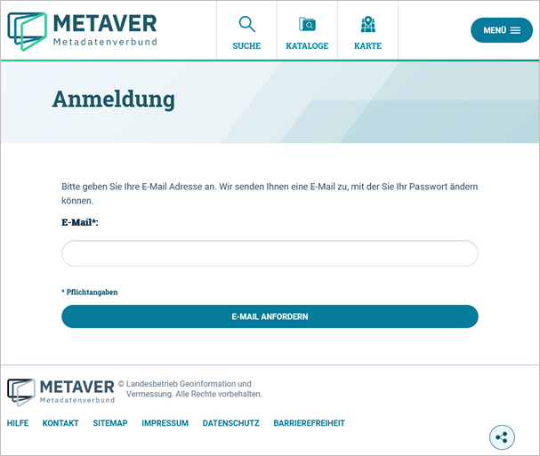

============================
Anmeldung
============================

Anmeldung im Metadaten-Editor des BKG-MIS
-----------------------------------------

Falls Sie noch keinen Zugang haben, wenden Sie sich bitte an die fachverfahrensverantwortliche Person oder nutzen das BKG-MIS Kontaktformular (https://mis.bkg.bund.de/kontakt).

Wenn Sie als Nutzer registriert sind, rufen Sie die Login-Seite auf: https://mis.bkg.bund.de/log-in

.. figure:: ../../img/registrierung-anmeldung/anmeldung.png
   :align: left
   :scale: 30
   :figwidth: 100%

Abb: Seitenanmeldung - Benutzername und Passwort eingeben

Startseite des Metadaten-Editor
---------------------------------------

Nach dem Laden des Editors wird zuerst die Übersichts-Seite gezeigt. Diese zeigt die zuletzt bearbeiteten Objekte an.

.. figure:: ../../img/registrierung-anmeldung/ige_dashboard.png
   :align: left
   :scale: 30
   :figwidth: 100%

Abb.: Home-Seite - Übersicht

Zuletzt im Katalog bearbeitet - Anzeige aller Metadaten, die zuletzt von einem Bearbeiter geändert wurden.

Zuletzt veröffentlicht im Katalog - Anzeige aller Metadaten, die zuletzt vom Bearbeiter veröffentlicht wurden.

Passwort vergessen
------------------

Aufruf der Seite "Anmeldung": https://mis.bkg.bund.de/log-in

.. figure:: ../../img/registrierung-anmeldung/log-in.png
   :align: left
   :scale: 40
   :figwidth: 100%

Abb: Funktion Passwort vergessen

Es öffnet sich die „Passwort vergessen“ - Seite. Deren Aufforderung bitte folgen.

Abb.: Angabe der E-Mail-Adresse

Nach Eingabe Ihrer Mail-Adresse und Betätigung "E-MAIL ANFORDERN" erscheint die Seite "E-Mail gesendet" mit der Nachricht: "Sie haben eine E-Mail mit Informationen zur Änderung Ihres Passworts erhalten".

.. figure:: ../../img/registrierung-anmeldung/anmeldung_passwort-vergessen_meldung.png
   :align: left
   :scale: 70
   :figwidth: 100%

Abb.: Seite E-Mail gesendet

Das System versendet folgende E-Mail:

.. figure:: ../../img/registrierung-anmeldung/anmeldung_passwort-vergessen_e-mail.png
   :align: left
   :scale: 60
   :figwidth: 100%

Abb.: versendete E-Mail

Es öffnet sich die Seite "Passwort ändern" mit der Aufforderung: "Ändern Sie bitte Ihr Passwort und melden Sie sich dann bitte erneut an.". Tragen Sie den Benutzernamen und das neue Passwort zweimal in das entsprechende Feld ein und klicken Sie abschließend auf "SPEICHERN".

.. figure:: ../../img/registrierung-anmeldung/anmeldung_passwort-vergessen_passwort-aendern.png
   :align: left
   :scale: 60
   :figwidth: 100%

Abb.: Seite Passwort ändern

Die Weiterleitung zur Anmeldeseite erfolgt automatisch. Hier können Sie sich direkt mit dem neuen Passwort einloggen.

.. figure:: ../../img/registrierung-anmeldung/anmeldung.png
   :align: left
   :scale: 30
   :figwidth: 100%

Abb.: Seite Anmeldung

Benutzername vergessen
----------------------

Wenn Sie Ihren Benutzernamen vergessen haben, wenden Sie sich bitte an die fachverfahrensverantwortliche Person oder nutzen das BKG-MIS Kontaktformular (https://mis.bkg.bund.de/kontakt).
