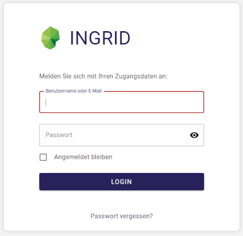
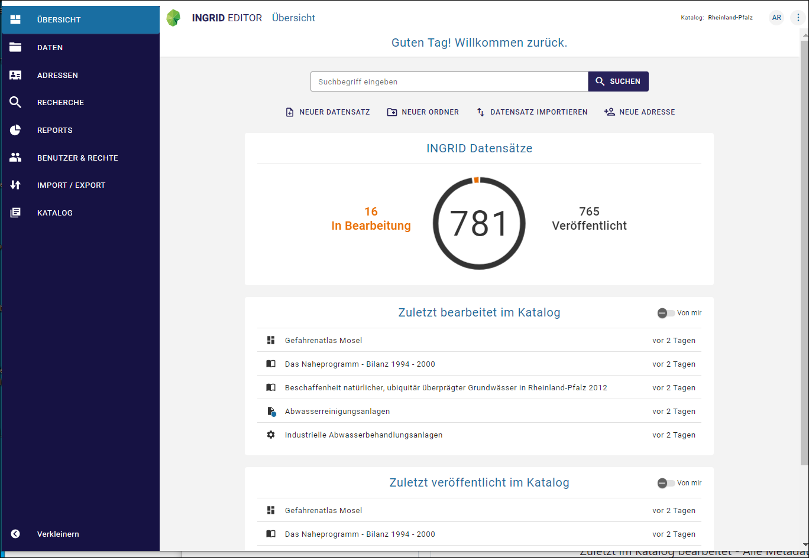
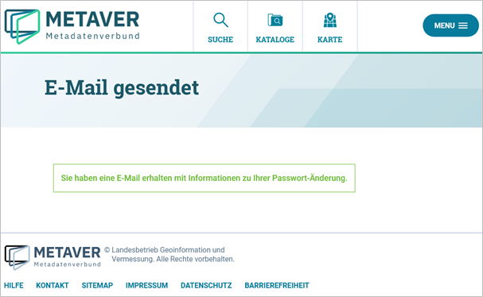
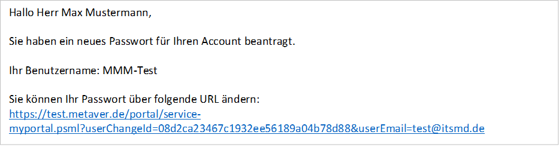

============================
Registrierung und Anmeldung
============================

Damit Sie mit dem InGrid Editor (IGE) Daten bearbeiten können, benötigen Sie einen Account. Dazu schreiben Sie bitte eine E-Mail an portalu<at>mkuem.rlp.de. Sobald Ihr Account eingerichtet ist, erhalten Sie eine E-Mail mit den Zugangsdaten. 

.. figure:: ../../img/registrierung-anmeldung/eMailAccount_rp.png
   :align: left
   :scale: 30
   :figwidth: 100%

Anmeldung am InGrid Editor
--------------------------

Wenn Sie über einen Account verfügen, rufen Sie die Login-Seite auf (https://www.portalu.rlp.de/log-in), geben Ihre Benutzerdaten ein und klicken abschließend auf die Schaltfläche "LOGIN".

Abb: Seitenanmeldung - Benutzername und Passwort eingeben

Der InGrid Editor im Ausgangszustand
------------------------------------

Nach dem Laden des Editors wird zuerst die Übersicht gezeigt. Hier wird dargestellt, welche Objekte bzw. Adressen zuletzt bearbeitet wurden und wann das geschehen ist.

Abb.: Home-Seite - Übersicht

Zuletzt im Katalog bearbeitet - Alle Metadaten anzeigen, die zuletzt von einem Bearbeiter geändert wurden.

Zuletzt veröffentlicht im Katalog - Es werden alle Metadaten angezeigt, die zuletzt vom Bearbeiter veröffentlicht wurden.

Passwort vergessen
------------------

Aufruf der Seite "Anmeldung": https://metaver.de/log-in. Klicken Sie auf den Link "Passwort vergessen?".

.. figure:: ../../img/registrierung-anmeldung/log-in.png
   :align: left
   :scale: 40
   :figwidth: 100%

Abb: Funktion Passwort vergessen

Es öffnet sich die „Passwort vergessen“ - Seite, deren Aufforderung bitte folgen.

.. figure:: ../../img/registrierung-anmeldung/anmeldung.png
   :align: left
   :scale: 30
   :figwidth: 100%

Abb.: Angabe der E-Mail-Adresse

Feld "E-Mail*": Bitte geben Sie hier Ihre E-Mail-Adresse ein und klicken Sie auf "E-MAIL ANFORDERN".

Es erscheint die Seite "E-Mail gesendet" mit der Nachricht: "Sie haben eine E-Mail mit Informationen zur Änderung Ihres Passworts erhalten".

Abb.: Seite E-Mail gesendet

Das System versendet folgende E-Mail:

Abb.: versendete E-Mail

Es öffnet sich die Seite "Passwort ändern" mit der Aufforderung: "Ändern Sie bitte Ihr Passwort und melden Sie sich dann bitte erneut an.". Tragen Sie den Benutzernamen und das neue Passwort zweimal in das entsprechende Feld ein und klicken Sie abschließend auf "SPEICHERN".

.. figure:: ../../img/registrierung-anmeldung/anmeldung_passwort-vergessen_passwort-aendern.png
   :align: left
   :scale: 60
   :figwidth: 100%

Abb.: Seite Passwort ändern

Die Weiterleitung zur Anmeldeseite erfolgt automatisch, wo man sich direkt mit dem neuen Passwort einloggen kann.

.. figure:: ../../img/registrierung-anmeldung/anmeldung.png
   :align: left
   :scale: 30
   :figwidth: 100%

Abb.: Seite Anmeldung

Benutzername vergessen
----------------------

Wenn Sie Ihren Benutzernamen vergessen haben, schreiben Sie bitte eine E-Mail an portalu<at>mkuem.rlp.de.
