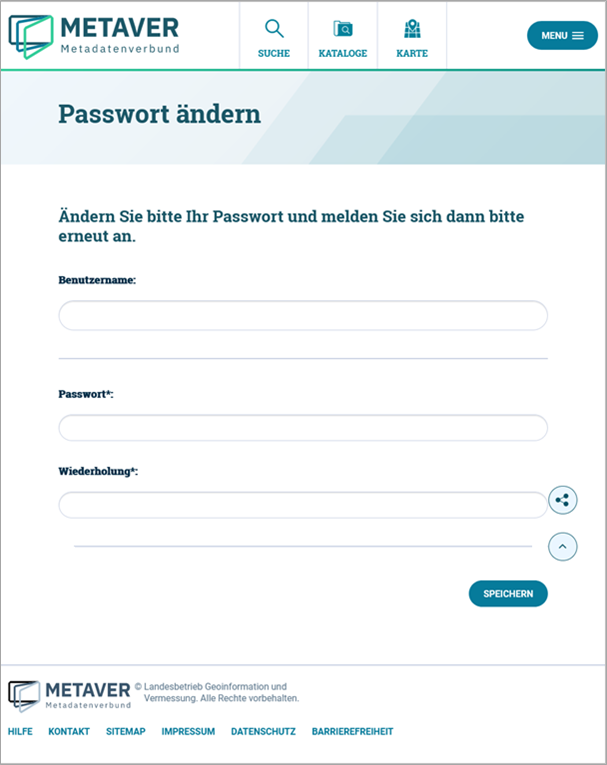

============================
Registrierung und Anmeldung
============================

Öffnen Sie die Anmeldeseite!

URL: https://metaver.de/log-in - hier login rlp eintragen

.. figure:: ../../img/registrierung-anmeldung/log-in.png
   :align: left
   :scale: 40
   :figwidth: 100%

Abb.: Seite Anmeldung

Um einen neuen Benutzer anzulegen, wählen Sie "REGISTRIEREN".

Auf der Anmeldeseite müssen Sie mindestens alle Pflichtfelder ausfüllen, welche durch ein Sternchen gekennzeichnet sind. Sie haben die Freiheit, Ihren Benutzernamen und das zugehörige Passwort selbst zu wählen.

.. figure:: ../../img/registrierung-anmeldung/registrierung.png
   :align: left
   :scale: 50
   :figwidth: 100%

Abb.: Seite Registrierung

Es wird eine Überprüfung des Passworts durchgeführt, bitte wählen Sie ein sicheres Passwort (grüner Balken).

Um die Registrierung abzuschließen, klicken Sie bitte auf den Button "KONTO ERSTELLEN". Anschließend erhalten Sie die folgende Nachricht in Ihrem Browserfenster.

.. figure:: ../../img/registrierung-anmeldung/account-angelegt.png
   :align: left
   :scale: 60
   :figwidth: 100%

Abb.: Seite "Account erfolgreich angelegt"

Außerdem erhalten Sie eine E-Mail an die zuvor von Ihnen eingegebene E-Mail-Adresse: 

.. figure:: ../../img/registrierung-anmeldung/e-mail.png
   :align: left
   :scale: 60
   :figwidth: 100%

Abb.: vom System versendete E-Mail

Um Ihre neue Benutzerkennung freizuschalten, klicken Sie bitte auf den Link in Ihrer E-Mail. Anschließend öffnet sich der Browser mit der folgenden Anzeige.

.. figure:: ../../img/registrierung-anmeldung/account-freigeschaltet.png
   :align: left
   :scale: 60
   :figwidth: 100%

Abb.: Seite "Ihr Account wurde erfolgreich freigeschaltet. ..."

Bevor Sie Metadaten erfassen und pflegen können, muss Ihre neue Benutzerkennung für die Erfassung und Pflege der Metadaten freigeschaltet werden. Bisher ist es Ihnen lediglich gestattet, sich am Portal anzumelden und persönliche Einstellungen vorzunehmen. Sie können jedoch noch keine Änderungen an den Metadaten vornehmen. 
Schreiben Sie uns über das METAVER-Kontaktformular und wählen Sie Ihr Bundesland aus, um uns mitzuteilen, dass Sie einen Zugang zum InGrid Editor benötigen. Geben Sie uns hierbei Ihren gewünschten Benutzernamen an. Wir richten den Zugang mit den notwendigen Berechtigungen ein. 

Anmeldung am InGrid Editor
--------------------------

Wenn Sie über eine Benutzerkennung verfügen und als InGrid Editor registriert sind, rufen Sie die Login-Seite auf (https://portalu.rlp.de/log-in), geben Ihre Benutzerdaten ein und klicken abschließend auf die Schaltfläche "ANMELDEN".

.. figure:: ../../img/registrierung-anmeldung/anmeldung.png
   :align: left
   :scale: 30
   :figwidth: 100%

Abb: Seitenanmeldung - Benutzername und Passwort eingeben

Der InGrid Editor im Ausgangszustand
------------------------------------

Nach dem Laden des Editors wird zuerst die Übersicht gezeigt. Hier wird dargestellt, welche Objekte bzw. Adressen zuletzt bearbeitet wurden und wann das geschehen ist.

.. figure:: ../../img/registrierung-anmeldung/ige_dashboard.png
   :align: left
   :scale: 30
   :figwidth: 100%

Abb.: Home-Seite - Übersicht

Zuletzt im Katalog bearbeitet - Alle Metadaten anzeigen, die zuletzt von einem Bearbeiter geändert wurden.

Zuletzt veröffentlicht im Katalog - Es werden alle Metadaten angezeigt, die zuletzt vom Bearbeiter veröffentlicht wurden.

Passwort vergessen
------------------

Aufruf der Seite "Anmeldung": https://metaver.de/log-in. Klicken Sie auf den Link "Passwort vergessen?".

.. figure:: ../../img/registrierung-anmeldung/log-in.png
   :align: left
   :scale: 40
   :figwidth: 100%

Abb: Funktion Passwort vergessen

Es öffnet sich die „Passwort vergessen“ - Seite, deren Aufforderung bitte folgen.

.. figure:: ../../img/registrierung-anmeldung/anmeldung.png
   :align: left
   :scale: 30
   :figwidth: 100%

Abb.: Angabe der E-Mail-Adresse

Feld "E-Mail*": Bitte geben Sie hier Ihre E-Mail-Adresse ein und klicken Sie auf "E-MAIL ANFORDERN".

Es erscheint die Seite "E-Mail gesendet" mit der Nachricht: "Sie haben eine E-Mail mit Informationen zur Änderung Ihres Passworts erhalten".

Abb.: Seite E-Mail gesendet

Das System versendet folgende E-Mail:

.. figure:: ../../img/registrierung-anmeldung/anmeldung_passwort-vergessen_e-mail.png
   :align: left
   :scale: 60
   :figwidth: 100%

Abb.: versendete E-Mail

Es öffnet sich die Seite "Passwort ändern" mit der Aufforderung: "Ändern Sie bitte Ihr Passwort und melden Sie sich dann bitte erneut an.". Tragen Sie den Benutzernamen und das neue Passwort zweimal in das entsprechende Feld ein und klicken Sie abschließend auf "SPEICHERN".

Abb.: Seite Passwort ändern

Die Weiterleitung zur Anmeldeseite erfolgt automatisch, wo man sich direkt mit dem neuen Passwort einloggen kann.

.. figure:: ../../img/registrierung-anmeldung/anmeldung.png
   :align: left
   :scale: 30
   :figwidth: 100%

Abb.: Seite Anmeldung

Benutzername vergessen
----------------------

Wenn Sie Ihren Benutzernamen vergessen haben, füllen Sie bitte das Kontaktformular auf METAVER (https://metaver.de/kontakt) aus und geben Sie Ihr Bundesland an. So wird Ihre Anfrage an den zuständigen Katalogadministrator zugestellt.
